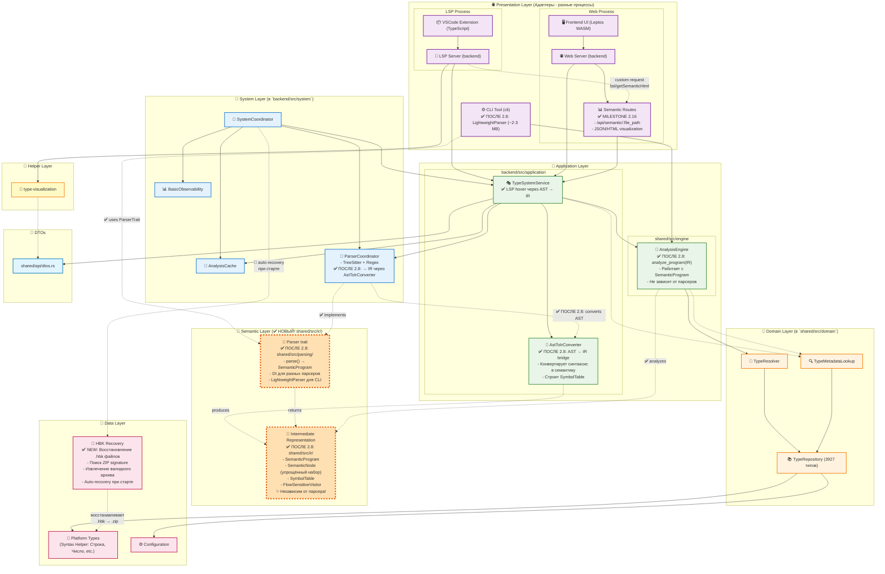

# Архитектура системы типов

## Диаграмма компонентов



## Потоки данных

### Загрузка данных
```
HTML документация → SyntaxHelperParser → RawTypeData → TypeRepository
```

### Статический анализ
```
Выражение → TypeResolver → RawTypeData → TypeResolution
```

### Web API
```
TypeResolution → TypeMetadataLookup → TypeDto → JSON → Frontend
```

## Ключевые структуры

| Структура | Слой | Назначение |
|-----------|------|------------|
| `RawTypeData` | Data | Хранение всех данных парсера (методы, свойства) |
| `TypeResolution` | Domain | Результат анализа (certainty, facets) |
| `TypeMetadataLookup` | Domain | Мост между Resolution и RawTypeData |
| `SemanticProgram` | Semantic | IR независимый от парсера |

## Фасеты 1С

```
Справочники.Контрагенты      → Manager
СправочникОбъект.Контрагенты → Object
СправочникСсылка.Контрагенты → Reference
```

## Резолвинг типов и свойств

### TypeResolution с active_facet

```rust
TypeResolution {
    type_name: "ДокументСсылка.ЗаказНаряды",
    active_facet: Some(Reference),  // Определяет доступные свойства!
    available_facets: [Manager, Object, Reference],
}
```

### Ключевые enum унификации

| Enum | Назначение | Пример |
|------|------------|--------|
| `FacetKind` | Тип фасета | `Manager`, `Object`, `Reference`, `Selection`, `List` |
| `MetadataKind` | Вид метаданных | `Catalog`, `Document`, `InformationRegister` |

**Методы `FacetKind`:**
- `shows_properties()` — Manager/Selection/List = `false`, Object/Reference = `true`
- `platform_suffix()` — `"Менеджер"`, `"Объект"`, `"Ссылка"`

### Flow резолвинга свойств

```
Код: Ссылка.Работы (где Ссылка: ДокументСсылка.ЗаказНаряды)
              ↓
resolve_member_type(object_type, "Работы")
              ↓
metadata_lookup.get_properties(object_type)
              ↓
active_facet = Reference → shows_properties() = true
              ↓
get_facet_properties() → платформенные + конфигурационные + табличные части
              ↓
Найдено: Работы: ТабличнаяЧасть<Работы>
```

### Хранение типов

| Где | Формат | Пример |
|-----|--------|--------|
| SymbolTable (переменные) | Фасетный | `ДокументСсылка.ЗаказНаряды` |
| TypeRepository | Коллекция | `Документы.ЗаказНаряды` |
| SignatureIndex (методы) | Базовый фасет | `ДокументОбъект`, `ДокументСсылка` |

**Конвертация:** `MetadataKind::Document.to_prefix()` → `"Документы"`

**Подробнее:** [docs/architecture/type_system_architecture.md](../../docs/architecture/type_system_architecture.md)
