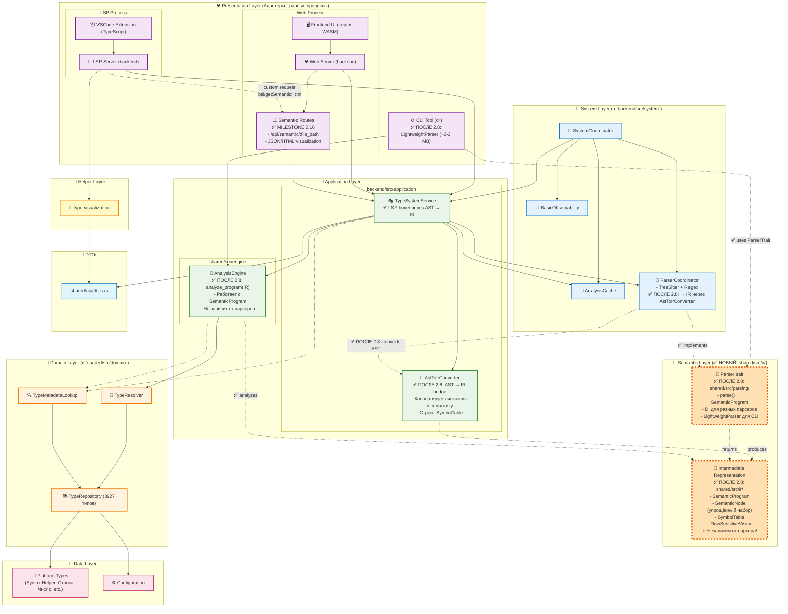

# CLAUDE.md

This file provides guidance to Claude Code (claude.ai/code) when working with code in this repository.

## 📋 Содержание

1. [Правила работы с Roadmap](#правила-работы-с-roadmap)
   - [Навигация по Roadmap](#-навигация-по-roadmap) — ссылки на ROADMAP_2025.md и ROADMAP_ARCHIVE_2025.md
2. [Архитектура проекта](#архитектура-проекта)
3. [Команды разработки](#команды-разработки)
4. [Архитектурная диаграмма](#архитектурная-диаграмма)
5. [Компоненты архитектуры](#компоненты-архитектуры)
6. [Анализ кода](#анализ-кода)
7. [MCP Инструментарий](#mcp-инструментарий)
8. [Научные основы](#научные-основы)

---

## Правила работы с Roadmap

### 🚨 КРИТИЧЕСКОЕ ТРЕБОВАНИЕ: Контрольная проверка выполнения

**ПРИ ВЫПОЛНЕНИИ ЛЮБЫХ ЭТАПОВ ИЗ ROADMAP:**

1. **ПЕРЕД отчётом о выполнении** — ОБЯЗАТЕЛЬНО провести **контрольную проверку фактического выполнения**

2. **Проверка должна включать:**
   - ✅ Чтение реального кода в файлах (Read tool)
   - ✅ Поиск реализованных функций/структур (Grep/Glob tools)
   - ✅ Запуск тестов для проверки работоспособности (Bash: cargo test)
   - ✅ Проверка компиляции (Bash: cargo check/build)

3. **ЗАПРЕЩЕНО:**
   - ❌ Утверждать о выполнении без проверки кода
   - ❌ Отчитываться о готовности всего этапа, если выполнена только часть задачи
   - ❌ Предполагать наличие кода без чтения файлов
   - ❌ Заявлять о прохождении тестов без их реального запуска

4. **Формат отчёта о выполнении:**
   ```markdown
   ## Статус выполнения [Milestone X.Y]

   ### ✅ Task N: [Название] — ВЫПОЛНЕНО
   **Проверка:**
   - ✅ [Файл:строка] — реализация найдена
   - ✅ cargo test [test_name] — тесты проходят
   - ✅ cargo check — компиляция успешна

   ### ❌ Task M: [Название] — НЕ НАЧАТО
   **Проверка:**
   - ❌ grep показывает отсутствие кода
   - ❌ файл не существует

   ### ⚠️ Task K: [Название] — ЧАСТИЧНО (X%)
   **Что есть:**
   - ✅ [конкретные файлы и строки]
   **Что отсутствует:**
   - ❌ [конкретные недостающие компоненты]
   ```

5. **Примеры ПРАВИЛЬНОЙ проверки:**
   ```bash
   # Проверка Task 1: Подключить tree-sitter-bsl
   grep -n "tree-sitter-bsl" Cargo.toml backend/Cargo.toml
   cargo test -p bsl-backend tree_sitter

   # Проверка Task 2: TreeSitterAdapter
   find backend/src -name "*adapter*" | grep tree
   grep -n "TreeSitterAdapter" backend/src -r

   # Проверка Task 4: Flow-sensitive analysis
   grep -n "FlowSensitive\|CFG\|ControlFlowGraph" backend/src -r
   ```

6. **Честность в отчётности:**
   - Если задача выполнена на 10% — так и указывай: **⚠️ ЧАСТИЧНО (10%)**
   - Если код не найден — четко заявляй: **❌ НЕ НАЧАТО**
   - Если тесты не проходят — не считай задачу выполненной

**Цель:** Реальный прогресс вместо иллюзии выполнения. Пользователь должен видеть объективную картину, а не оптимистичные предположения.

### 📍 Навигация по Roadmap

**Актуальный roadmap:** [ROADMAP_2025.md](ROADMAP_2025.md)
**Архив завершённых Milestones:** [ROADMAP_ARCHIVE_2025.md](ROADMAP_ARCHIVE_2025.md)

**Структура документации:**
- **ROADMAP_2025.md** — актуальный план развития проекта с компактным списком завершённых Milestones (таблица) и детальным описанием планируемых этапов
- **ROADMAP_ARCHIVE_2025.md** — архив с полными детальными описаниями всех 13 завершённых Milestones (задачи, примеры кода, тесты)

**Завершённые Milestones (13):**
- 2.1 Tree-sitter Integration
- 2.2 VSCode Extension Optimization
- 2.3 Advanced Type System
- 2.5 Унификация визуализации типов
- 2.7 TreeSitterAdapter
- 2.8 Semantic IR Layer
- 2.9 Inline Scope Analysis
- 2.10 LSP Configuration + Type Index
- 2.11 Tree-Sitter Span Extraction
- 2.13 IR Caching & Performance Optimization
- 2.14 Hash Unification
- 2.16 Semantic Tree Visualization
- 2.18 LSP Syntax Error Diagnostics

**Прогресс Версии 2.0:** ~65% завершено

---

## Архитектура проекта

BSL Gradual Type System - система градуальной типизации для языка 1С:Предприятие с Right-Sized Architecture философией.

### 📚 Научные основы

Проект основан на исследованиях в области статической типизации для 1С:Предприятие:

**Balyuk, A. S., & Popova, V. A. (2021).** *Static type-checking for programs developed on the platform 1C:Enterprise.* CEUR Workshop Proceedings, Vol-2984. [https://ceur-ws.org/Vol-2984/paper13.pdf](https://ceur-ws.org/Vol-2984/paper13.pdf)

Ключевые концепции из статьи, применённые в проекте:
- **Фасетная система типов** — множественное наследование функциональности объектов 1С (Manager, Object, Reference, Selection, List)
- **Configuration Types Tree (CTT)** — упрощённый формат для описания типов конфигурации
- **Три категории типовых ошибок:**
  1. Некорректная передача параметров методам
  2. Обращение к несуществующим свойствам объектов
  3. Обработка простых типов как коллекций

Валидация этих ошибок реализована в модуле [shared/src/domain/validators.rs](shared/src/domain/validators.rs).

### ✨ Inline Scope Analysis (Milestone 2.9)

**Концепция:** Анализ типов локальных переменных "на лету" при hover, без загрузки runtime типов в TypeRepository.

**Ключевая идея:**
```text
LSP hover(file, line, column):
  1. Парсим файл → SemanticProgram (IR)
  2. Вызываем find_variable_at_position(line, column)
  3. Получаем (var_name, TypeHint) из scope
  4. Резолвим тип через TypeRepository (Platform/Config)
  5. Получаем методы/свойства через TypeMetadataLookup
  6. Возвращаем hover text
```

**Реализация:**
- [shared/src/ir/mod.rs:find_variable_at_position()](shared/src/ir/mod.rs) — поиск переменной в scope hierarchy
- [backend/src/application/type_system_service.rs:get_hover_info_ir()](backend/src/application/type_system_service.rs) — Inline Scope Analysis flow

**Пример использования:**
```bsl
Процедура Тест()
    МассивДанных = Новый Массив();
    МассивДанных.Добавить(42);  // ← hover на "МассивДанных" показывает тип Массив + методы
КонецПроцедуры
```

**Преимущества:**
- ✅ НЕ нужно управлять жизненным циклом runtime типов
- ✅ НЕ нужно load_runtime_types() / invalidate_runtime_types()
- ✅ SemanticProgram всегда актуальная (парсится на каждый hover)
- ✅ Работает в пределах одной процедуры/функции (достаточно для базовой проверки!)

**Ограничения (приемлемы для MVP):**
- ❌ НЕ работает межмодульный анализ (рлф_ОбогащениеДанных.ОбогатитьСтруктуру)
- ❌ НЕ отслеживается мутабельность (Структура.Вставить)
- ❌ НЕ работает flow-sensitive анализ (Если x <> Неопределено)

**Тестирование:**
- [backend/tests/inline_scope_analysis_test.rs](backend/tests/inline_scope_analysis_test.rs) — 5 интеграционных тестов
- [cli/test_inline_scope.bsl](cli/test_inline_scope.bsl) — тестовый файл для ручной проверки

### 🎯 Tree-Sitter Span Extraction (Milestone 2.11)

**Цель:** Извлечение реальных координат из tree-sitter узлов для корректной работы LSP hover.

**Проблема (до 2.11):**
- Все `Span` в `SemanticNode` были фейковые (0, 0, 0, 0)
- `find_node_at_position(line, column)` всегда возвращал `None`
- Hover проваливался в fallback → одинаковая информация для всех переменных

**Решение (после 2.11):**
```rust
// Tree-sitter предоставляет точные координаты
let span = Span::new(
    node.start_position().row as u32,        // start_line
    node.start_position().column as u32,     // start_column
    node.end_position().row as u32,          // end_line
    node.end_position().column as u32        // end_column
);
```

**Ключевые компоненты:**
- ✅ [backend/src/system/tree_sitter_adapter.rs:node_to_span()](backend/src/system/tree_sitter_adapter.rs#L14-L31) — извлекает реальные координаты из tree-sitter
- ✅ [backend/src/application/ast_to_ir.rs:ast_span_to_ir_span()](backend/src/application/ast_to_ir.rs#L616-L638) — передаёт координаты в IR
- ✅ [backend/src/application/type_system_service.rs:get_hover_info()](backend/src/application/type_system_service.rs#L460-L520) — использует реальные Span для поиска узлов

**Результат:**
- ✅ 0 использований `Span::stub()` в production коде (только в тестовых данных)
- ✅ `find_node_at_position()` корректно находит узлы по позиции курсора
- ✅ Hover показывает разную информацию для разных переменных
- ✅ DEBUG логи отслеживают Span extraction в реальном времени

**Тестирование:**
- [backend/tests/hover_with_spans_test.rs](backend/tests/hover_with_spans_test.rs) — 6 интеграционных тестов, проверяющих:
  - Hover на переменной в объявлении
  - Hover на переменной при использовании
  - Hover показывает разную информацию для разных переменных
  - Hover на параметре функции
  - Hover на имени метода
  - Корректность `Span.contains(line, column)`

**Отладка:**
- DEBUG логи в `tree_sitter_adapter.rs` показывают извлечённые Span из tree-sitter
- DEBUG логи в `ast_to_ir.rs` показывают конвертацию AST Span → IR Span
- DEBUG/WARN логи в `type_system_service.rs` показывают результат поиска узлов

### 🎯 Configuration Type Certainty (Исправление 2025-01-18)

**Проблема:** Функция `resolve_member_access()` в TypeResolver ВСЕГДА возвращала `Certainty::Inferred(0.8)` (80%) для конфигурационных типов (Справочники.*, Документы.*), даже если метаданные конфигурации не загружены.

**Пример проблемы:**
```bsl
СправочникКонтрагенты = Справочники.Контрагенты;
// ❌ БЫЛО: Hover показывал "🟡 Inferred (80%)"
// Но метаданных конфигурации нет → ложная уверенность!
```

**Решение:** Честная оценка certainty на основе наличия метаданных в TypeRepository:

| Ситуация | Certainty | Пример |
|----------|-----------|--------|
| **Metadata найдена** | `Known (100%)` | Типы платформы из Syntax Helper |
| **Только синтаксис** | `Inferred (50%)` | Справочники.* без загруженной конфигурации |
| **Неизвестный тип** | `Unknown (0%)` | Опечатки, несуществующие типы |

**Код исправления (shared/src/domain/resolver.rs:124-136):**
```rust
// ✅ ИСПРАВЛЕНИЕ: Проверяем наличие метаданных для честного certainty
let type_name = format!("{}.{}", prefix, member);
let has_metadata = self.repository.find_type(&type_name).is_some();

// Определяем уровень уверенности:
// - Known (100%) - тип найден в метаданных конфигурации
// - Inferred (50%) - только синтаксис распарсили, метаданных нет
let (certainty, source) = if has_metadata {
    (Certainty::Known, ResolutionSource::Static)
} else {
    (Certainty::Inferred(0.5), ResolutionSource::Inferred)
};
```

**Теперь hover показывает:**
```
Переменная: СправочникКонтрагенты
Тип: Справочники.Контрагенты
Уверенность: 🟡 Inferred (50%)  ← ЧЕСТНО!
⚠️ **Детали типа недоступны**

💡 Возможные причины:
• Тип не загружен из Syntax Helper
• Требуется парсинг документации платформы
```

**Затронутые компоненты:**
- `shared/src/domain/resolver.rs` — логика TypeResolver
- `backend/tests/hover_unknown_type_test.rs` — обновлены assertions
- LSP hover, Web API, CLI — все используют новую логику certainty

**Тесты:**
- `cargo test -p bsl-backend --test hover_unknown_type_test` — 3/3 passed
- `cargo test -p bsl-shared resolver` — 43/43 passed
- Регрессия отсутствует: платформенные типы (Строка, Число) всё ещё показывают Known (100%)

**Code Review:** Reviewer оценил изменение на 9.2/10 ⭐, архитектурная корректность 10/10.

### 🚨 Syntax Error Detection (Milestone 2.18 — планируется)

**Текущее состояние (2025-01-18):**
Tree-sitter парсер **УСПЕШНО обнаруживает** синтаксические ошибки, но они **НЕ отображаются** пользователю в VSCode.

**Что работает:**
- ✅ `tree_sitter_adapter.rs` обнаруживает ERROR узлы
- ✅ `tree_sitter_adapter.rs` обнаруживает отсутствующие токены (`node.is_missing()`)
- ✅ `ParseResult.syntax_errors` содержит список ошибок с координатами
- ✅ Логирование ошибок в `rust_lsp_server.log`

**Что НЕ работает:**
- ❌ LSP Server НЕ передаёт ошибки в `publish_diagnostics`
- ❌ Пользователь НЕ видит красные волнистые линии в VSCode
- ❌ Diagnostics panel пуст

**Пример обнаруженной ошибки (из теста):**
```rust
// backend/tests/syntax_error_detection_test.rs

let source = r#"
Функция Тест()
    Если Истина Тогда
        Сообщить("Привет");
    // Отсутствует КонецЕсли!
    Возврат;
КонецФункции
"#;

let parse_result = parser.parse(source).unwrap();

// ✅ РАБОТАЕТ: Ошибка обнаружена
assert!(parse_result.has_errors());
assert_eq!(parse_result.syntax_errors.len(), 1);

// ✅ РАБОТАЕТ: Детали ошибки доступны
let error = &parse_result.syntax_errors[0];
assert_eq!(error.error_type, ErrorType::MissingToken);
assert!(error.message.contains("ENDIF_KEYWORD"));

// Позиция: строка 8, колонка 38
println!("{:?}", error.span);
```

**Типы синтаксических ошибок:**
```rust
// backend/src/parsing/bsl/mod.rs:48-56

pub enum ErrorType {
    UnexpectedToken,  // Неожиданный токен
    MissingToken,     // Отсутствующий токен (незакрытая конструкция)
    InvalidSyntax,    // Неверная структура
    ParseError,       // Общая ошибка парсинга
}
```

**Компоненты обнаружения ошибок:**

| Компонент | Файл | Статус | Функция |
|-----------|------|--------|---------|
| **TreeSitterAdapter** | `backend/src/system/tree_sitter_adapter.rs` | ✅ Работает | Обнаруживает ERROR узлы и missing tokens |
| **ParseResult** | `backend/src/parsing/bsl/mod.rs` | ✅ Работает | Хранит синтаксические ошибки |
| **ParserCoordinator** | `backend/src/system/parser_coordinator.rs` | ✅ Работает | Логирует ошибки в файл |
| **LSP diagnostics** | `backend/src/bin/lsp_server.rs` | ❌ НЕ работает | `publish_diagnostics` получает пустой массив |

**Тестирование:**
- [backend/tests/syntax_error_detection_test.rs](backend/tests/syntax_error_detection_test.rs) — 4 интеграционных теста
- Все тесты проходят, ошибки обнаруживаются корректно
- Протестированы: незакрытый Если, отсутствующий КонецЦикла, множественные ошибки

**Пример лога (rust_lsp_server.log):**
```
WARN tree_sitter_adapter: ⚠️ Обнаружены синтаксические ошибки при парсинге:
WARN tree_sitter_adapter:   - [8:38-8:38] Отсутствует обязательный элемент: ENDIF_KEYWORD
```

**Планируемое исправление (Milestone 2.18):**
Добавить конвертацию `ParseError` → LSP `Diagnostic` для отображения красных волнистых линий в VSCode.

**Ссылки:**
- Milestone 2.18 описание: [ROADMAP_2025.md:500-714](ROADMAP_2025.md#L500-L714)
- Тесты обнаружения: [backend/tests/syntax_error_detection_test.rs](backend/tests/syntax_error_detection_test.rs)

### 🎯 Философия: Right-Sized Architecture

**Start simple, scale up по необходимости** — 6-8 компонентов вместо 25-30.

### 📦 Workspace структура

```
bsl-gradual-types/
├── shared/          # Чистая доменная логика + AnalysisEngine
│   ├── domain/      # TypeResolver, TypeRepository, types
│   ├── engine/      # AnalysisEngine - переиспользуемое ядро
│   ├── ir/          # ✅ Semantic IR Layer (Milestone 2.8)
│   │                # SemanticProgram, SemanticNode, SymbolTable
│   ├── parsing/     # ✅ Parser trait для DI (Milestone 2.8)
│   └── api/         # DTO и контракты для API
│
├── backend/         # Все серверные слои в одном крейте
│   ├── system/      # SystemCoordinator, AnalysisCache, Observability
│   ├── application/ # TypeSystemService, AstToIrConverter
│   ├── presentation/# LSP Server, Web routes, SemanticRoutes
│   └── data/        # Platform types, Config loaders
│
├── frontend/        # Веб-интерфейс на Leptos WASM
├── cli/             # CLI инструменты (LightweightParser)
└── vscode-extension/# VSCode расширение (TypeScript)
```

### 🔑 Ключевые компоненты

#### System Layer (в backend)
- **SystemCoordinator** — единая точка координации и DI management
- **AnalysisCache** — простое LRU кеширование в памяти с TTL
- **ParserCoordinator** — TreeSitter (основной) + Regex (fallback), преобразует AST → IR
- **BasicObservability** — структурированное логирование и базовые метрики

#### Presentation Layer (в backend)
- **LSP Server** — Language Server Protocol для VSCode Extension
- **Web Server** — Axum web server для API endpoints
- **SemanticRoutes** — ✅ MILESTONE 2.16: API для semantic visualization (`/api/semantic/:file_path`)

#### Application Layer
- **AnalysisEngine** (в shared) — чистый оркестратор анализа, работает с IR вместо AST
- **TypeSystemService** (в backend) — высокоуровневый API для Web/LSP, использует AnalysisEngine
- **AstToIrConverter** (в backend) — ✅ мост между синтаксисом (AST) и семантикой (IR)

#### Semantic IR Layer (в shared) — ✅ Новый слой после Milestone 2.8
- **SemanticProgram** — промежуточное представление, независимое от конкретного парсера
- **SemanticNode** — упрощённый набор узлов (Variable, Function, IfStatement, etc.)
- **SymbolTable** — иерархия областей видимости с символами
- **Parser trait** — интерфейс для dependency inversion (разные парсеры → одна IR)

#### Domain Layer (в shared)
- **TypeResolver** — центральная логика анализа типов с flow-sensitive анализом
- **TypeRepository** — абстракция для работы с данными (3927 типов платформы)

### 🎯 Центральная абстракция: TypeResolution

```rust
struct TypeResolution {
    certainty: Certainty,        // Known | Inferred(0.0-1.0) | Unknown
    result: ResolutionResult,    // Concrete | Union | Dynamic
    active_facet: FacetKind,     // Manager | Object | Reference | Metadata
}
```

**Фасетная система** — один тип 1С имеет множество представлений:
- `Справочники.Контрагенты` (Manager) — создание, поиск
- `СправочникОбъект.Контрагенты` (Object) — изменяемый объект
- `СправочникСсылка.Контрагенты` (Reference) — ссылка на элемент
- `СправочникВыборка.Контрагенты` (Selection) — обход элементов
- `СправочникСписок.Контрагенты` (List) — управление списком в форме

*Selection и List добавлены на основе статьи Balyuk & Popova (2021)*

---

## Команды разработки

### Сборка
```bash
# Полная сборка workspace
cargo build --release

# Сборка отдельного компонента
cargo build -p bsl-backend --release
cargo build -p bsl-frontend --release
cargo build -p bsl-cli --release
```

### Тестирование
```bash
# Все тесты
cargo test

# Конкретные тесты
cargo test --test config_parser_guided_test
cargo run --example test_simple

# Semantic visualization тесты (Milestone 2.16)
cargo test --test semantic_visualization_test

# Performance тесты
cargo run --bin bsl-profiler benchmark --iterations 10
```

### Линтинг и форматирование
```bash
cargo fmt      # Форматирование кода
cargo clippy   # Статический анализ
```

### Запуск компонентов

#### LSP сервер
```bash
cargo run --bin bsl-lsp-server
```

#### Интегрированный Web сервер (API + Frontend)
```bash
# Базовый запуск (только примитивные типы)
cargo run -p bsl-backend --bin bsl-web-server -- --port 3002 --enable-cors true

# С парсингом Синтаксис-помощника (полные типы платформы)
# Передаём родительскую папку - парсер автоматически найдёт обе подпапки:
#   - rebuilt.shcntx_ru (контекстная справка: объекты, методы, свойства)
#   - rebuilt.shlang_ru (справка по языку: примитивные типы, операторы)
cargo run -p bsl-backend --bin bsl-web-server -- --port 3002 --enable-cors true --syntax-helper-path examples/syntax_helper

# Доступен на: http://127.0.0.1:3002
```

#### CLI инструменты
```bash
# Проверка типов (основной CLI)
cargo run --bin bsl-type-check -- "Справочники.Контрагенты"
cargo run --bin bsl-type-check -- --complete "Справочники."
cargo run --bin bsl-type-check -- --help

# Для расширенной CLI функциональности (планируется)
# cargo run --bin bsl-cli -- analyze /path/to/project
```

### VSCode Extension
```bash
cd vscode-extension

# Установка зависимостей и компиляция
npm install
npm run compile

# Упаковка и установка
npm install -g vsce
vsce package
code --install-extension bsl-gradual-types-1.0.0.vsix

# Тестирование
npm test
npm run lint  # TypeScript проверка
```

**⚠️ Type Index временно отключён (Milestone 2.9):**

В рамках упрощения архитектуры и устранения дублирования кеша типов, Hierarchical Type Index Provider в Extension временно отключён:
- ❌ Extension НЕ читает JSONL кеш (~4.5 MB)
- ❌ `loadPlatformTypes()` / `loadConfigurationTypes()` закомментированы
- ✅ Показывается заглушка: "ℹ️ Type Index временно отключён"
- ✅ Tooltip объясняет: используйте LSP hover вместо Type Index

**Планы на Milestone 2.10:**
- ✅ Extension будет запрашивать типы через LSP Custom Request (`bsl/getAllTypes`)
- ✅ TypeRepository в LSP Server — единственный источник истины
- ✅ Устранение дублирования данных между TypeScript и Rust

### Frontend (интегрированный в backend)
```bash
# Сборка WASM файлов (если нужно обновить frontend)
cd frontend
trunk build --release

# Интегрированный веб-сервер (API + Static WASM files)
cargo run -p bsl-backend --bin bsl-web-server -- --port 3001 --enable-cors true

# Доступ к веб-интерфейсу
# http://127.0.0.1:3001
```

## Configuration-guided Discovery

Новый компонент для автоматического парсинга конфигураций 1С:

```bash
# Быстрый тест
cargo run --example test_simple

# Unit-тесты
cargo test --test config_parser_guided_test

# Использование в коде
use bsl_gradual_types::data::loaders::config_parser_guided_discovery::ConfigurationGuidedParser;
```

## Важные особенности

### Performance profiles
- `dev` - быстрая компиляция для разработки
- `dev-fast` - оптимизированная разработка (opt-level = 1)  
- `release` - полная оптимизация с LTO

### Features
- `web-ui` - включение веб-интерфейса (по умолчанию)
- `lsp-only` - только LSP без веб-компонентов

### Кеширование
Система использует `.bsl_cache/` для кеширования результатов анализа между сессиями.

## Анализ кода

### ast-grep для поиска и анализа
```bash
# Подсчет структур/enum/impl в проекте
ast-grep run -p "struct " -l rust . | wc -l
ast-grep run -p "enum " -l rust . | wc -l
ast-grep run -p "impl " -l rust . | wc -l

# Поиск архитектурных компонентов
ast-grep run -p "SystemCoordinator\|TypeSystemService\|ParserCoordinator" -l rust .

# Анализ доменных типов
ast-grep run -p "enum" -l rust shared/src/domain/

# Поиск паттернов использования
ast-grep run -p "pub fn" -l rust . | head -20
```

**Рекомендации по использованию ast-grep:**
- Используйте для быстрой статистики и обзора структуры проекта
- Комбинируйте с grep и чтением файлов для глубокого анализа
- Простые текстовые паттерны работают надежнее сложных AST-паттернов
- Отлично подходит для поиска архитектурных компонентов и подсчета элементов кода

### Sourcebot для поиска в репозиториях
```bash
# Доступен через Claude Code MCP инструменты
# Sourcebot предоставляет поиск по коду с regex паттернами
```

**Возможности Sourcebot:**
- **Regex поиск** - точный поиск по regex паттернам в коде
- **Семантический поиск** - поиск концепций и архитектурных паттернов
- **Многоязычность** - поддержка русских терминов и комментариев
- **Фрагменты кода** - возвращает релевантные отрывки с контекстом
- **GitHub интеграция** - прямые ссылки на исходный код

**Примеры использования:**
- Точный поиск: `SystemCoordinator` - найдет все упоминания компонента
- Семантический: `координатор|зависимост|архитектур` - найдет концептуально связанные темы
- Архитектурный анализ: `dependency injection container IoC` - поиск паттернов DI
- Многоязычный: `управление жизненным циклом` - поиск русскоязычной документации

**Рекомендации по использованию Sourcebot:**
- Используйте для исследования архитектурных решений в коде
- Отлично подходит для поиска примеров использования компонентов
- Семантический поиск помогает найти связанные концепции
- Комбинируйте с ast-grep для комплексного анализа кодовой базы

## Полезные примеры

### Тестирование и разработка
```bash
# Все тесты
cargo test

# Configuration-guided discovery (если реализованы)
cargo run --example test_simple
cargo test --test config_parser_guided_test

# Другие примеры (если реализованы)
cargo run --example syntax_helper_parser_demo

# Производительность
cargo bench

# Линтинг текущего кода
cargo clippy --workspace --all-targets --all-features
```

### Web API тестирование

**ВАЖНО: Работа с кириллицей в URL через bash**

GitBash на Windows требует URL-кодирования для кириллических символов. Используй URL-encoded строки:

```bash
# ❌ НЕ РАБОТАЕТ - кириллица напрямую
curl "http://localhost:3002/api/search?q=Массив"

# ✅ РАБОТАЕТ - URL-encoded кириллица
curl "http://localhost:3002/api/search?q=%D0%9C%D0%B0%D1%81%D1%81%D0%B8%D0%B2"

# Конвертация: используй онлайн URL encoder или Python
python3 -c "import urllib.parse; print(urllib.parse.quote('УровеньИспользованияЗащищенногоСоединенияFTP'))"
```

**Примеры API запросов:**

```bash
# Запуск сервера
cargo run -p bsl-backend --bin bsl-web-server -- --port 3002 --enable-cors true

# Health check
curl "http://localhost:3002/api/health"

# Поиск типа (латиница - работает без encoding)
curl "http://localhost:3002/api/types?search=Array"

# Поиск типа (кириллица - требует URL encoding)
curl "http://localhost:3002/api/search?q=%D0%9C%D0%B0%D1%81%D1%81%D0%B8%D0%B2" | jq '.'

# Анализ кода
curl -X POST "http://localhost:3002/api/analyze" \
  -H "Content-Type: application/json" \
  -d '{"code": "Функция Тест() Возврат 42; КонецФункции"}'

# Semantic visualization (Milestone 2.16)
# JSON формат
curl "http://localhost:3002/api/semantic/test.bsl?format=json"

# HTML формат с темной темой
curl "http://localhost:3002/api/semantic/test.bsl?format=html&theme=dark"
```

---

## Архитектурная диаграмма

### 🏗️ Architecture Diagram (после Milestone 2.8)



### 📊 Описание потоков данных

**Presentation → Application:**
- LSP Server, Web Server → TypeSystemService
- **Semantic Routes** → TypeSystemService (для получения семантического дерева)
- Web Server → Semantic Routes (маршрутизация `/api/semantic/:file_path`)
- LSP Server → Semantic Routes (custom request `bsl/getSemanticHtml` для VSCode)
- CLI Tool → AnalysisEngine (напрямую, через LightweightParser)

**Application → Semantic IR (✅ НОВОЕ после Milestone 2.8):**
- TypeSystemService → ParserCoordinator → AstToIrConverter → SemanticProgram
- CLI Tool → LightweightParser (реализует Parser trait) → SemanticProgram
- AnalysisEngine работает с SemanticProgram вместо AST

**Semantic → Domain:**
- AnalysisEngine анализирует SemanticProgram → TypeResolver
- TypeResolver использует SymbolTable из IR для контекста

**Domain → Data:**
- TypeResolver → TypeRepository → PlatformTypes/ConfigData

**System Management:**
- SystemCoordinator координирует все backend компоненты

**Ключевое отличие после Milestone 2.8:**
- Раньше: `AST → AnalysisEngine → TypeResolver`
- Теперь: `AST → IR (SemanticProgram) → AnalysisEngine → TypeResolver`
- Независимость от парсера: разные парсеры (TreeSitter, LightweightParser) → единая IR

---

## Компоненты архитектуры

### 🔧 Детальное описание компонентов

#### 🎯 SystemCoordinator (в `backend`)
- **Структура:** Содержит экземпляры всех ключевых системных сервисов
- **Назначение:** Composition Root, управление жизненным циклом приложения
- **Зависимости:** AnalysisCache, ParserCoordinator, BasicObservability, TypeSystemService

#### 🚀 AnalysisEngine (в `shared`)
- **Структура:** ✅ ПОСЛЕ 2.8: Работает с SemanticProgram вместо AST
- **Назначение:** Чистый сценарий "проанализировать программу"
- **Особенность:** Не зависит от backend и конкретного парсера, переиспользуется всеми адаптерами
- **Метод:** `analyze_program(program: &SemanticProgram) -> TypedProgram`

#### 🎭 TypeSystemService (в `backend`)
- **Структура:** Содержит AnalysisEngine и backend-специфичные компоненты
- **Назначение:** Высокоуровневый API для LSP/Web с кэшированием
- **Использует:** AnalysisEngine, AnalysisCache, AstToIrConverter
- **Функции:** get_hover_info_ir() (IR-based), get_hover_info() (AST-based fallback)

#### 🔄 AstToIrConverter (в `backend`) — ✅ НОВЫЙ компонент Milestone 2.8
- **Структура:** Конвертер из tree-sitter AST в SemanticProgram
- **Назначение:** Мост между синтаксическим уровнем и семантическим
- **Процесс:** Двухпроходная конвертация (сбор символов + конвертация узлов)
- **Выход:** SemanticProgram с SymbolTable и SemanticNode деревом

#### 📄 SemanticProgram (в `shared/src/ir`) — ✅ НОВЫЙ Milestone 2.8
- **Структура:** Промежуточное представление программы
- **Компоненты:**
  - `nodes: Vec<SemanticNode>` — упрощённое дерево (Variable, Function, IfStatement, etc.)
  - `symbol_table: SymbolTable` — иерархия областей видимости
  - `source_map: SourceMap` — связь с исходным кодом
- **Преимущество:** Независимость от конкретного парсера (TreeSitter, Regex, LightweightParser)

#### 🔌 Parser trait (в `shared/src/parsing`) — ✅ НОВЫЙ Milestone 2.8
- **Назначение:** Dependency Inversion для парсеров
- **Метод:** `fn parse(&self, source: &str) -> Result<SemanticProgram>`
- **Реализации:**
  - ParserCoordinator (backend) — TreeSitter + Regex
  - LightweightParser (cli) — упрощённый парсер для CLI (~2-3 MB)

#### 💾 AnalysisCache
- **Структура:** LRU-кэш с TTL отслеживанием
- **Назначение:** Кэширование результатов анализа файлов в памяти
- **Ключи:** File hash для быстрого lookup

#### 🎨 ParserCoordinator
- **Структура:** TreeSitter (primary) + Regex (fallback)
- **Назначение:** ✅ ПОСЛЕ 2.8: Парсинг → AST → SemanticProgram (через AstToIrConverter)
- **Логика:** Попытка основного парсера → при ошибке → запасной → конвертация в IR

#### 📊 BasicObservability
- **Структура:** Структурированный логгер + простые метрики
- **Назначение:** Мониторинг работы приложения
- **Функции:** Логирование, метрики производительности, health endpoint

#### 📊 SemanticRoutes (в `backend/src/presentation`) — ✅ НОВЫЙ компонент Milestone 2.16
- **Структура:** Axum router для semantic visualization API
- **Назначение:** HTTP endpoint для получения семантического дерева BSL модулей
- **Endpoints:**
  - `GET /api/semantic/:file_path?format=json|html&theme=dark|light&compact=false`
- **Интеграция:**
  - Web Server: прямой вызов через маршрутизацию
  - LSP Server: custom request `bsl/getSemanticHtml` для VSCode Extension
- **Использует:** TypeSystemService для получения семантического дерева
- **Статус:** MVP stub (заглушка для тестирования API контракта)

### 🎯 Ключевые принципы архитектуры

1. **Semantic IR Layer** (shared) — ✅ НОВОЕ после Milestone 2.8: промежуточное представление, независимое от парсера
2. **AnalysisEngine** (shared) — чистый оркестратор, работает с IR вместо AST
3. **TypeSystemService** (backend) — высокоуровневый API с кэшированием, два режима hover (IR + AST fallback)
4. **SystemCoordinator** — единая точка координации всех компонентов
5. **Фасетная система** — автоматическое переключение контекста 1С объектов
6. **Градуальная типизация** — честность о неопределенности типов
7. **Слои внутри крейтов** — логическое разделение без физической фрагментации
8. **Parser trait** — ✅ Dependency Inversion: разные парсеры → единая IR (TreeSitter, LightweightParser)

## MCP Инструментарий

Claude Code предоставляет богатый набор MCP (Model Context Protocol) инструментов для эффективной работы с BSL проектом.

### Основные инструменты для BSL

#### Chrome DevTools - автоматизация веб-интерфейса
```bash
# Запуск BSL веб-сервера для тестирования
cargo run -p bsl-backend --bin bsl-web-server -- --port 3002 --enable-cors true

# Автоматизированное тестирование через Chrome DevTools:
# - take_screenshot - снимки интерфейса
# - click, fill, hover - взаимодействие с элементами
# - list_network_requests - анализ API запросов
# - performance_start_trace - измерение производительности
# - evaluate_script - выполнение JavaScript на странице
```

**Типовые сценарии Chrome DevTools:**
- Тестирование поиска типов и фильтрации
- Проверка производительности WASM компонентов
- Анализ API запросов к `/api/types` и `/api/search`
- Автоматические скриншоты для документации

#### Language Server Protocol - Rust диагностика
```bash
# Доступные LSP команды:
# - diagnostics - проверка ошибок компиляции
# - hover - информация о типах и функциях
# - definition - переход к определению символа
# - references - поиск всех использований
# - rename_symbol - безопасный рефакторинг

# Особенно полезно для:
# - Анализа TypeResolver и AnalysisEngine
# - Рефакторинга SystemCoordinator
# - Проверки совместимости API между крейтами
```

#### Sourcebot - поиск архитектурных паттернов
```bash
# Поиск ключевых компонентов BSL:
# SystemCoordinator - точка координации
# TypeResolver - логика анализа типов
# AnalysisEngine - оркестратор анализа
# FacetKind - фасетная система 1С

# Семантический поиск:
# "градуальная типизация" - концептуальные материалы
# "flow sensitive analysis" - алгоритмы анализа потоков
# "rust dependency injection" - паттерны DI
```

#### Context7 - документация библиотек
```bash
# Получение актуальной документации:
# - Leptos (frontend WASM)
# - Tower/Axum (web сервер)
# - Tree-sitter (парсинг)
# - Tokio (async runtime)

# Особенно полезно при:
# - Обновлении зависимостей
# - Изучении новых API
# - Поиске примеров использования
```

#### Tavily - веб-исследования
```bash
# Поиск информации о:
# - Градуальной типизации в языках программирования
# - Архитектурных паттернах для анализаторов кода
# - Лучших практиках TypeScript/Rust интеграции
# - Производительности WASM в браузерах
```

### Комплексные сценарии

#### Полное тестирование BSL системы
```bash
# 1. Запуск backend
cargo run -p bsl-backend --bin bsl-web-server -- --port 3002

# 2. Chrome DevTools автотесты:
#    - Загрузка интерфейса и снимок
#    - Тестирование поиска "Справочники"
#    - Проверка фильтров и навигации
#    - Измерение LCP и Core Web Vitals

# 3. Language Server диагностика:
#    - Проверка всех Rust файлов на ошибки
#    - Анализ типов в shared/src/domain/
#    - Валидация API контрактов
```

#### Рефакторинг архитектуры
```bash
# 1. Sourcebot - поиск паттернов использования компонента
# 2. Language Server - анализ зависимостей и типов
# 3. Chrome DevTools - проверка не поломался ли UI
# 4. Context7 - изучение альтернативных подходов
```

#### Исследование производительности
```bash
# 1. Chrome DevTools Performance trace
# 2. Анализ Network requests для API оптимизации
# 3. Tavily - поиск бенчмарков WASM vs JS
# 4. Context7 - документация по оптимизации Leptos
```

### Рекомендации по использованию

**Проактивное использование:**
- Chrome DevTools автоматически после изменений UI
- Language Server при рефакторинге Rust кода
- Sourcebot для изучения архитектурных решений
- Context7 перед обновлением зависимостей

**Эффективные комбинации:**
- LSP диагностика + Chrome DevTools тестирование
- Sourcebot поиск + Context7 документация
- Performance trace + Tavily исследование оптимизаций

**Специфика BSL проекта:**
- Фасетная система требует особого внимания к типам
- WASM компоненты лучше тестировать в реальном браузере
- Русскоязычные термины 1С в поиске и документации