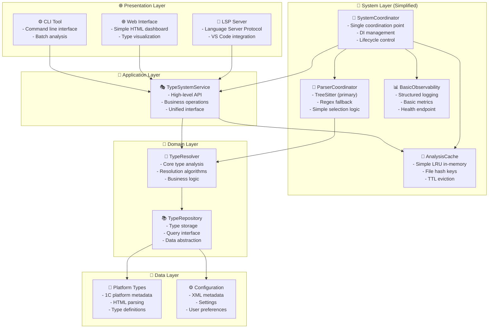

# Контекст проекта: bsl-gradual-types

## Обзор проекта

Этот репозиторий содержит проект **bsl-gradual-types**, который представляет собой систему градуальной типизации и набор инструментов для языка BSL (1С:Предприятие). Проект состоит из двух основных частей:
1.  **Ядро на Rust**: Основная логика, включающая LSP-сервер, парсеры, анализатор типов и инструменты командной строки.
2.  **Расширение для VS Code**: Клиентская часть, которая интегрирует ядро в редактор Visual Studio Code, предоставляя пользователям такие возможности, как подсветка синтаксиса, автодополнение, диагностика и многое другое.

Цель проекта — повысить надежность и качество кода, написанного на BSL, путем внедрения статического анализа и современной системы типов.

## Архитектура

Проект использует упрощенную, "правильно подобранную" (right-sized) архитектуру, основные принципы которой изложены в `docs/simplified_architecture.md`. Этот подход фокусируется на необходимых компонентах, избегая излишней сложности.

### Основные компоненты:
- **SystemCoordinator**: Единая точка координации, управляющая жизненным циклом и зависимостями.
- **AnalysisCache**: Простое кеширование в памяти (LRU) для результатов анализа.
- **ParserCoordinator**: Координатор парсинга, использующий `TreeSitter` как основной парсер и `Regex` в качестве запасного варианта.
- **BasicObservability**: Обеспечивает базовые возможности для логирования и сбора метрик.
- **TypeSystemService**: Высокоуровневый API, предоставляющий единый интерфейс для внешних клиентов (LSP, Web, CLI).
- **TypeResolver**: Ядро системы, отвечающее за анализ и разрешение типов.
- **TypeRepository**: Абстракция для хранения и получения данных о типах.

### Диаграмма упрощенной архитектуры:



## Ключевые технологии

- **Основной язык (ядро)**: Rust
- **Расширение VS Code**: TypeScript
- **Парсинг**: `tree-sitter` для BSL, `quick-xml` и `roxmltree` для XML.
- **Асинхронность**: `tokio`
- **Веб-сервер (опционально)**: `axum` с `leptos` для UI.
- **Сборка и зависимости (Rust)**: `cargo`
- **Сборка и зависимости (VS Code)**: `npm`

## Сборка и запуск

### Ядро на Rust

- **Сборка проекта**:
  ```bash
  cargo build
  ```
- **Запуск тестов**:
  ```bash
  cargo test
  ```
- **Форматирование кода**:
  ```bash
  cargo fmt
  ```
- **Линтинг (проверка кода)**:
  ```bash
  cargo clippy
  ```
- **Запуск бинарных файлов** (например, LSP-сервера):
  ```bash
  cargo run --bin lsp-server
  ```

### Расширение для VS Code

Необходимо перейти в каталог `vscode-extension`:
```bash
cd vscode-extension
```

- **Установка зависимостей**:
  ```bash
  npm install
  ```
- **Компиляция TypeScript в JavaScript**:
  ```bash
  npm run compile
  ```
- **Запуск тестов расширения**:
  ```bash
  npm test
  ```
- **Сборка пакета расширения (`.vsix`)**:
  ```bash
  vsce package
  ```

## Соглашения по разработке

Файл `CONTRIBUTING.md` содержит подробные правила и рекомендации для контрибьюторов.

- **Стиль кода**: Для Rust используется `cargo fmt`.
- **Коммиты**: Используется строгий формат сообщений коммитов, например: `feat(parser): add support for new syntax`.
- **Тестирование**: Ожидается, что новый функционал будет покрыт тестами. В проекте используются юнит-тесты, интеграционные и бенчмарки.
- **Документация**: Публичные API должны быть документированы с использованием `///` в коде Rust.
