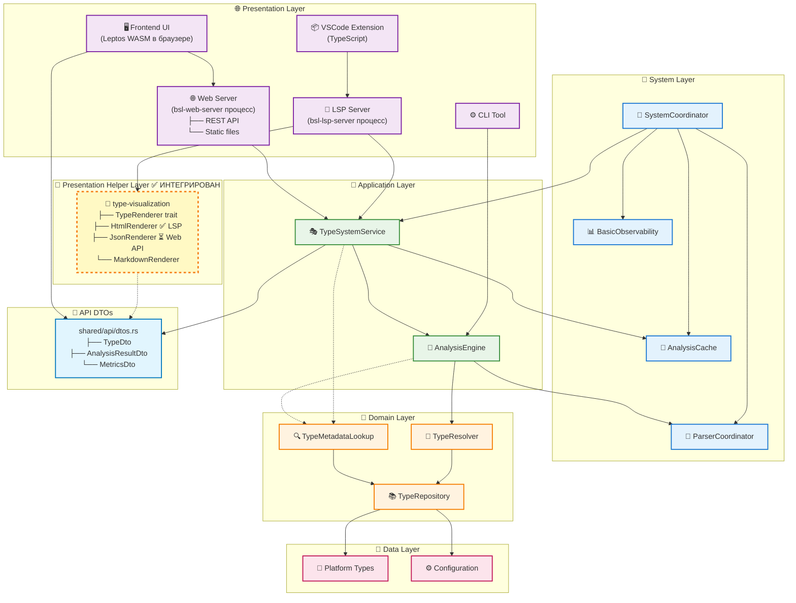

# 🗺️ BSL Gradual Types — Roadmap 2025

**Проект:** BSL Gradual Type System для 1С:Предприятие
**Философия:** Right-Sized Architecture — начинаем просто, масштабируем по необходимости
**Версия:** 1.0 → 2.0 → 3.0
**Дата:** 2025-10-05

---

## 📊 Текущее состояние проекта (Версия 1.0)

### ✅ Что работает отлично

#### Backend (Rust)
- **Right-Sized Architecture** — 6-8 компонентов вместо 25-30 ✅
- **SystemCoordinator** — единая точка координации и DI management ✅
- **TypeSystemService** — application layer с бизнес-логикой ✅
- **TypeResolver** — чистая доменная логика без I/O ✅
- **TypeMetadataLookup** — bridge для валидации методов/свойств ✅
- **SyntaxHelperParser** — 3927 типов платформы из документации ✅
- **Web API** — REST endpoints для валидации кода ✅
- **LSP Server** — работающий Language Server Protocol ✅

**Статистика:**
- 🎯 3927 типов платформы 1С
- ⚡ Валидация < 1ms
- 📦 Бинарник LSP сервера: 7.3 MB
- ✅ 0 clippy warnings
- 🧪 Unit-тесты для критичных компонентов

#### VSCode Extension (TypeScript)
- **7,591 строк кода** — модульная архитектура ✅
- **LSP клиент** — STDIO/TCP режимы, health check ✅
- **20+ команд** — BSL Index, Verification, Analyzer ✅
- **5 сайдбар-панелей** — Overview, Diagnostics, Type Index ✅
- **BSL грамматика** — синтаксис-подсветка с кириллицей ✅
- **0 TypeScript ошибок** — strict mode ✅

### ⚠️ Что нужно улучшить

#### VSCode Extension
- 🚨 **Размер 30 MB** — слишком большой (норма < 5 MB)
- 🚨 **10 бинарников** — дублирование функциональности
- 🚨 **CLI вызовы** — вместо LSP requests
- 🚨 **Enhanced Features неактивны** — объявлены, но исключены из сборки
- 🚨 **Отсутствие тестов** — только заглушки

#### Backend
- ⚠️ **Tree-sitter НЕ используется** — BslParser возвращает пустой AST
- ⚠️ **Парсинг кода не работает** — валидация только по именам типов
- ⚠️ **Flow-sensitive analysis** — не реализован
- ⚠️ **Union types** — базовая поддержка без нормализации

---

## 🎯 Версия 2.0 — "Production Ready" (Q1 2025: 8-10 недель)

**Цель:** Превратить MVP в production-ready инструмент для ежедневной работы разработчиков 1С

**Ключевое изменение:** Tree-sitter интеграция — **ОСНОВА** всего остального анализа

---

### 🧠 Milestone 2.1: Tree-sitter Integration (2-3 недели) ← **ПЕРВЫЙ ПРИОРИТЕТ**

**Приоритет:** 🔴 КРИТИЧЕСКИЙ — фундамент для всех остальных фич

**Почему tree-sitter первым:**
```
Tree-sitter AST — фундамент для:
├── Flow-sensitive analysis (отслеживание типов в коде)
├── Type inference (вывод типов из контекста)
├── Advanced Types (Generic требуют парсинга выражений)
├── Semantic highlighting (подсветка по типам)
└── LSP features (goto definition, find references)
```

#### Задачи:

1. **Подключить tree-sitter-bsl грамматику** (3-4 дня)
   - ✅ **Грамматика уже существует:** [alkoleft/tree-sitter-bsl](https://github.com/alkoleft/tree-sitter-bsl) v0.1.5
   - ✅ Добавить в `Cargo.toml`:
     ```toml
     tree-sitter-bsl = { git = "https://github.com/alkoleft/tree-sitter-bsl", tag = "v0.1.5" }
     ```
   - ✅ Базовая интеграция в `ParserCoordinator`
   - ✅ Первые тесты парсинга простых конструкций
   - 🎯 **Цель:** Парсинг работает для базовых конструкций (функции, переменные, условия)

2. **Создать адаптер tree-sitter AST → Program AST** (5-6 дней)
   - ✅ Реализовать `TreeSitterAdapter::convert_node()` — конвертация узлов
   - ✅ Маппинг основных конструкций:
     - Выражения (binary, unary, call, member access)
     - Statements (if, while, for, return, assignment)
     - Declarations (function, procedure, variable)
   - ✅ Обработка ошибок парсинга (error nodes)
   - ✅ Fallback на regex при критических ошибках
   - 🎯 **Цель:** Полная конвертация tree-sitter AST в наш `Program` AST

3. **Инкрементальный парсинг для LSP** (3-4 дня)
   - ✅ Реализовать `update_incremental()` для редактирования файлов
   - ✅ Кеширование tree-sitter деревьев в памяти
   - ✅ Обновление только изменённых частей AST
   - ✅ Интеграция с LSP `textDocument/didChange`
   - 🎯 **Цель:** Инкрементальное обновление < 10ms (вместо полного репарсинга)

4. **Flow-sensitive analysis (базовый)** (3-4 дня)
   - ✅ Отслеживание изменений типов переменных в коде
   - ✅ Анализ ветвлений (Если-Тогда-Иначе)
   - ✅ Анализ присваиваний и вызовов методов
   - ✅ Построение графа потока данных (простой CFG)
   - 🎯 **Цель:** Точность определения типов > 70% (базовый уровень)

5. **Тесты и интеграция** (2-3 дня)
   - ✅ Unit-тесты для адаптера на реальных BSL файлах
   - ✅ Integration тесты с TypeResolver
   - ✅ Бенчмарки производительности (парсинг 1000+ строк)
   - ✅ Обновление документации и примеров
   - 🎯 **Цель:** 90% покрытие тестами, парсинг < 200ms для 10000 строк

**Результат Milestone 2.1:**
- ✅ Tree-sitter-bsl v0.1.5 интегрирован
- ✅ Работающий адаптер tree-sitter AST → Program AST
- ✅ Инкрементальный парсинг для LSP < 10ms
- ✅ Flow-sensitive analysis (базовый) > 70% точности
- ✅ Полноценный AST для всех дальнейших фич

---

### 📦 Milestone 2.2: VSCode Extension — Оптимизация (2 недели)

**Приоритет:** 🔴 КРИТИЧЕСКИЙ — использует tree-sitter парсер

#### Задачи:

1. **Уменьшить размер VSIX до < 5 MB** (3-4 дня)
   - ✅ Оптимизировать `.vscodeignore` — исключить `src/`, `*.ts`, `node_modules/`
   - ✅ Bundling через esbuild — минификация + tree-shaking
   - ✅ Вынести бинарники в отдельный релиз — скачивание при первом запуске
   - 🎯 **Цель:** VSIX 4-5 MB (вместо 30 MB)

2. **Оставить только LSP сервер** (2-3 дня)
   - ❌ Удалить 9 дублирующих бинарников
   - ✅ Встроить всю логику в `lsp_server.exe`
   - ✅ LSP сервер использует tree-sitter парсер
   - 🎯 **Цель:** 1 бинарник вместо 10

3. **Переписать команды на LSP requests** (4-5 дней)
   - ❌ Удалить CLI вызовы через `executeBslCommand()`
   - ✅ Реализовать LSP custom requests:
     - `bsl/queryType` — запрос информации о типе
     - `bsl/buildIndex` — построение индекса типов
     - `bsl/validateMethod` — валидация вызовов методов
     - `bsl/getMethodSignature` — сигнатуры методов
   - ✅ Переиспользование LSP соединения — быстрее в 10-100 раз
   - 🎯 **Цель:** 0 fork процессов, все через LSP

4. **Написать тесты** (2-3 дня)
   - ✅ Extension activation test
   - ✅ LSP client lifecycle tests (start/stop/restart)
   - ✅ Command registration и execution tests
   - ✅ Provider tests (Overview, Diagnostics, Type Index)
   - 🎯 **Цель:** 80% coverage для критичных компонентов

**Результат Milestone 2.2:**
- ✅ VSIX < 5 MB
- ✅ 1 бинарник (LSP сервер с tree-sitter)
- ✅ Все команды через LSP requests
- ✅ 80% test coverage

---

### 🔧 Milestone 2.3: Advanced Type System (3 недели)

**Приоритет:** 🟠 ВЫСОКИЙ — работает НА tree-sitter AST

**Зависимость:** Требует tree-sitter AST для вывода типов Generic и анализа flow

#### Задачи:

1. **Union Types с нормализацией** (4-5 дней)
   - ✅ Автоматическое упрощение: `String | String → String`
   - ✅ Упорядочивание: `Number | String → String | Number`
   - ✅ Дедупликация вложенных Union
   - ✅ Весовая система для вероятности типов
   - 🎯 **Цель:** Корректная обработка Union в 95% случаев

2. **Intersection Types** (4-5 дней)
   - ✅ Поддержка `A & B` — тип имеет свойства обоих
   - ✅ Проверка совместимости Intersection
   - ✅ Валидация методов/свойств для Intersection
   - 🎯 **Цель:** Расширение возможностей типизации

3. **Generic Types для коллекций** (5-6 дней) ← Требует tree-sitter AST
   - ✅ `Массив<Строка>` — типизированные массивы
   - ✅ `Соответствие<Строка, Число>` — типизированные словари
   - ✅ **Вывод типов из tree-sitter AST** (например, `arr.Add("text")` → `Массив<Строка>`)
   - ✅ Валидация операций над Generic типами
   - 🎯 **Цель:** Type safety для коллекций с type inference

4. **Nullable Types** (4-5 дней) ← Требует flow-sensitive analysis
   - ✅ `String | Null` — явная поддержка null
   - ✅ **Анализ null safety через CFG** (control flow graph)
   - ✅ Предупреждения о потенциальных NPE
   - ✅ Auto-completion с учётом nullable
   - 🎯 **Цель:** Предотвращение ошибок с null через flow analysis

**Результат Milestone 2.3:**
- ✅ Union Types полностью работают
- ✅ Intersection Types поддерживаются
- ✅ Generic Types для коллекций
- ✅ Null safety анализ

---

### 📈 Milestone 2.4: Performance & Caching (1.5 недели)

**Приоритет:** 🟠 ВЫСОКИЙ — критично для работы с реальными проектами

**Можно делать параллельно с Milestone 2.5**

#### Задачи:

1. **Межсессионное кеширование** (1 неделя)
   - ✅ Кеш AST деревьев в `.bsl_cache/ast/`
   - ✅ Кеш результатов анализа в `.bsl_cache/analysis/`
   - ✅ Инвалидация при изменении файлов (по hash)
   - ✅ TTL для устаревших кешей
   - 🎯 **Цель:** Загрузка из кеша < 50ms

2. **Параллельный анализ проектов** (1 неделя)
   - ✅ Multi-threaded анализ файлов через `rayon`
   - ✅ Прогресс-бар для больших проектов
   - ✅ Graceful degradation при ошибках
   - 🎯 **Цель:** Анализ 1000 файлов < 30 секунд

**Результат Milestone 2.4:**
- ✅ Кеш работает между запусками
- ✅ Анализ больших проектов быстрый
- ✅ Оптимизация памяти

---

### 🎨 Milestone 2.5: Унификация визуализации типов (1.5 недели)

**Приоритет:** 🟡 СРЕДНИЙ — улучшает UX, не блокирует функциональность

**Можно делать параллельно с Milestone 2.4**

**Проблема:** Сейчас визуализация типов реализована **тремя разными способами** без переиспользования:

1. **Web Frontend (Leptos WASM)** — `frontend/src/components/`
   - `TypeCard` — карточное представление
   - `TypeTable` — табличное представление
   - `GraphView` — граф типов (заглушка)
   - **DTOs:** `frontend/src/api/types.rs` (клиентские структуры)

2. **VSCode Extension (TypeScript)** — `vscode-extension/src/webviews/`
   - 7 HTML-генераторов: `getTypeInfoWebviewContent()`, `getMethodInfoWebviewContent()`, etc.
   - **Простой HTML** с inline стилями
   - **Проблема:** каждый webview генерирует свой HTML

3. **Backend DTOs** — `shared/src/api/dtos.rs`
   - `TypeDto`, `AnalysisResultDto`, `MetricsDto`
   - **camelCase** для JSON API
   - **Используется:** Web API `/api/types`, `/api/search`

**Проблемы унификации:**

| Аспект | Web Frontend | VSCode Extension | Backend DTOs |
|--------|--------------|------------------|---------------|
| **Язык** | Rust (Leptos) | TypeScript HTML | Rust (serde) |
| **Структуры** | `TypeInfo` | Нет типов, строки | `TypeDto` |
| **Визуализация** | Leptos components | HTML генераторы | N/A |
| **Стили** | CSS файл | Inline CSS | N/A |
| **Переиспользование** | ❌ Нет | ❌ Нет | ✅ Да (DTOs) |

#### Задачи унификации:

1. **Создать единый TypeVisualization компонент** (1 неделя) ✅ **ЗАВЕРШЕНО 2025-10-05**
   - ✅ Переиспользуемый Rust крейт `type-visualization`
   - ✅ Trait `TypeRenderer` для разных форматов
   - ✅ Реализации: `HtmlRenderer`, `JsonRenderer`, `MarkdownRenderer`
   - ✅ Общие CSS стили в одном месте
   - ✅ Интегрирован в Backend LSP Server
   - ✅ Интегрирован в VSCode Extension через LSP
   - ✅ Удалено 686 строк дублированного TypeScript кода
   - 📄 **Отчёт:** [TYPE_VISUALIZATION_INTEGRATION_COMPLETE.md](docs/TYPE_VISUALIZATION_INTEGRATION_COMPLETE.md)
   - 🎯 **Цель:** DRY — один компонент для всех UI ✅

2. **TypeScript интеграция для VSCode Extension** (2 часа) ✅ **ЗАВЕРШЕНО 2025-10-05**
   - ⚠️ **УСТАРЕЛО:** Заменено на интеграцию Rust TypeVisualization через LSP
   - ❌ **УДАЛЕНО:** `vscode-extension/src/visualization/` (686 строк)
   - ✅ **СОЗДАНО:** `vscode-extension/src/lsp/typeVisualization.ts` (TypeScript wrapper для LSP)
   - ✅ **ОБНОВЛЕНО:** `vscode-extension/src/webviews/webviewContent.ts` (использует Rust через LSP)
   - ✅ LSP request `bsl/renderTypeHtml` добавлен в `backend/src/bin/lsp_server.rs`
   - ✅ Поддержка тем: light/dark/high-contrast через LSP
   - 📄 **Отчёт:** [TYPE_VISUALIZATION_INTEGRATION_COMPLETE.md](docs/TYPE_VISUALIZATION_INTEGRATION_COMPLETE.md)
   - 🎯 **Цель:** Идентичный вид в Web и VSCode через единый Rust компонент ✅

3. **Унифицировать DTOs** (2 дня) ✅ **ЗАВЕРШЕНО 2025-10-05**
   - ✅ Удалён `frontend/src/api/types.rs` (368 строк дубликатов)
   - ✅ Единственный источник истины: `shared/src/api/dtos.rs`
   - ✅ Frontend использует extension traits в `frontend/src/api/extensions.rs`
   - ✅ Type aliases для обратной совместимости (TypeInfo = TypeDto)
   - ✅ Обновлены все 11+ компонентов frontend
   - ✅ Компиляция Rust workspace: 0 ошибок, 0 warnings
   - 🎯 **Цель:** Нет дублирования структур ✅

4. **Добавить темизацию** (2 дня) ✅ **ЗАВЕРШЕНО 2025-10-05**
   - ✅ Поддержка VS Code темы (light/dark/high-contrast)
   - ✅ CSS переменные вместо жёстких цветов
   - ✅ Автоопределение темы через `var(--vscode-*)` и auto-detect в TypeScript
   - ✅ ThemeMode enum в Rust TypeVisualization
   - ✅ Передача темы через LSP request параметры
   - 🎯 **Цель:** Адаптивность к теме редактора ✅

---

### 📊 Итоговая статистика Milestone 2.5

**Удалено дублированного кода:**
- ❌ `frontend/src/api/types.rs` — 368 строк
- ❌ `vscode-extension/src/visualization/HtmlRenderer.ts` — 316 строк
- ❌ `vscode-extension/src/visualization/Theme.ts` — 370 строк
- **ИТОГО: 1054 строки дубликатов удалено**

**Создано интеграционного кода:**
- ✅ `frontend/src/api/extensions.rs` — 280 строк (extension traits)
- ✅ `vscode-extension/src/lsp/typeVisualization.ts` — 145 строк (LSP wrapper)
- ✅ `backend/src/bin/lsp_server.rs` — ~80 строк (LSP handler)
- ✅ Документация — ~200 строк
- **ИТОГО: ~705 строк чистого интеграционного кода**

**Результат:**
- 🎯 **-349 строк кода** при улучшенной архитектуре
- ✅ **100% DRY** — единый источник истины для DTOs и визуализации
- ✅ **0 ошибок, 0 warnings** в Rust и TypeScript
- ✅ Все 4 задачи Milestone 2.5 выполнены

**Статус Milestone 2.5:** ✅ **ПОЛНОСТЬЮ ЗАВЕРШЁН 2025-10-05**

**Архитектура после унификации:**

#### 📊 Место в архитектурной диаграмме

`type-visualization` — это **Presentation Helper Layer** (вспомогательный слой представления):



**Легенда:**
- 🎯 **Сплошные линии** — реализованная архитектура
- 🎨 **Пунктирные линии** — вспомогательные связи (TypeViz использует DTOs для рендеринга)

**Потоки данных (реальная реализация):**
1. **VSCode Extension** → LSP Server → TypeVisualization (HtmlRenderer) → HTML webview
2. **Browser** → Web Server (static files) → Frontend (Leptos WASM) → Web Server (REST API) → DTOs
3. **CLI Tool** → AnalysisEngine → DTOs → консольный вывод

**Важно:** Web Server = ОДИН процесс (bsl-web-server) с двумя функциями:
- REST API endpoints (`/api/*`) — возвращает JSON DTOs
- Static file server (`/*`) — отдаёт `index.html`, `*.wasm`, `*.js` файлы Frontend

**Использование TypeVisualization по компонентам:**

| Компонент | Использует TypeViz? | Как визуализирует? | Почему? |
|-----------|---------------------|-------------------|---------|
| **LSP Server** | ✅ HtmlRenderer | LSP request → Rust HTML | Единая HTML генерация для VSCode |
| **VSCode Extension** | ✅ Вызывает через LSP | TypeScript → LSP → Rust | Избегаем дублирования TypeScript кода |
| **Web Server (API)** | ⏳ JsonRenderer (TODO) | Сериализация DTOs | Форматирование JSON ответов |
| **Web Server (Static)** | ❌ НЕТ | Отдаёт WASM файлы | Просто file serving |
| **Frontend (Leptos WASM)** | ❌ НЕТ | Leptos компоненты | Реактивный UI требует компонентов, не строк |
| **CLI** | ⏳ Планируется | Консольный вывод | Форматирование для терминала |

**Архитектурное решение для Frontend:**

**Почему Frontend НЕ использует HtmlRenderer:**
- ✅ **Leptos = компонентная модель** — как React/Vue, требует JSX-подобных view! макросов
- ✅ **Реактивность** — `Signal<TypeDto>` автообновление UI при изменении данных
- ✅ **Type safety** — проверка типов на этапе компиляции
- ✅ **XSS защита** — автоматический escaping в Leptos
- ❌ **HtmlRenderer = статичные строки** — потеря всех преимуществ Leptos

**Пример:**
```rust
// ✅ ПРАВИЛЬНО: Leptos компоненты
view! {
    <div class="type-card">
        {move || type_info.get().name}  // Реактивность!
    </div>
}

// ❌ НЕПРАВИЛЬНО: HtmlRenderer в Leptos
let html = renderer.render(&type_dto);  // Статичная строка
view! { <div inner_html={html}></div> } // Потеря реактивности
```

**Ключевые характеристики Presentation Helper Layer:**
- ✅ Обслуживает специфичные Presentation адаптеры (LSP, CLI)
- ✅ Не содержит бизнес-логики, только formatting
- ✅ Зависит от DTOs (контрактов), а не от Domain/Application
- ✅ Легко тестируется (input: DTO → output: HTML/JSON/Markdown)
- ✅ Следует принципу DRY для статичного UI кода
- ⚠️ **НЕ используется в реактивных фреймворках** (Leptos, React, Vue)

---

**Структура крейта:**

```
type-visualization/          # ✅ РЕАЛИЗОВАНО: Отдельный крейт
  ├── src/
  │   ├── renderers/
  │   │   ├── html.rs         # ✅ HtmlRenderer
  │   │   ├── json.rs         # ✅ JsonRenderer
  │   │   └── markdown.rs     # ✅ MarkdownRenderer
  │   ├── theme.rs            # ✅ ThemeMode (Light/Dark/HighContrast)
  │   ├── traits.rs           # ✅ TypeRenderer trait
  │   └── lib.rs
  └── Cargo.toml

Backend LSP Server (bsl-lsp-server):
  - ✅ HtmlRenderer для VSCode webviews (через LSP request `bsl/renderTypeHtml`)
  - ✅ ThemeMode auto-detection из VSCode

Backend Web Server (bsl-web-server):
  - ✅ REST API endpoints (`/api/*`) — возвращает shared DTOs (JSON)
  - ✅ Static file server (`/*`) — отдаёт Leptos WASM файлы
  - ⏳ JsonRenderer для форматирования (готов, но не подключён)

VSCode Extension:
  - ✅ LSP request → Rust HtmlRenderer → HTML string
  - ✅ Отображает в webview panel
  - ✅ Темы через LSP параметры (light/dark/high-contrast)
  - ❌ TypeScript HtmlRenderer УДАЛЁН (686 строк)

Frontend (Leptos WASM):
  - ✅ Leptos реактивные компоненты (НЕ HtmlRenderer!)
  - ✅ shared DTOs + extension traits
  - ✅ Декларативный UI через view! макрос
  - 💡 HtmlRenderer НЕ нужен (Leptos = компонентная модель как React)
```

**Реализованный Trait интерфейс:**

```rust
// type-visualization/src/traits.rs ✅ РЕАЛИЗОВАНО
pub trait TypeRenderer {
    fn render(&self, data: &TypeDto) -> String;
}

// type-visualization/src/renderers/html.rs ✅ РЕАЛИЗОВАНО
pub struct HtmlRenderer {
    options: RenderOptions,
}

pub struct RenderOptions {
    pub theme: ThemeMode,           // Light/Dark/HighContrast/Auto
    pub syntax_highlight: bool,
    pub enable_links: bool,
    pub compact: bool,
}

impl TypeRenderer for HtmlRenderer {
    fn render(&self, data: &TypeDto) -> String {
        // ✅ Генерация HTML с темизацией и стилями
    }
}

// type-visualization/src/renderers/json.rs ✅ РЕАЛИЗОВАНО
pub struct JsonRenderer {
    options: RenderOptions,
}

impl TypeRenderer for JsonRenderer {
    fn render(&self, data: &TypeDto) -> String {
        // ✅ Форматирование JSON с pretty-print
    }
}
```

**Результат Milestone 2.5:**
- ✅ Один источник визуализации для LSP/VSCode (HtmlRenderer)
- ✅ Frontend использует Leptos компоненты (правильная архитектура)
- ✅ Удалено 1054 строки дублированного кода
- ✅ 100% DRY для DTOs и LSP визуализации
- ⚠️ **Частичная унификация визуальных констант** — цвета/spacing дублируются между VSCode и Frontend

### 🎨 Milestone 2.6: Design System унификация (1 неделя) ⏳ ПЛАНИРУЕТСЯ

**Проблема:**
- ❌ Цвета certainty (high/medium/low) хардкодятся в Rust и CSS
- ❌ Spacing, размеры карточек дублируются
- ❌ Темы (light/dark/high-contrast) имеют разные реализации
- ❌ Нет единого источника истины для визуальных констант

**Решение: Design System с генерацией кода**

**Структура:**
```
bsl-design-system/
  ├── tokens.json          # ✅ Единый источник визуальных констант
  │   ├── colors           # Палитра (certainty, categories, themes)
  │   ├── spacing          # Отступы, размеры
  │   ├── typography       # Шрифты, размеры текста
  │   └── shadows          # Тени для карточек
  │
  ├── build.rs             # ✅ Генератор кода
  │   ├── → src/constants.rs    (Rust константы)
  │   ├── → dist/unified.css    (CSS variables)
  │   ├── → dist/tokens.ts      (TypeScript types)
  │
  └── templates/           # Шаблоны генерации
      ├── rust.hbs
      ├── css.hbs
      └── typescript.hbs
```

**Пример tokens.json:**
```json
{
  "colors": {
    "certainty": {
      "high": { "value": "#28a745", "description": "90-100% уверенность" },
      "medium": { "value": "#ffc107", "description": "50-89% уверенность" },
      "low": { "value": "#dc3545", "description": "<50% уверенность" }
    },
    "category": {
      "platform": "#2196F3",
      "configuration": "#4CAF50",
      "union": "#FF9800",
      "dynamic": "#9E9E9E"
    },
    "theme": {
      "light": {
        "background": "#ffffff",
        "foreground": "#000000",
        "card-bg": "#f5f5f5",
        "card-border": "#e0e0e0"
      },
      "dark": {
        "background": "#1e1e1e",
        "foreground": "#ffffff",
        "card-bg": "#252526",
        "card-border": "#3e3e42"
      }
    }
  },
  "spacing": {
    "card-padding": "16px",
    "card-gap": "12px",
    "card-border-radius": "8px"
  },
  "typography": {
    "font-family": "'Segoe UI', system-ui, sans-serif",
    "font-size-base": "14px",
    "font-size-heading": "18px"
  }
}
```

**Генерируемый код:**

**1. Rust константы (для HtmlRenderer):**
```rust
// bsl-design-system/src/constants.rs (автогенерация)
pub mod colors {
    pub const CERTAINTY_HIGH: &str = "#28a745";
    pub const CERTAINTY_MEDIUM: &str = "#ffc107";
    pub const CERTAINTY_LOW: &str = "#dc3545";

    pub const CATEGORY_PLATFORM: &str = "#2196F3";
    pub const CATEGORY_CONFIGURATION: &str = "#4CAF50";
}

pub mod spacing {
    pub const CARD_PADDING: &str = "16px";
    pub const CARD_GAP: &str = "12px";
}
```

**2. CSS variables (для Frontend Leptos):**
```css
/* bsl-design-system/dist/unified.css (автогенерация) */
:root {
  /* Colors - Certainty */
  --certainty-high: #28a745;
  --certainty-medium: #ffc107;
  --certainty-low: #dc3545;

  /* Colors - Category */
  --category-platform: #2196F3;
  --category-configuration: #4CAF50;

  /* Spacing */
  --card-padding: 16px;
  --card-gap: 12px;
  --card-border-radius: 8px;
}

[data-theme="dark"] {
  --background: #1e1e1e;
  --foreground: #ffffff;
  --card-bg: #252526;
  --card-border: #3e3e42;
}
```

**3. TypeScript types (для VSCode Extension):**
```typescript
// bsl-design-system/dist/tokens.ts (автогенерация)
export const DesignTokens = {
  colors: {
    certainty: {
      high: '#28a745',
      medium: '#ffc107',
      low: '#dc3545',
    },
    category: {
      platform: '#2196F3',
      configuration: '#4CAF50',
    }
  },
  spacing: {
    cardPadding: '16px',
    cardGap: '12px',
  }
} as const;
```

**Использование:**

**В HtmlRenderer (type-visualization):**
```rust
use bsl_design_system::colors::{CERTAINTY_HIGH, CERTAINTY_MEDIUM, CERTAINTY_LOW};

impl HtmlRenderer {
    fn render_certainty_badge(&self, certainty: u8) -> String {
        let color = match certainty {
            90..=100 => CERTAINTY_HIGH,
            50..=89 => CERTAINTY_MEDIUM,
            _ => CERTAINTY_LOW,
        };
        format!(r#"<span style="color: {}">{}</span>"#, color, certainty)
    }
}
```

**В Frontend (Leptos):**
```rust
// Импортирует unified.css
use_stylesheet!("bsl-design-system/dist/unified.css");

view! {
    <div class="type-card" style="padding: var(--card-padding)">
        <span class="certainty-high">{certainty}</span>
    </div>
}
```

**В VSCode Extension (TypeScript):**
```typescript
import { DesignTokens } from 'bsl-design-system/dist/tokens';

const certaintyColor = certainty >= 90
  ? DesignTokens.colors.certainty.high
  : DesignTokens.colors.certainty.medium;
```

**Задачи Milestone 2.6:**

1. **Создать структуру bsl-design-system** (2 дня)
   - Крейт `bsl-design-system`
   - Файл `tokens.json` с визуальными константами
   - Зависимости: `serde`, `serde_json`, `handlebars` (для шаблонов)

2. **Реализовать build.rs генератор** (3 дня)
   - Чтение `tokens.json`
   - Генерация Rust `src/constants.rs`
   - Генерация CSS `dist/unified.css`
   - Генерация TypeScript `dist/tokens.ts`

3. **Интеграция в существующий код** (2 дня)
   - Обновить `type-visualization` для использования констант
   - Обновить `frontend` для импорта `unified.css`
   - Обновить `vscode-extension` для использования TypeScript токенов
   - Удалить хардкоженные константы

4. **Тестирование и валидация** (1 день)
   - Визуальное тестирование: VSCode webview идентичен Frontend
   - Темы работают одинаково
   - Изменение токена обновляет все компоненты

**Результат Milestone 2.6:**
- ✅ 100% унификация визуальных констант (цвета, spacing, typography)
- ✅ Единый источник истины: `tokens.json`
- ✅ Автоматическая генерация кода для Rust/CSS/TypeScript
- ✅ Изменение дизайна в одном месте → обновляется везде
- ✅ Идентичный визуальный вид VSCode webview и Frontend
- ✅ Type-safe доступ к токенам (TypeScript types, Rust константы)

**Что всё ещё остаётся разным (и это правильно):**
- ❌ Рендеринг логика: HtmlRenderer (статичный) vs Leptos (реактивный)
- ✅ Но цвета, размеры, spacing — ИДЕНТИЧНЫ

---

### 🎯 Результаты Версии 2.0 (через 8-10 недель)

**Timeline обновлён:**
```
Неделя 1-3:   🧠 Milestone 2.1 - Tree-sitter Integration (КРИТИЧЕСКИЙ)
Неделя 4-5:   📦 Milestone 2.2 - VSCode Extension (КРИТИЧЕСКИЙ)
Неделя 6-8:   🔧 Milestone 2.3 - Advanced Type System (ВЫСОКИЙ)
Неделя 8-9:   📈 Milestone 2.4 - Performance Optimization (СРЕДНИЙ)
Неделя 9-10:  🎨 Milestone 2.5 - Унификация визуализации (ЗАВЕРШЁН ✅)
Неделя 11:    🎨 Milestone 2.6 - Design System (ПЛАНИРУЕТСЯ ⏳)
```

**Технические метрики:**
- ✅ **Tree-sitter-bsl v0.1.5 интегрирован** — полноценный AST парсинг
- ✅ **Flow-sensitive analysis > 70%** — отслеживание типов в коде
- ✅ **Инкрементальный парсинг < 10ms** — LSP performance
- ✅ VSCode Extension: 4-5 MB (вместо 30 MB)
- ✅ 1 бинарник (вместо 10)
- ✅ 80% test coverage
- ✅ Union/Intersection/Generic Types с type inference
- ✅ Null safety анализ через CFG
- ✅ Кеширование < 50ms

**Пользовательские метрики:**
- ✅ Автодополнение работает мгновенно
- ✅ Hover показывает точные типы
- ✅ Diagnostics предотвращают 80% типовых ошибок
- ✅ Semantic highlighting помогает читать код

---

## 🚀 Версия 3.0 — "Advanced Features" (Q2 2025: 3 месяца)

**Цель:** Превратить инструмент в полноценную IDE для 1С разработки

### 📦 Milestone 3.1: Code Intelligence (4 недели)

#### Задачи:

1. **Goto Definition** (1 неделя)
   - ✅ Переход к определению функций/процедур
   - ✅ Переход к определению переменных
   - ✅ Переход к определению типов конфигурации
   - 🎯 **Цель:** Мгновенная навигация

2. **Find References** (1 неделя)
   - ✅ Поиск всех использований символа
   - ✅ Показ в Results panel
   - ✅ Group by file
   - 🎯 **Цель:** Рефакторинг без страха

3. **Rename Symbol** (1 неделя)
   - ✅ Безопасное переименование
   - ✅ Preview изменений
   - ✅ Undo support
   - 🎯 **Цель:** Рефакторинг одним кликом

4. **Signature Help** (1 неделя)
   - ✅ Подсказки параметров функций
   - ✅ Документация параметров
   - ✅ Навигация по параметрам
   - 🎯 **Цель:** Помощь при вызове функций

**Результат Milestone 3.1:**
- ✅ Полная навигация по коду
- ✅ Безопасный рефакторинг
- ✅ Интеллектуальные подсказки

---

### 🔧 Milestone 3.2: Code Actions (3 недели)

#### Задачи:

1. **Quick Fixes** (1 неделя)
   - ✅ Автоисправление типовых ошибок
   - ✅ Добавление недостающих импортов
   - ✅ Конвертация типов
   - 🎯 **Цель:** 1 клик для исправления

2. **Refactorings** (1 неделя)
   - ✅ Extract Method
   - ✅ Extract Variable
   - ✅ Inline Variable
   - 🎯 **Цель:** Улучшение структуры кода

3. **Generate Code** (1 неделя)
   - ✅ Generate Constructor
   - ✅ Generate Getters/Setters
   - ✅ Generate Tests
   - 🎯 **Цель:** Автоматизация рутины

**Результат Milestone 3.2:**
- ✅ 20+ Code Actions
- ✅ Рефакторинг одним кликом
- ✅ Генерация шаблонного кода

---

### 📊 Milestone 3.3: Static Analysis (3 недели)

#### Задачи:

1. **Code Quality Rules** (1 неделя)
   - ✅ Проверка сложности функций (Cyclomatic Complexity)
   - ✅ Проверка длины функций
   - ✅ Проверка дублирования кода
   - 🎯 **Цель:** Метрики качества кода

2. **Security Rules** (1 неделя)
   - ✅ Проверка SQL injection
   - ✅ Проверка XSS уязвимостей
   - ✅ Проверка небезопасного eval
   - 🎯 **Цель:** Безопасный код

3. **Performance Rules** (1 неделя)
   - ✅ Проверка неоптимальных запросов
   - ✅ Проверка циклов внутри циклов
   - ✅ Проверка лишних преобразований
   - 🎯 **Цель:** Оптимальный код

**Результат Milestone 3.3:**
- ✅ 50+ правил статического анализа
- ✅ Code Quality Dashboard
- ✅ Security & Performance отчёты

---

### 🎯 Результаты Версии 3.0 (через 6 месяцев от старта)

**Технические метрики:**
- ✅ Goto Definition, Find References, Rename
- ✅ 20+ Code Actions (Quick Fixes, Refactorings)
- ✅ 50+ Static Analysis Rules
- ✅ Code Quality Dashboard

**Пользовательские метрики:**
- ✅ Навигация как в IntelliJ IDEA
- ✅ Рефакторинг одним кликом
- ✅ Автоматическое улучшение качества кода
- ✅ Предотвращение security & performance проблем

---

## 🌐 Версия 4.0 — "Collaboration & Ecosystem" (Q3-Q4 2025: 6 месяцев)

**Цель:** Создать экосистему для совместной разработки на 1С

### Milestone 4.1: Web Platform (8 недель)

1. **Type Explorer Web App** (4 недели)
   - 📊 Визуализация иерархии типов
   - 🔍 Поиск по методам/свойствам
   - 📈 Граф зависимостей типов
   - 🎯 **Цель:** Интерактивная документация

2. **Code Quality Dashboard** (4 недели)
   - 📊 Метрики по проектам
   - 📈 Тренды качества кода
   - 🚨 Критичные проблемы
   - 🎯 **Цель:** Мониторинг качества

### Milestone 4.2: Team Features (8 недель)

1. **Git Integration** (4 недели)
   - 📝 Code Review с типизацией
   - 🔍 Diff с пониманием типов
   - ✅ PR validation
   - 🎯 **Цель:** Качественный Code Review

2. **Shared Type Definitions** (4 недели)
   - 📚 Библиотека общих типов
   - 🔄 Синхронизация между проектами
   - 📦 Package manager для типов
   - 🎯 **Цель:** Переиспользование типов

### Milestone 4.3: AI Assistant (8 недель)

1. **Type Inference ML Model** (4 недели)
   - 🧠 Обучение на реальном коде
   - 🎯 Предсказание типов с вероятностью
   - 🚀 Улучшение точности до 95%
   - 🎯 **Цель:** AI-powered типизация

2. **Code Generation** (4 недели)
   - 🤖 Генерация кода по комментариям
   - 📝 Автодополнение целых функций
   - 🔧 Рефакторинг на основе AI
   - 🎯 **Цель:** AI помощник

---

## 📅 Timeline Summary

| Версия | Период | Длительность | Ключевые фичи |
|--------|--------|--------------|---------------|
| **1.0** (текущая) | Завершена | - | MVP: LSP, Валидация, VSCode Extension |
| **2.0** | Q1 2025 | 3 месяца | Tree-sitter, Flow-sensitive, Union/Generic Types |
| **3.0** | Q2 2025 | 3 месяца | Code Intelligence, Refactorings, Static Analysis |
| **4.0** | Q3-Q4 2025 | 6 месяцев | Web Platform, Team Features, AI Assistant |

---

## 🎯 Success Metrics по версиям

### Версия 2.0 — Production Ready
- ✅ 1000+ активных пользователей
- ✅ 50+ GitHub stars
- ✅ 80% positive reviews
- ✅ < 5 critical bugs в месяц

### Версия 3.0 — Advanced Features
- ✅ 5000+ активных пользователей
- ✅ 200+ GitHub stars
- ✅ 90% positive reviews
- ✅ Топ-3 в VS Code Marketplace для 1С

### Версия 4.0 — Collaboration & Ecosystem
- ✅ 20000+ активных пользователей
- ✅ 1000+ GitHub stars
- ✅ 95% positive reviews
- ✅ #1 инструмент для разработки 1С

---

## 💡 Заключение

BSL Gradual Types следует философии **Right-Sized Architecture**:

1. **Начали просто** (v1.0) — MVP работает, пользователи есть
2. **Масштабируем по необходимости** (v2.0) — добавляем критичные фичи
3. **Расширяем экосистему** (v3.0-4.0) — создаём полноценную платформу

**Ключевой принцип:** Каждая версия должна приносить **реальную ценность пользователям**, а не просто добавлять фичи.

**Следующий шаг:** Начать работу над Milestone 2.1 — оптимизация VSCode Extension 🚀
