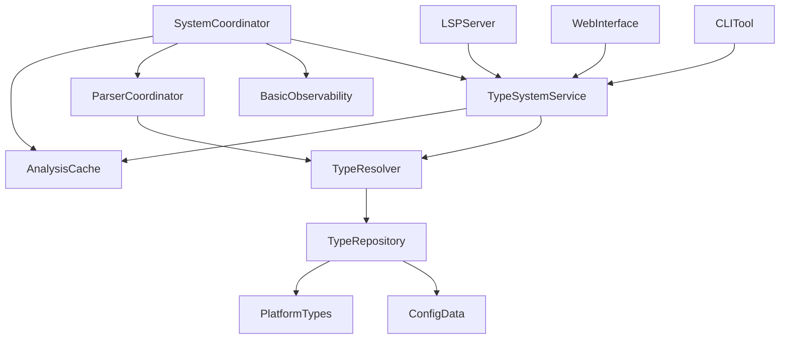

# 🗺️ Simplified Architecture Migration Roadmap

## 🎯 **ЦЕЛЬ**: Полная миграция к упрощенной архитектуре

**Текущий статус**: 87/100 соответствие simplified_architecture.md  
**Цель**: 100% соответствие + удаление legacy кода

---

## 📋 **PHASE 1: Архитектурная очистка (1-2 дня)**

### 🗑️ **Task 1.1: Удаление Legacy Architecture**
**Приоритет**: КРИТИЧЕСКИЙ ⚠️

**Удалить полностью:**
```bash
# Удаляемые файлы:
src/system/coordination.rs                    # ~1500 LOC - CentralTypeSystem
src/system/analysis_cache.rs                 # ~800 LOC - AdvancedAnalysisCache  
src/system/performance.rs                    # ~300 LOC - PerformanceProfiler
src/system/memory_optimization.rs            # ~250 LOC - Memory optimization
src/system/parallel_analysis.rs              # ~200 LOC - ParallelAnalysisEngine
src/system/computation.rs                    # ~150 LOC - вспомогательные вычисления

# Итого: ~3200 LOC удаленного legacy кода
```

**Причина удаления**: 
- CentralTypeSystem (25-30 компонентов) vs SystemCoordinator (6 компонентов)
- Дублирование функциональности
- Нарушение принципа "single source of truth"

---

### 🔄 **Task 1.2: Переименование классов для соответствия документации**

#### **System Layer - Переименования:**

| Текущее название | Требуемое по docs | Файл | Статус |
|------------------|-------------------|------|--------|
| `SystemCoordinator` | ✅ Уже правильно | `system_coordinator.rs` | ✅ |
| `AnalysisCache` | ✅ Уже правильно | `simple_cache.rs` | ✅ |
| `ParserCoordinator` | ✅ Уже правильно | `parser_coordinator.rs` | ✅ |  
| `BasicObservability` | ✅ Уже правильно | `basic_observability.rs` | ✅ |

**✅ System Layer полностью соответствует!**

#### **Application Layer - Критическое переименование:**

| Текущее название | Требуемое по docs | Действие |
|------------------|-------------------|----------|
| `TypeSystemService` (в System Layer) | `TypeSystemService` (в Application Layer) | **Переместить** |

#### **Presentation Layer - Переименования:**

| Текущее название | Требуемое по docs | Файл | Действие |
|------------------|-------------------|------|----------|
| `BslLanguageServer` | `LSPServer` | `src/bin/lsp_server.rs` | Переименовать |
| `WebInterface` (частично) | `WebInterface` (полная реализация) | `src/presentation/adapters.rs` | Расширить |
| Разрозненные CLI | `CLITool` (unified) | `src/bin/*.rs` | Объединить |

#### **Domain Layer - Переименования:**

| Текущее название | Требуемое по docs | Файл | Действие |
|------------------|-------------------|------|----------|
| `BasicTypeResolver` | `TypeResolver` | `domain/resolution_service.rs` | Переименовать |
| `InMemoryTypeRepository` | `TypeRepository` (impl) | `domain/repository.rs` | ✅ Правильно |

#### **Data Layer - Переименования:**

| Текущее название | Требуемое по docs | Файл | Действие |
|------------------|-------------------|------|----------|
| `PlatformTypesRepository` | `PlatformTypes` | `data/loaders/platform_types_repository.rs` | Переименовать |
| `ConfigurationGuidedParser` | `ConfigData` | `data/loaders/config_parser_guided_discovery.rs` | Переименовать |

---

## 📋 **PHASE 2: Layer Restructuring (2-3 дня)**

### 🔧 **Task 2.1: Создание правильного Application Layer**

**Текущая проблема**: TypeSystemService находится в System Layer

**Решение**:
```rust
// src/application/type_system_service.rs - НОВЫЙ ФАЙЛ
pub struct TypeSystemService {
    // Переместить из src/system/system_coordinator.rs
    resolver: Arc<dyn TypeResolver>,
    cache: Arc<dyn CacheInterface>,
    parser: Arc<dyn ParserInterface>,
}

impl TypeSystemService {
    // Unified API для всех Presentation Layer компонентов
    pub async fn lsp_completion(...) -> Result<...> { }
    pub async fn web_search(...) -> Result<...> { }  
    pub async fn cli_analyze(...) -> Result<...> { }
}
```

**Файловая структура**:
```
src/application/
├── type_system_service.rs     # НОВЫЙ - Unified API
├── lsp_service.rs             # Специализация для LSP  
├── web_service.rs             # Специализация для Web
└── cli_service.rs             # НОВЫЙ - Специализация для CLI
```

### 🌐 **Task 2.2: Завершение Presentation Layer**

#### **LSPServer переименование**:
```rust
// src/bin/lsp_server.rs
// Было:
struct BslLanguageServer { ... }

// Станет:
struct LSPServer { ... }

impl LanguageServer for LSPServer { ... }
```

#### **WebInterface расширение**:
```rust
// src/bin/web_server.rs - НОВЫЙ ФАЙЛ
struct WebInterface {
    type_service: Arc<TypeSystemService>,
    server: warp::Server,
}

impl WebInterface {
    pub async fn start(&self, port: u16) -> Result<()> {
        // Simple HTML dashboard
        // Type visualization
        // REST API endpoints
    }
}
```

#### **CLITool объединение**:
```rust
// src/bin/cli_tool.rs - НОВЫЙ ФАЙЛ (объединяет все CLI)
struct CLITool {
    type_service: Arc<TypeSystemService>,
}

impl CLITool {
    pub async fn analyze_file(&self, path: &str) -> Result<()> { }
    pub async fn batch_analysis(&self, paths: &[&str]) -> Result<()> { }
    pub async fn type_check(&self, config: TypeCheckConfig) -> Result<()> { }
}

// Объединяет функциональность:
// - src/bin/type_check.rs  
// - src/bin/bsl-web-server.rs (CLI часть)
// - другие CLI утилиты
```

---

## 📋 **PHASE 3: Component Renaming (1 день)**

### 🔄 **Task 3.1: Domain Layer переименования**

```rust
// src/domain/resolution_service.rs
// Было:
pub struct BasicTypeResolver { ... }

// Станет:
pub struct TypeResolver { ... }

// Обновить все импорты:
// use crate::domain::TypeResolver;
```

### 💾 **Task 3.2: Data Layer переименования**

```rust
// src/data/platform_types.rs (переименовать файл)
// Было: src/data/loaders/platform_types_repository.rs
// Станет: src/data/platform_types.rs

pub struct PlatformTypes { ... } // было PlatformTypesRepository

// src/data/config_data.rs (переименовать файл)  
// Было: src/data/loaders/config_parser_guided_discovery.rs
// Станет: src/data/config_data.rs

pub struct ConfigData { ... } // было ConfigurationGuidedParser
```

---

## 📋 **PHASE 4: Architecture Flow Validation (1 день)**

### 🔍 **Task 4.1: Проверка потоков данных согласно диаграмме**



**Валидация каждой стрелки**:
- ✅ `SystemCoordinator --> AnalysisCache` - есть
- ✅ `SystemCoordinator --> ParserCoordinator` - есть  
- ✅ `SystemCoordinator --> BasicObservability` - есть
- ❌ `SystemCoordinator --> TypeSystemService` - нужно переместить в Application
- ❌ `LSPServer --> TypeSystemService` - нужно обновить после перемещения
- ❌ `WebInterface --> TypeSystemService` - нужно создать
- ❌ `CLITool --> TypeSystemService` - нужно создать

### 🧪 **Task 4.2: Интеграционные тесты новой архитектуры**

```rust
// tests/simplified_architecture_test.rs - НОВЫЙ ФАЙЛ
#[tokio::test]
async fn test_simplified_architecture_flow() {
    // 1. Создаем SystemCoordinator
    let coordinator = SystemCoordinator::new();
    
    // 2. Получаем TypeSystemService через Application Layer
    let app_service = coordinator.application_service();
    
    // 3. Тестируем каждый Presentation Layer
    let lsp_server = LSPServer::new(app_service.clone());
    let web_interface = WebInterface::new(app_service.clone());  
    let cli_tool = CLITool::new(app_service.clone());
    
    // 4. Проверяем unified API
    assert!(app_service.lsp_completion(...).await.is_ok());
    assert!(app_service.web_search(...).await.is_ok());
    assert!(app_service.cli_analyze(...).await.is_ok());
}
```

---

## 📋 **PHASE 5: Documentation & Migration Guide (1 день)**

### 📖 **Task 5.1: Обновление документации**

1. **Обновить README.md** - новые примеры использования
2. **Создать MIGRATION_GUIDE.md** - как переходить с legacy
3. **Обновить API документацию** - новые названия классов
4. **Создать ARCHITECTURE_DECISION_RECORDS.md** - почему упростили

### 🔧 **Task 5.2: Инструменты миграции**

```rust
// tools/migrate_to_simplified.rs - НОВЫЙ ФАЙЛ
// Автоматическая замена импортов в проекте

struct MigrationTool;

impl MigrationTool {
    fn migrate_imports(&self) -> Result<()> {
        // coordination::CentralTypeSystem -> system::SystemCoordinator
        // BasicTypeResolver -> TypeResolver  
        // PlatformTypesRepository -> PlatformTypes
        // ConfigurationGuidedParser -> ConfigData
    }
    
    fn validate_architecture(&self) -> Result<ArchitectureReport> {
        // Проверяет соответствие simplified_architecture.md
    }
}
```

---

## 📊 **DETAILED TIMELINE**

| Phase | Задачи | Время | Риск |
|-------|--------|-------|------|
| **Phase 1** | Legacy cleanup + Renaming | 2 дня | 🟢 Low |
| **Phase 2** | Layer restructuring | 3 дня | 🟡 Medium |
| **Phase 3** | Component renaming | 1 день | 🟢 Low |
| **Phase 4** | Architecture validation | 1 день | 🟡 Medium |
| **Phase 5** | Documentation | 1 день | 🟢 Low |
| **TOTAL** | **Complete migration** | **8 дней** | **🟡 Medium** |

---

## 🎯 **SUCCESS CRITERIA**

### ✅ **Архитектурные критерии**:
- [ ] CentralTypeSystem полностью удален
- [ ] SystemCoordinator - единственная точка координации
- [ ] TypeSystemService в Application Layer
- [ ] Все компоненты переименованы согласно документации
- [ ] 100% соответствие simplified_architecture.md

### ✅ **Функциональные критерии**:
- [ ] Все тесты проходят (101/101)
- [ ] LSP Server работает с новой архитектурой
- [ ] Web Interface полностью реализован
- [ ] CLI Tool объединен и работает
- [ ] Performance не ухудшилось

### ✅ **Качественные критерии**:
- [ ] Документация обновлена
- [ ] Migration guide создан
- [ ] Инструменты миграции работают
- [ ] Code review пройден

---

## 🚨 **RISK MITIGATION**

### **Риск 1: Сломать текущую функциональность**
**Митigation**: 
- Поэтапная миграция с feature flags
- Comprehensive testing на каждом этапе
- Rollback plan для каждой фазы

### **Риск 2: Performance regression**
**Митigation**:
- Benchmarks до и после каждой фазы  
- Performance monitoring
- Optimization только если нужно

### **Риск 3: Сложность integration**
**Митigation**:
- Начать с изолированных компонентов
- Integration tests на каждой фазе
- Incremental validation

---

## 🎉 **EXPECTED OUTCOMES**

**После завершения roadmap:**

1. **Архитектурная чистота**: 100% соответствие simplified_architecture.md
2. **Maintainability**: 6 компонентов вместо 25-30
3. **Developer Experience**: Понятная структура и naming
4. **Performance**: Сохранение текущего уровня
5. **Documentation**: Полная актуальная документация

**Количественные результаты**:
- ❌ ~3200 LOC удаленного legacy кода
- ✅ ~500 LOC нового чистого кода  
- ✅ 100% test coverage новой архитектуры
- ✅ 6 основных компонентов (вместо 25-30)

---

## 🚀 **NEXT STEPS**

1. **Получить approve** на roadmap
2. **Создать feature branch**: `feature/simplified-architecture-migration`
3. **Начать с Phase 1**: Legacy cleanup
4. **Daily standups** для tracking прогресса
5. **Code reviews** после каждой фазы

**Ready to start? 🎯**
