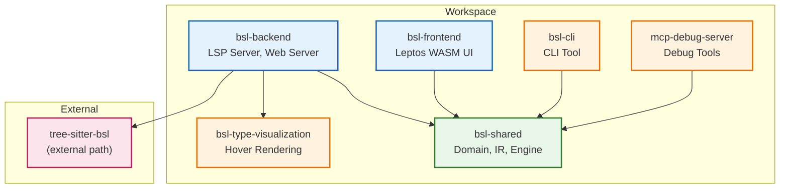
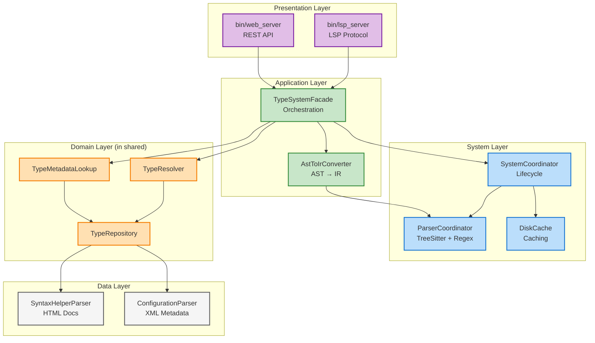
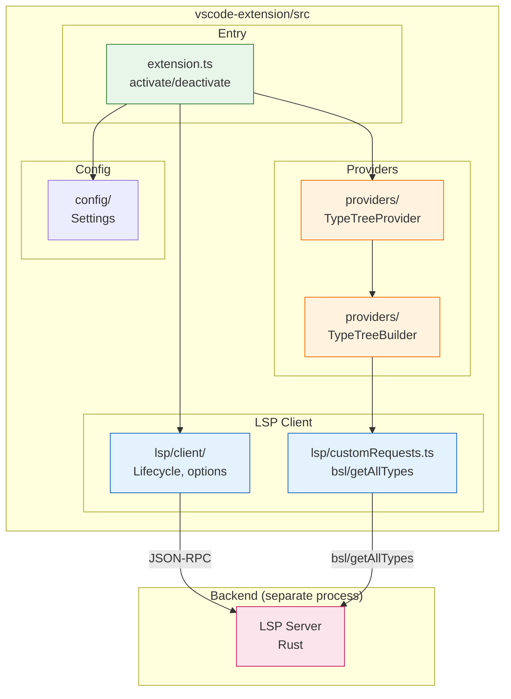

# Диаграммы зависимостей проекта

**Дата создания:** 2025-12-12
**Статус:** Актуально

---

## 1. Зависимости между crates



**Ключевые зависимости:**
- `bsl-shared` — ядро системы, используется всеми crates
- `bsl-backend` — зависит от shared, type-visualization, tree-sitter-bsl
- `bsl-frontend` — зависит от shared с feature `wasm`

---

## 2. Слои DDD в Backend



**Правила зависимостей:**
- Presentation → Application → System/Domain → Data
- Domain не зависит от Infrastructure (чистая архитектура)

---

## 3. Структура shared crate

```mermaid
graph TB
    subgraph "shared/src"
        subgraph "API Layer"
            API["api/<br/>DTOs, contracts"]
        end

        subgraph "Domain Layer"
            Domain["domain/<br/>TypeResolver, Repository"]
            Types["types/<br/>TypeResolution, RawTypeData"]
        end

        subgraph "Engine Layer"
            Engine["engine.rs<br/>AnalysisEngine"]
            Analysis["analysis/<br/>Flow analysis"]
        end

        subgraph "IR Layer"
            IR["ir/<br/>SemanticProgram, SymbolTable"]
            Parsing["parsing/<br/>Parser trait"]
        end

        subgraph "Utils"
            Formatting["formatting/<br/>Theme, colors"]
            Utils["utils/<br/>Helpers"]
        end
    end

    %% Dependencies
    API --> Domain
    API --> Types

    Engine --> IR
    Engine --> Domain
    Engine --> Analysis

    Domain --> Types
    Domain --> IR

    Analysis --> IR
    Analysis --> Types

    %% Styling
    classDef api fill:#e3f2fd,stroke:#1565c0
    classDef domain fill:#fff3e0,stroke:#ef6c00
    classDef engine fill:#e8f5e9,stroke:#2e7d32
    classDef ir fill:#fce4ec,stroke:#c2185b
    classDef utils fill:#f5f5f5,stroke:#757575

    class API api
    class Domain,Types domain
    class Engine,Analysis engine
    class IR,Parsing ir
    class Formatting,Utils utils
```

**Ключевые модули:**
- `ir/` — Intermediate Representation (независим от парсера)
- `domain/` — бизнес-логика типизации
- `engine.rs` — точка входа для анализа

---

## 4. VSCode Extension структура



---

## Навигация

- [Архитектура системы типов](type_system_architecture.md)
- [История Milestones](milestones-history.md)
- [План рефакторинга](../roadmap/refactoring-plan.md)
