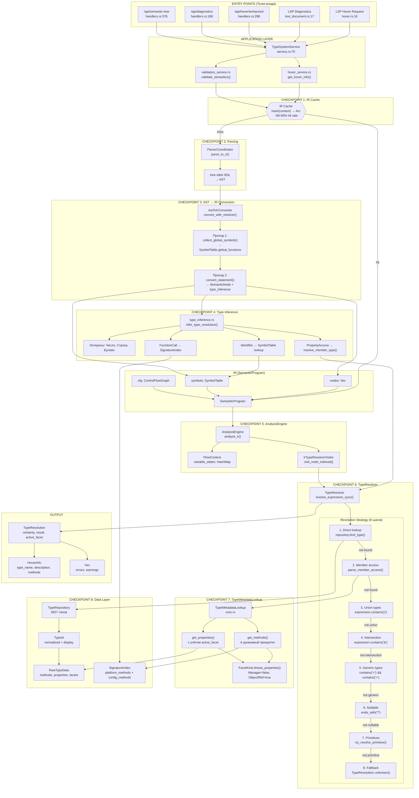
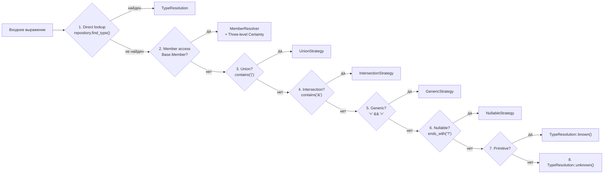

# Workflow вычисления типов: Контрольные точки

## Общая диаграмма с контрольными точками



## Детальные контрольные точки

### CHECKPOINT 1: Entry Points

| Entry Point | Файл:строка | Первый контакт с типами |
|-------------|-------------|------------------------|
| LSP Hover | `hover.rs:16` | `resolver.resolve_variable_with_context()` |
| LSP Diagnostics | `text_document.rs:17` | `AstToIrConverter::convert_with_resolver()` |
| /api/hover/enhanced | `handlers.rs:298` | Делегирует в hover_service |
| /api/diagnostics | `handlers.rs:186` | Делегирует в validation_service |
| /api/semantic-tree | `handlers.rs:376` | `parser.parse_to_ir()` |

### CHECKPOINT 2: IR Cache (Milestone 2.13)

```
hash(file_content) → Option<Arc<SemanticProgram>>
```

- **Hit rate:** ~80-90%
- **Hover с cache hit:** ~3-5ms
- **Hover с cache miss:** ~50-105ms

### CHECKPOINT 3: AST → IR Conversion

**Двухпроходная конвертация:**

```
Проход 1: collect_global_symbols()
├─ Регистрирует функции/процедуры в SymbolTable
└─ Создаёт FunctionSignature с типами параметров

Проход 2: convert_statement()
├─ Строит scope hierarchy (Global → Function → Block)
├─ Вызывает type_inference для каждого выражения
└─ Обновляет SymbolTable переменными с их TypeResolution
```

### CHECKPOINT 4: Type Inference

**infer_type_resolution() в type_inference.rs:**

| Выражение | Логика | Результат |
|-----------|--------|-----------|
| `123` | Литерал | `TypeResolution::primitive("Число")` |
| `"текст"` | Литерал | `TypeResolution::primitive("Строка")` |
| `Истина` | Литерал | `TypeResolution::primitive("Булево")` |
| `x` (identifier) | SymbolTable lookup | `symbol_table.get_variable_type(scope, "x")` |
| `obj.prop` | resolve_member_type() | TypeMetadataLookup → SignatureIndex |
| `Func()` | SignatureIndex | `signature_index.find_method()` |

### CHECKPOINT 5: TypeResolver Strategy

**8-шаговая стратегия resolve_expression_sync():**



### CHECKPOINT 6: Member Access Resolution

**Three-level Certainty для конфигурационных типов:**

| has_metadata | config_loaded | Certainty | Смысл |
|--------------|---------------|-----------|-------|
| true | any | `Known` | Тип найден в метаданных |
| false | false | `Inferred(0.5)` | Graceful degradation |
| false | true | `Unknown` | Ошибка: объект не найден |

### CHECKPOINT 7: Фасетная система

**FacetKind влияет на доступные свойства:**

```
Manager:   shows_properties() = false  → только методы (Create, Find)
Object:    shows_properties() = true   → свойства + методы (Write, Delete)
Reference: shows_properties() = true   → свойства readonly + методы (GetObject)
Selection: shows_properties() = false  → методы итерации
List:      shows_properties() = false  → методы списка
```

### CHECKPOINT 8: Data Layer

**TypeId нормализация:**
```
"ТаблицаЗначений" → TypeId { normalized: "таблицазначений", display: "ТаблицаЗначений" }
"TableOfValues"   → TypeId { normalized: "tableofvalues", display: "TableOfValues" }
```

**O(1) lookup:** `type_index[TypeId] → usize → types[usize] → RawTypeData`

## Структуры данных

### TypeResolution (результат резолвинга)

```rust
TypeResolution {
    certainty: Certainty,           // Known | Inferred(f32) | Unknown
    result: ResolutionResult,       // Concrete | Union | Generic | Unknown
    source: ResolutionSource,       // Explicit | Inferred | Platform
    active_facet: Option<FacetKind>,// Manager | Object | Reference
    available_facets: Vec<FacetKind>,
}
```

### SemanticProgram (IR)

```rust
SemanticProgram {
    symbols: SymbolTable,          // Переменные и функции
    nodes: Vec<SemanticNode>,      // Все узлы программы
    source_info: SourceInfo,       // path, hash
    cfg: Option<ControlFlowGraph>, // Для flow-sensitive
}
```

### RawTypeData (хранилище)

```rust
RawTypeData {
    name: String,                  // "ТаблицаЗначений"
    methods: Vec<RawMethodData>,   // Методы типа
    properties: Vec<RawPropertyData>,
    facets: Vec<FacetKind>,        // [Manager, Object, Reference]
    kind: Option<MetadataKind>,    // Catalog, Document, etc.
    tabular_sections: Vec<...>,    // Табличные части
}
```

## Временные метрики

| Операция | Время | Примечание |
|----------|-------|-----------|
| IR Cache hit | <1 ms | Hash lookup |
| parse_to_ir() | 40-60 ms | tree-sitter + конвертация |
| analyze_ir() | 60-100 ms | Резолвинг всех узлов |
| resolve_expression_sync() | 0.1-0.5 ms | Один тип |
| find_type() | <0.001 ms | O(1) HashMap |
| **Hover total** | **3-105 ms** | Зависит от cache |
| **Diagnostics total** | **60-160 ms** | Всегда полный анализ |

## Оценка архитектуры

### Плюсы (НЕ костыль)

1. **Чёткое разделение слоёв:** Presentation → Application → Domain → Data
2. **IR независимость от парсера:** SemanticProgram не знает о tree-sitter
3. **O(1) lookup:** TypeId + HashMap обеспечивает константное время
4. **Фасетная система:** Научно обоснована (Balyuk & Popova 2021)
5. **Gradual typing:** TypeResolution всегда возвращается (не exceptions)
6. **Cache стратегия:** IR Cache даёт 80-90% hit rate

### Потенциальные улучшения

1. **TypeResolver 8 шагов:** Можно оптимизировать через pattern matching вместо последовательных проверок
2. **Member resolution:** Three-level certainty добавляет сложность, но необходим для graceful degradation
3. **SignatureIndex merge:** Двойной источник (platform + config) требует merge логики

### Вывод

**Архитектура НЕ является костылём.** Это продуманная система с:
- Научным обоснованием (фасеты)
- Чётким разделением ответственности
- Оптимизациями производительности (cache, O(1) lookup)
- Graceful degradation (Certainty levels)
