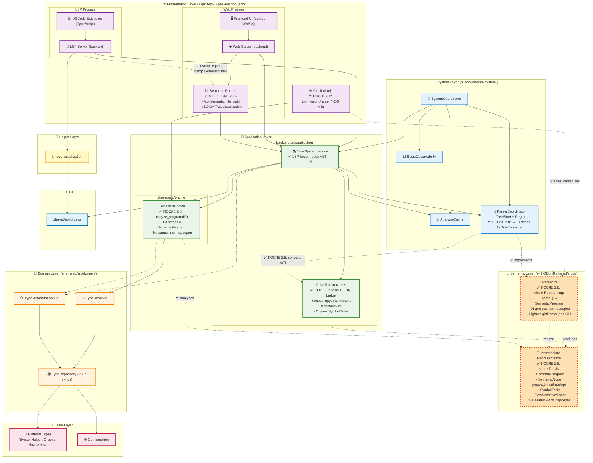

# 📐 Архитектура Системы Типов BSL Gradual Types

> **Дата:** 2025-10-01
> **Версия:** 1.0
> **Статус:** Архитектурный анализ и предложения по улучшению

## 📋 Содержание

1. [Введение](#введение)
2. [Визуальная диаграмма архитектуры](#визуальная-диаграмма-архитектуры)
3. [Полная карта структур типов](#полная-карта-структур-типов)
4. [Матрица ответственностей компонентов](#матрица-ответственностей-компонентов)
5. [Потоки данных](#потоки-данных)
6. [Архитектурные решения и обоснования](#архитектурные-решения-и-обоснования)
7. [Выявленные проблемы](#выявленные-проблемы)
8. [Предлагаемые решения](#предлагаемые-решения)
9. [План реализации](#план-реализации)

---

## Введение

BSL Gradual Type System - система градуальной типизации для языка 1С:Предприятие. Ключевая особенность - честность о неопределенности типов через `Certainty::Known | Inferred(f32) | Unknown`.

Данный документ описывает текущую архитектуру системы типов, выявляет архитектурные проблемы и предлагает решения.

### Ключевые принципы

- **Градуальная типизация** - допускаем неопределенность и честно о ней сообщаем
- **Фасетная система 1С** - один тип имеет множество представлений (Manager, Object, Reference)
- **Separation of Concerns** - четкое разделение анализа (TypeResolution) и документации (RawTypeData)
- **Single Source of Truth** - RawTypeData в Repository - единственный источник метаданных

---

## Визуальная диаграмма архитектуры

### 🏗️ Architecture Diagram (после Milestone 2.8)



### 📊 Описание потоков данных

**Presentation → Application:**
- LSP Server, Web Server → TypeSystemService
- **Semantic Routes** → TypeSystemService (для получения семантического дерева)
- Web Server → Semantic Routes (маршрутизация `/api/semantic/:file_path`)
- LSP Server → Semantic Routes (custom request `bsl/getSemanticHtml` для VSCode)
- CLI Tool → AnalysisEngine (напрямую, через LightweightParser)

**Application → Semantic IR (✅ НОВОЕ после Milestone 2.8):**
- TypeSystemService → ParserCoordinator → AstToIrConverter → SemanticProgram
- CLI Tool → LightweightParser (реализует Parser trait) → SemanticProgram
- AnalysisEngine работает с SemanticProgram вместо AST

**Semantic → Domain:**
- AnalysisEngine анализирует SemanticProgram → TypeResolver
- TypeResolver использует SymbolTable из IR для контекста

**Domain → Data:**
- TypeResolver → TypeRepository → PlatformTypes/ConfigData

**System Management:**
- SystemCoordinator координирует все backend компоненты

**Ключевое отличие после Milestone 2.8:**
- Раньше: `AST → AnalysisEngine → TypeResolver`
- Теперь: `AST → IR (SemanticProgram) → AnalysisEngine → TypeResolver`
- Независимость от парсера: разные парсеры (TreeSitter, LightweightParser) → единая IR

**См. также:**
- [Milestones History](milestones-history.md) — детальная история Milestone 2.8-2.18
- [Components Detailed](components-detailed.md) — детальное описание каждого компонента

---

## Полная карта структур типов

### 🗂️ Data Layer - Хранение и источники данных

#### **RawTypeData** ([types.rs:9](../../shared/src/domain/types.rs#L9))

**Назначение:** Универсальный формат для хранения ВСЕХ данных, полученных из парсеров (HTML, XML, Tree-sitter)

```rust
#[derive(Debug, Clone, Serialize, Deserialize, Default)]
pub struct RawTypeData {
    // === Идентификация ===
    pub name: String,                    // ✅ Используется в TypeResolution
    pub english_name: String,            // ❌ Теряется
    pub category: String,                // ❌ Теряется
    pub source: RawDataSource,           // ❌ Теряется

    // === Документация ===
    pub description: String,             // ❌ Теряется

    // === Структура типа ===
    pub methods: Vec<RawMethodData>,     // ❌ Теряется - ПРОБЛЕМА!
    pub properties: Vec<RawPropertyData>,// ❌ Теряется - ПРОБЛЕМА!
    pub facets: Vec<FacetKind>,          // ✅ Используется (после fix)

    // === Метаданные конфигурации ===
    pub kind: Option<MetadataKind>,      // ❌ Теряется
    pub attributes: Vec<RawAttributeData>,          // ❌ Теряется
    pub tabular_sections: Vec<RawTabularSectionData>, // ❌ Теряется
}
```

**Итого:** Из 11 полей только 2 попадают в TypeResolution!

**Вспомогательные структуры:**
- `RawMethodData` - метод с параметрами и типом возврата
- `RawPropertyData` - свойство с типом и readonly флагом
- `RawAttributeData` - реквизит конфигурации (для Справочников, Документов)
- `RawTabularSectionData` - табличная часть с реквизитами

---

### 🧠 Domain Layer - Бизнес-логика типизации

#### **TypeResolution** ([types.rs:89](../../shared/src/domain/types.rs#L89))

**Назначение:** Результат статического анализа типа выражения с оценкой достоверности

```rust
#[derive(Debug, Clone, PartialEq, Serialize, Deserialize)]
pub struct TypeResolution {
    // Градуальная типизация - честность о неопределенности
    pub certainty: Certainty,             // Known | Inferred(0.0-1.0) | Unknown

    // Результат разрешения типа
    pub result: ResolutionResult,         // Concrete | Union | Dynamic

    // Контекст разрешения
    pub source: ResolutionSource,         // Static | Inferred | Annotated | Runtime
    pub metadata: ResolutionMetadata,     // file, line, column, notes

    // Фасетная система 1С
    pub active_facet: Option<FacetKind>,  // Текущий активный фасет
    pub available_facets: Vec<FacetKind>, // Доступные фасеты типа
}
```

**Ключевое отличие от RawTypeData:**
- ✅ TypeResolution - это **результат анализа** (что мы вывели)
- ✅ RawTypeData - это **документация** (что мы знаем из справки)

**Почему TypeResolution не содержит methods/properties:**
1. TypeResolution создается при КАЖДОМ анализе выражения
2. Один тип может иметь тысячи TypeResolution (в разных местах кода)
3. Дублирование methods/properties в каждом экземпляре неэффективно
4. Methods/properties - это документация, не результат анализа

---

#### Перечисления типов

##### **Certainty** - степень уверенности

```rust
pub enum Certainty {
    Known,           // Точно известно (из аннотации, конструктора)
    Inferred(f32),   // Выведено с вероятностью 0.0-1.0
    Unknown,         // Не удалось определить
}
```

##### **ResolutionResult** - результат разрешения

```rust
pub enum ResolutionResult {
    Concrete(ConcreteType),      // Конкретный тип (Массив, Строка)
    Union(Vec<WeightedType>),    // Объединение типов с весами
    Dynamic,                     // Произвольный тип (как any в TypeScript)
}
```

##### **ConcreteType** - варианты конкретных типов

```rust
pub enum ConcreteType {
    Platform(PlatformType),            // Массив, ТаблицаЗначений
    Configuration(ConfigurationType),  // Справочники.Контрагенты
    Primitive(PrimitiveType),          // String, Number, Boolean, Date
    Special(SpecialType),              // Undefined, Null, Type
    GlobalFunction(GlobalFunctionInfo),// Глобальные функции
}
```

##### **FacetKind** - фасеты 1С объектов

```rust
pub enum FacetKind {
    Manager,     // СправочникМенеджер - создание, поиск
    Object,      // СправочникОбъект - изменяемый объект
    Reference,   // СправочникСсылка - ссылка на элемент
    Metadata,    // Метаданные
    Constructor, // Конструктор
    Collection,  // Коллекция (для обхода Для Каждого)
    Singleton,   // Одиночный объект
    Selection,   // СправочникВыборка - обход результатов запроса
    List,        // СправочникСписок - управление списком в форме
}
```

**Пример фасетов:**
```
Справочники.Контрагенты          → Manager facet
СправочникОбъект.Контрагенты     → Object facet
СправочникСсылка.Контрагенты     → Reference facet
```

---

### 🔧 Service Layer - Оркестрация

#### **TypeResolver** ([resolver.rs:10](../../shared/src/domain/resolver.rs#L10))

**Назначение:** Сервис разрешения типов - ЧИСТАЯ бизнес-логика без I/O

```rust
pub struct TypeResolver {
    repository: Arc<dyn TypeRepository>,
}

impl TypeResolver {
    /// Основной метод - разрешить выражение в тип
    pub fn resolve_expression_sync(&self, expression: &str) -> TypeResolution

    /// Проверить совместимость присваивания
    pub fn is_assignment_compatible(&self, from: &TypeResolution, to: &TypeResolution) -> bool

    /// Сужение типа на основе условия (flow-sensitive анализ)
    pub fn narrow_type(&self, current: &TypeResolution, type_check: &str) -> TypeResolution
}
```

**Алгоритм разрешения:**
1. Прямой поиск в repository (`Массив`, `Строка`)
2. Парсинг составных имен (`Справочники.Контрагенты`)
3. Union types (пока не реализовано)
4. Возврат `Unknown` если ничего не подошло

---

#### **TypeValidator** ([validators.rs:77](../../shared/src/domain/validators.rs#L77))

**Назначение:** Валидация использования типов (на основе статьи Balyuk & Popova, 2021)

**Три категории ошибок:**
1. **IncorrectParameterType** - некорректная передача параметров методу
2. **NonExistentProperty** - обращение к несуществующему свойству/методу
3. **SimpleTypeAsCollection** - обработка простого типа как коллекции

```rust
/// Проверка вызова метода
pub fn validate_method_call(
    method_name: &str,
    expected_params: &[String],
    actual_params: &[TypeResolution],
) -> Vec<TypeErrorKind>

/// Проверка доступа к свойству
pub fn validate_property_access(
    object_type: &ConcreteType,
    property_name: &str,
    available_properties: &[String],  // ❌ ПРОБЛЕМА: Откуда взять?
) -> Option<TypeErrorKind>
```

**❌ ПРОБЛЕМА:** TypeValidator готов, но нет способа получить список методов/свойств!

---

### 🌐 API Layer - Передача данных

#### **TypeDto** ([dtos.rs:23](../../shared/src/api/dtos.rs#L23))

**Назначение:** Data Transfer Object для Web API и LSP

```rust
#[derive(Debug, Clone, Serialize, Deserialize)]
#[serde(rename_all = "camelCase")]
pub struct TypeDto {
    pub id: String,
    pub name: String,
    pub category: String,
    pub certainty: u8,              // 0-100
    pub certainty_text: String,
    pub facets: Vec<String>,        // ✅ Из TypeResolution (после fix)

    // ❌ HARDCODED - должны быть из RawTypeData!
    pub methods_count: Option<usize>,
    pub methods: Vec<String>,
    pub attributes_count: Option<usize>,

    pub description: String,        // ⚠️ Генерируется, не из RawTypeData
    pub source: String,
    pub flow_sensitive: bool,

    // Optional поля
    pub union_types: Option<Vec<UnionComponentDto>>,
    pub flow_analysis: Option<FlowAnalysisDto>,
    pub connections: Option<TypeConnectionsDto>,
}
```

**❌ ПРОБЛЕМА:** `methods_count` и `methods` захардкожены в `None` и `vec![]`!

---

## Матрица ответственностей компонентов

| Компонент | Слой | Ответственность | Что ЗНАЕТ | Что НЕ ЗНАЕТ |
|-----------|------|-----------------|-----------|--------------|
| **RawTypeData** | Data | Хранение ВСЕХ данных парсера | methods, properties, attributes, facets | Как использовать эти данные |
| **TypeResolution** | Domain | Результат статического анализа | certainty, result, facets | methods, properties (❌ потеря данных) |
| **TypeResolver** | Domain | Логика разрешения типов | Repository, алгоритмы вывода | Кэширование, Web API |
| **TypeValidator** | Domain | Валидация использования типов | Правила типизации | Откуда брать methods/properties |
| **TypeRepository** | Data | Хранение и поиск типов | RawTypeData, индексы | Логику анализа |
| **TypeInferenceService** | Application | Оркестрация для Web/LSP | TypeResolver, Repository | Детали LSP |
| **TypeSystemService** | Application | Высокоуровневый API + кэш | AnalysisEngine, Cache | Внутренности Domain |
| **TypeDto** | API | Передача данных клиенту | Формат JSON, contracts | Внутренние структуры |

---

## Потоки данных

### 📥 Поток 1: Загрузка данных (Initialization)

```
┌─────────────────────────────────────────────────────────────────┐
│ HTML документация (examples/syntax_helper/rebuilt.shcntx_ru/)  │
│ - Массив.html, ТаблицаЗначений.html, Строка.html...            │
└─────────────────────────────────────────────────────────────────┘
                            ↓
        [SyntaxHelperParser::parse_html()]
                            ↓
┌─────────────────────────────────────────────────────────────────┐
│ RawTypeData {                                                   │
│   name: "Массив",                                               │
│   methods: [                                                    │
│     RawMethodData { name: "Добавить", ... },                    │
│     RawMethodData { name: "Количество", ... },                  │
│   ],                                                            │
│   properties: [...],                                            │
│   facets: [Collection],  // ← detect_facets()                   │
│   ...                                                           │
│ }                                                               │
└─────────────────────────────────────────────────────────────────┘
                            ↓
              [TypeRepository::save()]
                            ↓
┌─────────────────────────────────────────────────────────────────┐
│ TypeRepository (in-memory storage)                              │
│ HashMap<String, RawTypeData>                                    │
│   "Массив" → RawTypeData { methods: [...], facets: [...] }     │
│   "ТаблицаЗначений" → RawTypeData { ... }                      │
│   ...                                                           │
└─────────────────────────────────────────────────────────────────┘
```

**Файлы:**
- [syntax_helper_parser.rs:1408-1443](../../backend/src/data/loaders/syntax_helper_parser.rs#L1408) - `detect_facets()`
- [converters.rs:10-45](../../backend/src/data/adapters/converters.rs#L10) - `convert_syntax_helper_to_raw()`

---

### 🔍 Поток 2: Статический анализ (Analysis)

```
┌─────────────────────────────────────────────────────────────────┐
│ Выражение: "Массив"                                             │
└─────────────────────────────────────────────────────────────────┘
                            ↓
       [TypeResolver::resolve_expression_sync()]
                            ↓
       [Repository::find_type("Массив")]
                            ↓
┌─────────────────────────────────────────────────────────────────┐
│ RawTypeData (найдено!)                                          │
│   name: "Массив"                                                │
│   methods: [Добавить, Количество, ...]                          │
│   facets: [Collection]                                          │
└─────────────────────────────────────────────────────────────────┘
                            ↓
       [create_resolution_from_raw()]
                            ↓
┌─────────────────────────────────────────────────────────────────┐
│ TypeResolution {                                                │
│   certainty: Known,                                             │
│   result: Concrete(Platform("Массив")),                         │
│   available_facets: [Collection],  // ✅ FIXED!                 │
│   // ❌ methods LOST                                            │
│   // ❌ properties LOST                                         │
│   // ❌ description LOST                                        │
│ }                                                               │
└─────────────────────────────────────────────────────────────────┘
```

**Файлы:**
- [resolver.rs:20-37](../../shared/src/domain/resolver.rs#L20) - `resolve_expression_sync()`
- [resolver.rs:40-51](../../shared/src/domain/resolver.rs#L40) - `create_resolution_from_raw()`

**❌ ПРОБЛЕМА:** 10 из 11 полей RawTypeData теряются при создании TypeResolution!

---

### 🌐 Поток 3: Web API (Presentation)

```
┌─────────────────────────────────────────────────────────────────┐
│ TypeResolution                                                  │
│   name: "Массив"                                                │
│   facets: [Collection]                                          │
└─────────────────────────────────────────────────────────────────┘
                            ↓
       [TypeSystemService::get_all_types()]
                            ↓
┌─────────────────────────────────────────────────────────────────┐
│ TypeDto {                                                       │
│   name: "Массив",                                               │
│   facets: ["Collection"],          // ✅ Есть                   │
│   methods_count: None,             // ❌ HARDCODE!              │
│   methods: [],                     // ❌ HARDCODE!              │
│   description: "Платформенный тип" // ⚠️ Сгенерировано          │
│ }                                                               │
└─────────────────────────────────────────────────────────────────┘
                            ↓
              [JSON serialization]
                            ↓
┌─────────────────────────────────────────────────────────────────┐
│ Web API Response                                                │
│ GET /api/types?search=Массив                                    │
└─────────────────────────────────────────────────────────────────┘
                            ↓
┌─────────────────────────────────────────────────────────────────┐
│ Frontend WASM (Leptos)                                          │
│ Отображает:                                                     │
│ - Имя: "Массив"                                                 │
│ - Фасеты: [Collection]                                          │
│ - Методы: пусто ❌                                              │
└─────────────────────────────────────────────────────────────────┘
```

**Файлы:**
- [type_system_service.rs:74-153](../../backend/src/application/type_system_service.rs#L74) - `get_all_types()`

**❌ ДВОЙНАЯ ПОТЕРЯ:**
1. **RawTypeData → TypeResolution** - теряем methods, properties, description
2. **TypeResolution → TypeDto** - можем передать только то, что есть в TypeResolution

---

### ❌ Поток 4: Валидация методов (НЕРЕАЛИЗОВАНО)

```
┌─────────────────────────────────────────────────────────────────┐
│ BSL код:                                                        │
│ ТаблДанных = Новый ТаблицаЗначений();                           │
│ ТаблДанных.НеСуществующийМетод();  // ← Ошибка!                 │
└─────────────────────────────────────────────────────────────────┘
                            ↓
       [TypeResolver::resolve_expression_sync("ТаблДанных")]
                            ↓
┌─────────────────────────────────────────────────────────────────┐
│ TypeResolution {                                                │
│   result: Platform("ТаблицаЗначений"),                          │
│   certainty: Known                                              │
│ }                                                               │
└─────────────────────────────────────────────────────────────────┘
                            ↓
            ⚠️ КАК ПРОВЕРИТЬ МЕТОД?
                            ↓
       [TypeValidator::validate_property_access()]
                            ↓
┌─────────────────────────────────────────────────────────────────┐
│ fn validate_property_access(                                    │
│     object_type: &ConcreteType,                                 │
│     property_name: "НеСуществующийМетод",                       │
│     available_properties: ??? // ❌ Откуда взять?               │
│ )                                                               │
└─────────────────────────────────────────────────────────────────┘
```

**❌ ПРОБЛЕМА:**
- TypeValidator готов проверять методы
- TypeResolution не содержит список методов
- RawTypeData содержит методы, но недоступны для валидатора
- **Нужен мост между TypeResolution и RawTypeData!**

---

## Архитектурные решения и обоснования

### ✅ Решение 1: TypeResolution - легковесный Value Object

**Принцип:** TypeResolution содержит ТОЛЬКО результат анализа, без документации

**Обоснование:**
- TypeResolution создается при КАЖДОМ анализе выражения в коде
- Один тип может иметь тысячи TypeResolution экземпляров (в разных местах файла)
- Хранение methods/properties в каждом TypeResolution = массивное дублирование данных
- Methods/properties - это документация (статические метаданные), не результат анализа

**Что хранится в TypeResolution:**
- ✅ `certainty` - важно для градуальной типизации (Known/Inferred/Unknown)
- ✅ `result` - сам тип (Concrete/Union/Dynamic)
- ✅ `available_facets` - важно для контекстного анализа 1С
- ✅ `metadata` - где найдено (файл, строка, заметки)

**Что НЕ хранится (и это правильно):**
- ❌ `methods` - это документация, хранится в RawTypeData
- ❌ `properties` - это документация
- ❌ `attributes` - это документация
- ❌ `description` - это документация
- ❌ `english_name` - это документация

**Аналогия:**
- TypeResolution ~ TypeScript inferred type
- RawTypeData ~ TypeScript .d.ts declaration

---

### ✅ Решение 2: RawTypeData - Single Source of Truth

**Принцип:** Repository хранит ПОЛНУЮ информацию в RawTypeData один раз

**Обоснование:**
- Документация загружается один раз при старте приложения
- Все адаптеры (HTML, XML, Tree-sitter) конвертируются в RawTypeData
- Хранится в `HashMap<String, RawTypeData>` в памяти
- Не дублируется между анализами

**Источники RawTypeData:**
1. **HTML справка платформы** (SyntaxHelperParser)
   - `examples/syntax_helper/rebuilt.shcntx_ru/`
   - Массив.html, ТаблицаЗначений.html, Строка.html...
2. **XML файлы конфигурации** (ConfigurationGuidedParser)
   - Справочники.xml, Документы.xml, Обработки.xml...
3. **Tree-sitter BSL** (пока stub)
   - Парсинг реального BSL кода для custom типов

---

### ✅ Решение 3: Separation of Concerns

**Разделение ответственностей:**

| Что | Где хранится | Назначение |
|-----|--------------|------------|
| **Документация типов** | RawTypeData в Repository | Справочная информация (методы, свойства, описание) |
| **Результат анализа** | TypeResolution | Что мы вывели о типе выражения (certainty, facet) |
| **API контракт** | TypeDto | Что передаем клиенту (Web, LSP) |

**Принцип:** Не смешивать "что мы знаем" (RawTypeData) с "что мы вывели" (TypeResolution)

---

## Выявленные проблемы

### ❌ Проблема 1: Потеря данных при RawTypeData → TypeResolution

**Описание:**
Из 11 полей RawTypeData только 2 попадают в TypeResolution (name, facets)

**Потерянные поля:**
- `english_name` - английское имя типа
- `description` - описание типа
- `category` - категория типа
- `methods` - **КРИТИЧНО!** Нужно для валидации
- `properties` - **КРИТИЧНО!** Нужно для валидации
- `kind` - MetadataKind (Catalog, Document...)
- `attributes` - реквизиты конфигурации
- `tabular_sections` - табличные части
- `source` - RawDataSource (Platform/Configuration)

**Почему это проблема:**
- TypeValidator не может проверить вызов несуществующего метода
- TypeDto не может отобразить список методов в UI
- LSP не может предложить автодополнение методов

**Где происходит:**
- [resolver.rs:40-51](../../shared/src/domain/resolver.rs#L40) - `create_resolution_from_raw()`
- [type_inference_service.rs:67-81](../../backend/src/application/type_inference_service.rs#L67) - `get_all_platform_globals()`

---

### ❌ Проблема 2: Hardcoded данные в TypeDto

**Описание:**
TypeDto содержит hardcoded значения вместо реальных данных из RawTypeData

**Код ([type_system_service.rs:74-153](../../backend/src/application/type_system_service.rs#L74)):**
```rust
TypeDto {
    methods_count: None,        // ❌ Должно быть Some(raw_type.methods.len())
    methods: Vec::new(),        // ❌ Должно быть raw_type.methods
    attributes_count: None,     // ❌ Должно быть Some(raw_type.attributes.len())
    description: self.generate_type_description(res),  // ⚠️ Генерируется, не из RawTypeData
    // ...
}
```

**Последствия:**
- Веб-интерфейс не показывает методы типа
- LSP не может предоставить документацию методов
- Пользователь не видит полную информацию о типе

---

### ❌ Проблема 3: Разрыв между TypeResolution и RawTypeData

**Сценарий:**
```rust
// Есть TypeResolution из анализа
let resolution = resolver.resolve_expression_sync("ТаблДанных");
// resolution = { result: Platform("ТаблицаЗначений"), certainty: Known }

// Нужно проверить метод "НеСуществующийМетод"
TypeValidator::validate_property_access(
    &resolution.result,
    "НеСуществующийМетод",
    ??? // ❌ Откуда взять список методов?
)
```

**Проблема:**
- TypeResolution не содержит methods
- TypeValidator требует список available_properties
- RawTypeData содержит methods, но нет прямого доступа

**Нужен мост!**

---

## Предлагаемые решения

### 💡 Решение: TypeMetadataLookup Service

**Идея:** Создать сервис-мост между TypeResolution и RawTypeData

#### Вариант 1: Standalone Lookup Service (РЕКОМЕНДУЕТСЯ)

```rust
// shared/src/domain/metadata_lookup.rs

use std::sync::Arc;
use crate::domain::repository::TypeRepository;
use crate::domain::types::{
    TypeResolution, RawTypeData, RawMethodData, RawPropertyData,
    ResolutionResult, ConcreteType
};

/// Сервис для получения метаданных типа по TypeResolution
pub struct TypeMetadataLookup {
    repository: Arc<dyn TypeRepository>,
}

impl TypeMetadataLookup {
    pub fn new(repository: Arc<dyn TypeRepository>) -> Self {
        Self { repository }
    }

    /// Получить полную RawTypeData для TypeResolution
    pub fn get_raw_type(&self, resolution: &TypeResolution) -> Option<RawTypeData> {
        let type_name = self.extract_type_name(resolution)?;
        self.repository.find_type(&type_name)
    }

    /// Получить методы для TypeResolution
    pub fn get_methods(&self, resolution: &TypeResolution) -> Vec<RawMethodData> {
        self.get_raw_type(resolution)
            .map(|raw| raw.methods)
            .unwrap_or_default()
    }

    /// Получить свойства для TypeResolution
    pub fn get_properties(&self, resolution: &TypeResolution) -> Vec<RawPropertyData> {
        self.get_raw_type(resolution)
            .map(|raw| raw.properties)
            .unwrap_or_default()
    }

    /// Проверить существование метода/свойства
    pub fn has_member(&self, resolution: &TypeResolution, member_name: &str) -> bool {
        let raw = match self.get_raw_type(resolution) {
            Some(r) => r,
            None => return false,
        };

        raw.methods.iter().any(|m| m.name == member_name)
            || raw.properties.iter().any(|p| p.name == member_name)
    }

    /// Извлечь имя типа из TypeResolution
    fn extract_type_name(&self, resolution: &TypeResolution) -> Option<String> {
        match &resolution.result {
            ResolutionResult::Concrete(concrete) => match concrete {
                ConcreteType::Platform(platform) => Some(platform.name.clone()),
                ConcreteType::Configuration(config) => {
                    // Для конфигурации типа "Справочники.Контрагенты"
                    Some(format!("{}.{}", config.kind.display_name(), config.name))
                }
                _ => None,
            },
            _ => None,
        }
    }
}
```

**Использование в TypeValidator:**
```rust
// shared/src/domain/validators.rs

pub fn validate_property_access_with_lookup(
    resolution: &TypeResolution,
    property_name: &str,
    metadata_lookup: &TypeMetadataLookup,
) -> Option<TypeErrorKind> {
    if !metadata_lookup.has_member(resolution, property_name) {
        Some(TypeErrorKind::NonExistentProperty {
            object_type: format!("{:?}", resolution.result),
            property_name: property_name.to_string(),
        })
    } else {
        None
    }
}
```

**Использование в TypeSystemService:**
```rust
// backend/src/application/type_system_service.rs

use shared::domain::metadata_lookup::TypeMetadataLookup;

pub struct TypeSystemService {
    // ...
    metadata_lookup: TypeMetadataLookup,
}

impl TypeSystemService {
    pub fn get_all_types(&self) -> Vec<TypeDto> {
        // ...
        for (name, res) in &resolutions {
            // Получаем методы через lookup
            let methods = self.metadata_lookup.get_methods(&res);
            let raw_type = self.metadata_lookup.get_raw_type(&res);

            let dto = TypeDto {
                // ...
                methods_count: Some(methods.len()),
                methods: methods.iter().map(|m| m.name.clone()).collect(),
                description: raw_type.map(|r| r.description).unwrap_or_default(),
                // ...
            };
            // ...
        }
        // ...
    }
}
```

---

#### Вариант 2: Расширенные методы TypeResolver

```rust
impl TypeResolver {
    /// Разрешить и сразу получить методы
    pub fn resolve_with_methods(&self, expression: &str)
        -> (TypeResolution, Vec<RawMethodData>)
    {
        let resolution = self.resolve_expression_sync(expression);
        let methods = self.get_methods_for_resolution(&resolution);
        (resolution, methods)
    }

    fn get_methods_for_resolution(&self, resolution: &TypeResolution)
        -> Vec<RawMethodData>
    {
        // Lookup в repository
    }
}
```

**Недостатки:**
- ❌ Смешивает ответственности (TypeResolver + metadata lookup)
- ❌ Не всегда нужны методы при resolve
- ❌ Менее явный контракт

---

#### Вариант 3: TypeContext (контекст анализа)

```rust
pub struct TypeAnalysisContext {
    pub resolution: TypeResolution,
    pub raw_type: Option<RawTypeData>,  // Полные данные если есть
}

impl TypeResolver {
    pub fn resolve_with_context(&self, expression: &str) -> TypeAnalysisContext {
        let resolution = self.resolve_expression_sync(expression);
        let raw_type = self.lookup_raw_type(&resolution);
        TypeAnalysisContext { resolution, raw_type }
    }
}
```

**Недостатки:**
- ❌ Дублирует данные (resolution + raw_type)
- ❌ Больше потребление памяти
- ❌ Неясно когда использовать Context vs просто Resolution

---

### 📊 Рекомендация: Вариант 1 (TypeMetadataLookup)

**Преимущества:**
- ✅ **Separation of Concerns** - четкое разделение ответственностей
- ✅ **TypeResolution остается легковесным** - не раздувается данными
- ✅ **Явный запрос метаданных** - только когда действительно нужно
- ✅ **Легко тестировать** - mock Repository для тестов
- ✅ **Переиспользуемый** - можно использовать в TypeValidator, TypeSystemService, LSP

**Недостатки:**
- ⚠️ Дополнительный lookup при валидации (но быстрый - HashMap)
- ⚠️ Возможен cache miss если тип не в repository

**Решение недостатков:**
- Lookup по HashMap очень быстрый (O(1))
- Cache miss обрабатывается возвратом `None` или пустого `Vec`

---

## План реализации

### Phase 1: Создание TypeMetadataLookup — ✅ **ЗАВЕРШЕНА**

**Статус:** ✅ Полностью реализовано (2025-10-03)

**Реализованные задачи:**
1. ✅ Создан [shared/src/domain/metadata_lookup.rs](../../shared/src/domain/metadata_lookup.rs) (417 строк)
2. ✅ Реализован TypeMetadataLookup с методами:
   - `get_raw_type()` — получение полной RawTypeData
   - `get_methods()` — получение методов типа
   - `get_properties()` — получение свойств типа
   - `has_member()` — проверка существования метода/свойства
   - `get_description()`, `get_category()` — дополнительные метаданные
3. ✅ Добавлено 6 unit-тестов (строки 292-416)
4. ✅ Экспортирован в [shared/src/domain/mod.rs](../../shared/src/domain/mod.rs#L11)

**Критерии завершения:**
- ✅ Все тесты проходят (`cargo test`)
- ✅ `cargo clippy` без warnings
- ✅ Полная rustdoc документация с примерами использования (строки 1-48)

---

### Phase 2: Интеграция в TypeValidator — ⚠️ **ЧАСТИЧНО ЗАВЕРШЕНА**

**Статус:** ⚠️ TypeValidator существует, но **НЕ** использует TypeMetadataLookup

**Текущее состояние:**
- ✅ TypeValidator реализован в [shared/src/domain/validators.rs](../../shared/src/domain/validators.rs)
- ✅ Определены три категории ошибок (IncorrectParameterType, NonExistentProperty, SimpleTypeAsCollection)
- ❌ Метод `validate_property_access_with_lookup()` **НЕ РЕАЛИЗОВАН**
- ❌ Текущий `validate_method_call()` не проверяет существование методов

**Требуется реализовать:**

```rust
// shared/src/domain/validators.rs

use crate::domain::metadata_lookup::TypeMetadataLookup;

impl TypeValidator {
    /// Проверка доступа к свойству/методу с использованием TypeMetadataLookup
    pub fn validate_property_access_with_lookup(
        resolution: &TypeResolution,
        property_name: &str,
        metadata_lookup: &TypeMetadataLookup,
    ) -> Option<TypeErrorKind> {
        if !metadata_lookup.has_member(resolution, property_name) {
            Some(TypeErrorKind::NonExistentProperty {
                object_type: format!("{:?}", resolution.result),
                property_name: property_name.to_string(),
            })
        } else {
            None
        }
    }
}
```

**Пример использования (после реализации):**
```rust
let resolution = resolver.resolve_expression_sync("ТаблДанных");
let metadata_lookup = TypeMetadataLookup::new(repository);
let error = TypeValidator::validate_property_access_with_lookup(
    &resolution,
    "НеСуществующийМетод",
    &metadata_lookup
);
assert!(error.is_some()); // Должна быть ошибка NonExistentProperty
```

---

### Phase 3: Обновление TypeSystemService — ✅ **ЗАВЕРШЕНА**

**Статус:** ✅ Полностью реализовано (2025-10-03)

**Реализованные задачи:**
1. ✅ Добавлено поле `metadata_lookup: TypeMetadataLookup` ([строка 26](../../backend/src/application/type_system_service.rs#L26))
2. ✅ Обновлен `get_all_types_as_dto()` для использования реальных данных из RawTypeData ([строки 118-121](../../backend/src/application/type_system_service.rs#L118))
3. ✅ Исправлен TypeDto:
   - ✅ `methods_count: Some(methods.len())` — реальное количество методов
   - ✅ `methods: methods.iter().map(|m| m.name.clone()).collect()` — реальные имена методов
   - ✅ `description: raw_type.map(|r| r.description).unwrap_or_else(...)` — реальное описание из RawTypeData
   - ✅ `properties: properties.iter().map(|p| p.name.clone()).collect()` — реальные свойства
   - ✅ `enum_values: raw_type.and_then(|rt| ...)` — значения перечислений для платформенных типов
4. ❓ Тестирование Web API — **требует проверки**

**Файл:** [backend/src/application/type_system_service.rs](../../backend/src/application/type_system_service.rs)

**Ключевые изменения:**
```rust
// Строки 118-126
let methods = self.metadata_lookup.get_methods(res);
let properties = self.metadata_lookup.get_properties(res);
let raw_type = self.metadata_lookup.get_raw_type(res);

let description = raw_type.as_ref()
    .map(|rt| rt.description.clone())
    .unwrap_or_else(|| self.generate_type_description(res));
```

**Результат:** TypeDto теперь содержит **реальные данные** вместо hardcoded значений!

---

### Phase 4: Обновление Web UI — ❓ **ТРЕБУЕТ ТЕСТИРОВАНИЯ**

**Статус:** ❓ Backend готов, frontend требует проверки

**План тестирования:**

1. ❓ **Проверить что API возвращает методы:**
   ```bash
   # Запустить веб-сервер
   cargo run -p bsl-backend --bin bsl-web-server -- --port 3002 --enable-cors true

   # Проверить API ответ (с URL-кодированием для кириллицы)
   curl "http://localhost:3002/api/types" | jq '.types[0].methods'
   curl "http://localhost:3002/api/search?q=%D0%9C%D0%B0%D1%81%D1%81%D0%B8%D0%B2" | jq '.'
   ```

2. ❓ **Проверить frontend отображение:**
   - Открыть http://localhost:3002
   - Найти тип "Массив" или "ТаблицаЗначений"
   - Убедиться что методы отображаются в карточке типа

3. ❓ **E2E тестирование через Chrome DevTools MCP:**
   - Автоматизированное тестирование поиска типов
   - Проверка отображения методов и фильтров
   - Измерение Core Web Vitals

**Критерии завершения:**
- ✅ Backend API возвращает реальные методы (уже реализовано)
- ❓ Типы "Массив", "ТаблицаЗначений" показывают полный список методов в UI
- ❓ Методы корректно отображаются и раскрываются
- ❓ E2E тесты проходят успешно

---

### Phase 5: Интеграция в LSP (будущее)

**Задачи:**
1. Использовать TypeMetadataLookup для автодополнения методов
2. Показывать документацию методов при hover
3. Валидация вызовов методов в реальном времени

**Статус:** Планируется после реализации BslParser

---

## Статус реализации

**Дата обновления:** 2025-10-03

| Компонент | Статус | Приоритет | Комментарий |
|-----------|--------|-----------|-------------|
| TypeMetadataLookup | ✅ **Реализован** | 🔥 Критичный | [shared/src/domain/metadata_lookup.rs](../../shared/src/domain/metadata_lookup.rs) - полностью реализован с тестами |
| TypeValidator integration | ⚠️ **Частично** | 🔥 Критичный | TypeValidator существует, но не использует TypeMetadataLookup для валидации |
| TypeSystemService update | ✅ **Реализован** | 🔥 Критичный | [backend/src/application/type_system_service.rs](../../backend/src/application/type_system_service.rs) - использует реальные данные через TypeMetadataLookup |
| Web UI update | ❓ **Не проверено** | ⚠️ Высокий | Требует тестирования отображения методов в веб-интерфейсе |
| LSP integration | ⏳ Не начато | 📅 Будущее | Планируется после завершения Web UI |

---

## Заключение

**Дата обновления:** 2025-10-03

Архитектура системы типов BSL Gradual Types основана на правильных принципах:
- ✅ Separation of Concerns (TypeResolution vs RawTypeData)
- ✅ Single Source of Truth (RawTypeData в Repository)
- ✅ Градуальная типизация с честностью о неопределенности

### 🎉 Достигнутые результаты

**✅ Критичные проблемы РЕШЕНЫ:**
- ✅ **TypeMetadataLookup реализован** — мост между TypeResolution и RawTypeData работает
- ✅ **TypeSystemService обновлён** — реальные данные вместо hardcoded значений
- ✅ **Simplified Architecture реализована** — SystemCoordinator, AnalysisEngine, все System Layer компоненты

**⚠️ Требует доработки:**
- ⚠️ **TypeValidator не использует TypeMetadataLookup** — нужно добавить `validate_property_access_with_lookup()`
- ❓ **Web UI не протестирован** — требуется проверка отображения методов в браузере

**📊 Общий прогресс:**
- **Phase 1 (TypeMetadataLookup):** ✅ 100% завершено
- **Phase 2 (TypeValidator integration):** ⚠️ 30% завершено (структура есть, интеграция нет)
- **Phase 3 (TypeSystemService):** ✅ 100% завершено
- **Phase 4 (Web UI):** ❓ 50% завершено (backend готов, frontend не проверен)
- **Phase 5 (LSP integration):** ⏳ 0% (планируется в будущем)

### 🎯 Следующие шаги

1. **Высокий приоритет:**
   - Реализовать `validate_property_access_with_lookup()` в TypeValidator
   - Протестировать Web UI с реальными методами

2. **Средний приоритет:**
   - E2E тестирование через Chrome DevTools MCP
   - Добавить интеграционные тесты для валидации

3. **Будущее:**
   - LSP интеграция для автодополнения методов
   - Hover документация в редакторе

**Приоритет оставшихся задач:** Высокий для валидации, средний для Web UI тестирования.
