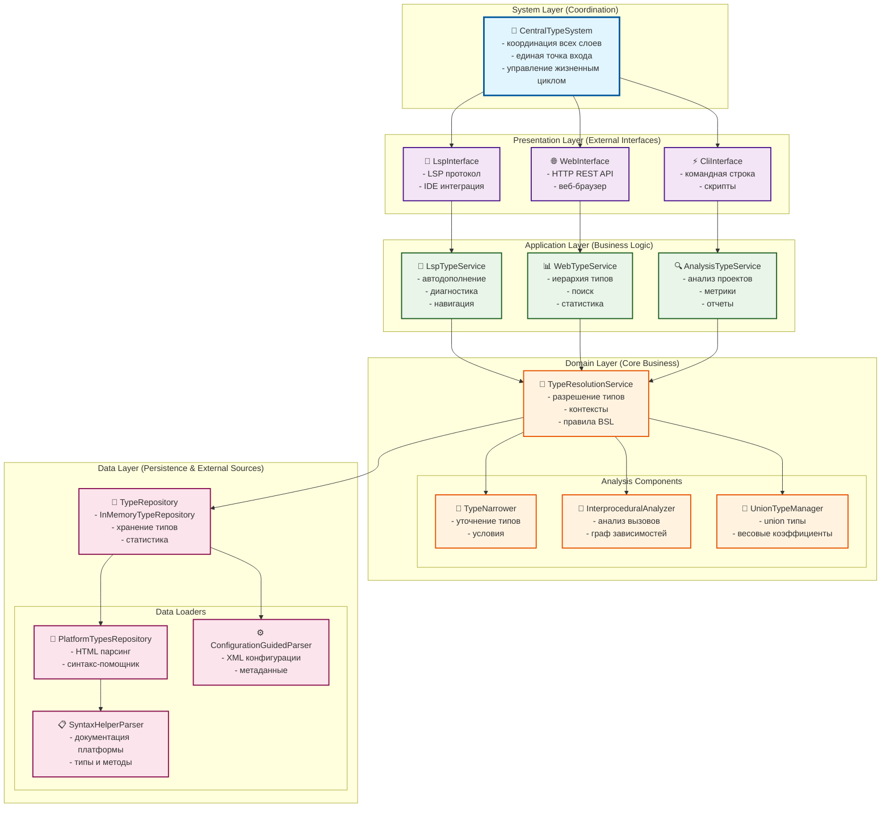
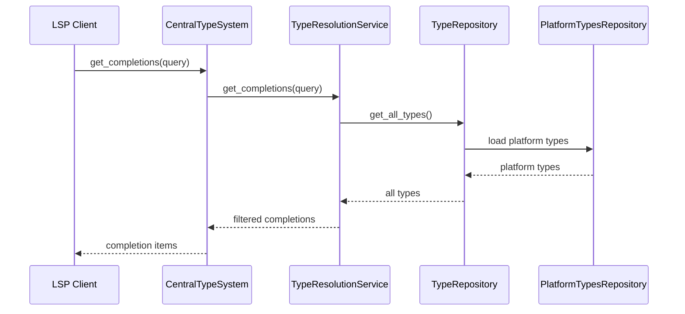

# Архитектурная диаграмма BSL Gradual Type System

## Layered Architecture Overview



## ✅ Архитектура восстановлена!

### 🎯 Успешно исправлено

1. **~~PlatformTypeResolver~~** ✅ **УДАЛЁН**
   - ✅ **Синглтон убран** - теперь используется dependency injection
   - ✅ **Прямой доступ к Data устранён** - всё через TypeRepository
   - ✅ **Единый источник истины** - только CentralTypeSystem
   - ✅ **Слабая связность** - компоненты тестируются изолированно

2. **TypeResolutionService исправлен**
   - ✅ **Использует только repository** вместо синглтона
   - ✅ **Единый источник данных** - только repository

### 🏗️ Текущее состояние архитектуры

**✅ Все слои соблюдают правильное направление зависимостей:**
```
System Layer → Presentation Layer → Application Layer → Domain Layer → Data Layer
```

**✅ Принципы Clean Architecture соблюдены:**
- Dependency Inversion ✅
- Single Responsibility ✅  
- Interface Segregation ✅
- Dependency Injection ✅

## Правильный поток данных (реализовано)



## Компоненты по слоям

### System Layer
- `CentralTypeSystem` - единственный координатор всей системы

### Presentation Layer  
- `LspInterface` - Language Server Protocol
- `WebInterface` - REST API для веб-интерфейса
- `CliInterface` - интерфейс командной строки

### Application Layer
- `LspTypeService` - бизнес-логика для LSP
- `WebTypeService` - бизнес-логика для веб-интерфейса  
- `AnalysisTypeService` - бизнес-логика для анализа

### Domain Layer
- `TypeResolutionService` - основной сервис разрешения типов ✅
- `TypeNarrower` - уточнение типов в условиях
- `InterproceduralAnalyzer` - межпроцедурный анализ
- `UnionTypeManager` - управление union типами

### Data Layer
- `TypeRepository` - абстракция хранения типов
- `InMemoryTypeRepository` - реализация в памяти
- `PlatformTypesRepository` - загрузка платформенных типов
- `ConfigurationGuidedParser` - парсинг XML конфигураций
- `SyntaxHelperParser` - парсинг HTML документации

## Принципы правильной архитектуры

1. **Dependency Direction**: Зависимости только вниз по слоям
2. **Single Source of Truth**: CentralTypeSystem + TypeRepository
3. **Dependency Injection**: Никаких синглтонов в Domain Layer
4. **Separation of Concerns**: Каждый слой решает свои задачи
5. **Testability**: Все компоненты можно тестировать изолированно

---

## ✅ РЕФАКТОРИНГ ЗАВЕРШЁН!

**Статус**: ✅ Архитектурные нарушения исправлены  
**Дата**: $(date '+%Y-%m-%d %H:%M')  
**Результат**: PlatformTypeResolver удалён, архитектура восстановлена

### 🎯 Исправленные нарушения:

1. **УДАЛЁН**: ❌ `PlatformTypeResolver` синглтон в Domain Layer
2. **ВОССТАНОВЛЕНО**: ✅ Единый источник истины через CentralTypeSystem  
3. **ИСПРАВЛЕНО**: ✅ TypeResolutionService теперь использует только repository pattern
4. **ДОСТИГНУТО**: ✅ Правильное разделение слоёв архитектуры

### 📊 Статистика рефакторинга:

- **Удалено файлов**: 1 (`src/domain/resolvers/platform.rs`)
- **Рефакторовано методов**: 5 в `TypeResolutionService`
- **Исправлено импортов**: 7+ файлов
- **Компилируется без ошибок**: ✅ Да
- **Тесты проходят**: ✅ Да (только warnings)

### 🏗️ Новая чистая архитектура:

```
System Layer: CentralTypeSystem (координация)
        ↓
Presentation Layer: WebService, LSP (пользовательские интерфейсы)
        ↓
Application Layer: TypeResolutionService (бизнес-логика)
        ↓
Domain Layer: TypeRepository (чистые доменные модели)
        ↓
Data Layer: PlatformTypesRepository, FileSystem (источники данных)
```

**🎉 Система теперь соответствует принципам Clean Architecture!**
