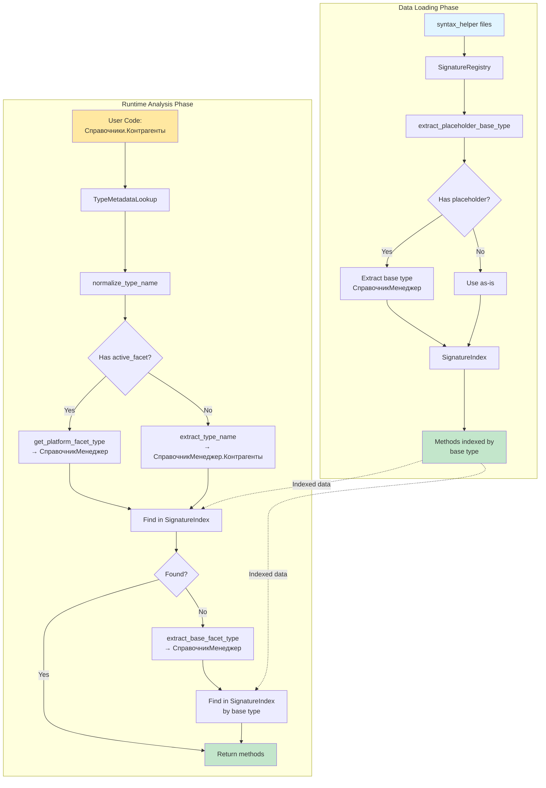
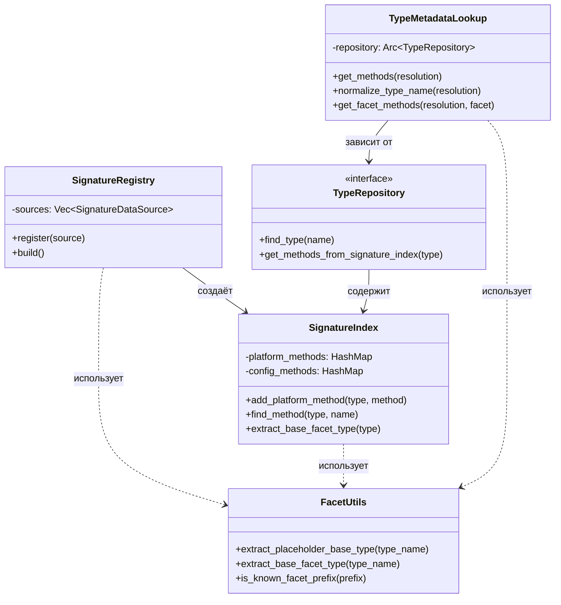

# Архитектура поиска типов (Type Lookup)

## Обзор

Система поиска типов в BSL Gradual Type System имеет двухфазную архитектуру, основанную на фасетной системе типов платформы 1С. Один объект метаданных (например, `Справочники.Контрагенты`) имеет несколько представлений (фасетов):

- **Manager** (СправочникМенеджер) - управление объектами
- **Object** (СправочникОбъект) - редактируемый экземпляр
- **Reference** (СправочникСсылка) - ссылка на объект
- **Selection** (СправочникВыборка) - выборка объектов
- **List** (СправочникСписок) - динамический список

Архитектура разделена на две фазы:

### 1. Data Loading Phase (Загрузка данных)
Происходит при инициализации системы:
- `SignatureRegistry` загружает типы из `syntax_helper`
- `extract_placeholder_base_type()` извлекает базовые типы из placeholder формата
- Пример: `СправочникМенеджер.<Имя справочника>` → `СправочникМенеджер`

### 2. Runtime Analysis Phase (Анализ во время выполнения)
Происходит при анализе кода пользователя:
- `TypeMetadataLookup` ищет методы для конкретных типов
- `extract_base_facet_type()` извлекает базовые типы из конкретного формата
- Пример: `СправочникМенеджер.Контрагенты` → `СправочникМенеджер`

## Фазы работы

### Фаза 1: Data Loading Phase

**Когда происходит:** При загрузке типов платформы из `examples/syntax_helper`

**Входные данные:**
```
СправочникМенеджер.<Имя справочника>
ДокументОбъект.<Имя документа>
РегистрСведенийНаборЗаписей.<Имя регистра сведений>
```

**Процесс:**

```rust
// В SignatureRegistry при загрузке типов
for platform_type in &types {
    for method in &platform_type.methods {
        let signature = raw_method_to_signature(method, &platform_type.name);

        // Добавляем под полным именем с placeholder
        index.add_platform_method(platform_type.name.clone(), signature.clone());

        // Также добавляем под базовым именем для фасетных типов
        if let Some(base_type) = extract_placeholder_base_type(&platform_type.name) {
            // base_type = "СправочникМенеджер"
            index.add_platform_method(base_type.to_string(), signature);
        }
    }
}
```

**Функция извлечения:**

```rust
pub fn extract_placeholder_base_type(type_name: &str) -> Option<&str> {
    // Стандартный формат: .<Имя
    if let Some(pos) = type_name.find(".<Имя") {
        return Some(&type_name[..pos]);
    }

    // HTML-encoded формат: .&lt;Имя
    if let Some(pos) = type_name.find(".&lt;Имя") {
        return Some(&type_name[..pos]);
    }

    None
}
```

**Результат:** Методы индексированы по базовому типу (`СправочникМенеджер`) и доступны для всех конкретных справочников.

---

### Фаза 2: Runtime Analysis Phase

**Когда происходит:** При анализе кода пользователя во время выполнения LSP

**Входные данные:**
```bsl
Процедура Пример()
    Менеджер = Справочники.Контрагенты; // → СправочникМенеджер.Контрагенты
    Менеджер.СоздатьЭлемент();          // Какой return type?
КонецПроцедуры
```

**Процесс:**

```rust
// В TypeMetadataLookup.get_methods()

// 1. Извлекаем имя конкретного типа
let type_name = "СправочникМенеджер.Контрагенты";

// 2. Ищем методы в SignatureIndex
let methods = repository.get_methods_from_signature_index(type_name);

// 3. Если не найдено, извлекаем базовый тип
if methods.is_empty() {
    if let Some(base_type) = extract_base_facet_type(type_name) {
        // base_type = "СправочникМенеджер"
        methods = repository.get_methods_from_signature_index(base_type);
    }
}
```

**Функция извлечения:**

```rust
pub fn extract_base_facet_type(type_name: &str) -> Option<&str> {
    // Проверяем наличие точки (признак конкретизированного типа)
    let dot_pos = type_name.find('.')?;

    let prefix = &type_name[..dot_pos];

    // Проверяем что префикс - известный фасетный тип
    if is_known_facet_prefix(prefix) {
        Some(prefix)
    } else {
        None
    }
}
```

**Результат:** Найдены методы базового типа `СправочникМенеджер`, которые применимы к конкретному справочнику `Контрагенты`.

---

## Ключевые компоненты

### facet_utils.rs

Централизованная логика работы с фасетными типами.

**Основные функции:**

| Функция | Назначение | Фаза |
|---------|-----------|------|
| `extract_placeholder_base_type()` | Извлекает базовый тип из placeholder формата | Loading |
| `extract_base_facet_type()` | Извлекает базовый тип из конкретного формата | Runtime |
| `is_known_facet_prefix()` | Проверяет известность фасетного префикса | Обе |

**Пример использования:**

```rust
// Loading Phase
let base = extract_placeholder_base_type("СправочникМенеджер.<Имя справочника>");
// → Some("СправочникМенеджер")

// Runtime Phase
let base = extract_base_facet_type("СправочникМенеджер.Контрагенты");
// → Some("СправочникМенеджер")

// Validation
let is_facet = is_known_facet_prefix("СправочникМенеджер");
// → true
```

---

### SignatureIndex

Хранит сигнатуры методов с поддержкой merge-логики.

**Ключевые возможности:**

1. **Индексация по базовому типу:**
```rust
// Методы хранятся под ключом "СправочникМенеджер"
platform_methods: HashMap<String, Vec<MethodSignature>>
```

2. **Fallback поиск с фасетами:**
```rust
pub fn find_method(&self, type_name: &str, method_name: &str) -> Option<&MethodSignature> {
    // 1. Сначала ищем по точному имени типа
    if let Some(method) = self.find_method_in_maps(type_name, method_name) {
        return Some(method);
    }

    // 2. Если не найдено и это фасетный тип, ищем по базовому типу
    if let Some(base_type) = extract_base_facet_type(type_name) {
        return self.find_method_in_maps(base_type, method_name);
    }

    None
}
```

3. **Merge-логика для обогащения данных:**
```rust
pub fn add_platform_method(&mut self, type_name: String, method: MethodSignature) {
    let methods = self.platform_methods.entry(type_name.clone()).or_default();

    // Ищем существующий метод
    if let Some(existing) = methods.iter_mut().find(|m| m.name == method.name) {
        // Обновляем только пустые поля
        if existing.return_type.is_none() && method.return_type.is_some() {
            existing.return_type = method.return_type;
        }
        if existing.return_facet.is_none() && method.return_facet.is_some() {
            existing.return_facet = method.return_facet;
        }
    } else {
        // Добавляем новый метод
        methods.push(method);
    }
}
```

**Преимущества merge-логики:**
- `syntax_helper` предоставляет список методов (без return types)
- `platform_types.rs` предоставляет return types и facets
- SignatureIndex объединяет оба источника в полную сигнатуру

---

### SignatureRegistry

Управляет загрузкой типов из разных источников с приоритетами.

**Registry Pattern:**

```rust
let index = SignatureSourceRegistry::new()
    .register(SyntaxHelperSource::new(platform_types))  // priority: 10
    .register(PlatformTypesSource::new())               // priority: 20
    .build();
```

**Преимущества:**
- Декларативная регистрация источников
- Автоматическая сортировка по приоритету
- Merge-логика применяется автоматически
- Защита от забытых источников

---

### TypeMetadataLookup

Мост между TypeResolution и RawTypeData для получения документации типа.

**Приоритеты поиска методов:**

```rust
pub fn get_methods(&self, resolution: &TypeResolution) -> Vec<RawMethodData> {
    // Приоритет 1: Lazy lookup через active_facet (для конфигурационных типов)
    if let Some(facet) = resolution.active_facet {
        if let Some(facet_methods) = self.get_facet_methods(resolution, facet) {
            return facet_methods;
        }
    }

    // Приоритет 2: Нормализованное имя типа через SignatureIndex
    if let Some(name) = self.normalize_type_name(resolution) {
        let sig_methods = self.repository.get_methods_from_signature_index(&name);
        if !sig_methods.is_empty() {
            return sig_methods.into_iter().map(Self::method_signature_to_raw).collect();
        }
    }

    // Приоритет 3: Fallback на raw types
    if let Some(name) = self.extract_type_name(resolution) {
        if let Some(raw) = self.repository.find_type(&name) {
            return raw.methods.clone();
        }

        // Fallback для фасетных типов: извлекаем базовый тип
        if let Some(base_type) = extract_base_facet_type(&name) {
            if let Some(raw) = self.repository.find_type(base_type) {
                return raw.methods.clone();
            }
        }
    }

    vec![]
}
```

**Нормализация имени типа:**

```rust
fn normalize_type_name(&self, resolution: &TypeResolution) -> Option<String> {
    // Если есть active_facet → строим platform facet type name
    if let Some(facet) = resolution.active_facet {
        if let Some(metadata_kind) = self.extract_metadata_kind(resolution) {
            if let Some(platform_name) = Self::get_platform_facet_type(metadata_kind, facet) {
                return Some(platform_name.to_string());
            }
        }
    }

    // Fallback на extract_type_name
    self.extract_type_name(resolution)
}
```

**Mapping MetadataKind + FacetKind → Platform Type:**

```rust
fn get_platform_facet_type(kind: MetadataKind, facet: FacetKind) -> Option<&'static str> {
    match (kind, facet) {
        // Documents
        (Document, Manager)   => Some("ДокументМенеджер.<Имя документа>"),
        (Document, Object)    => Some("ДокументОбъект.<Имя документа>"),
        (Document, Reference) => Some("ДокументСсылка.<Имя документа>"),
        (Document, Selection) => Some("ДокументВыборка.<Имя документа>"),
        (Document, List)      => Some("ДокументСписок.<Имя документа>"),

        // Catalogs
        (Catalog, Manager)    => Some("СправочникМенеджер.<Имя справочника>"),
        (Catalog, Object)     => Some("СправочникОбъект.<Имя справочника>"),
        (Catalog, Reference)  => Some("СправочникСсылка.<Имя справочника>"),
        (Catalog, Selection)  => Some("СправочникВыборка.<Имя справочника>"),
        (Catalog, List)       => Some("СправочникСписок.<Имя справочника>"),

        // ... другие виды метаданных
        _ => None,
    }
}
```

---

## Диаграмма потока данных



**Легенда:**
- 🔵 Голубой - входные данные
- 🟢 Зелёный - результат
- 🟡 Жёлтый - анализируемый код

---

## Сравнение функций извлечения базового типа

| Критерий | `extract_placeholder_base_type` | `extract_base_facet_type` |
|----------|--------------------------------|---------------------------|
| **Фаза** | Data Loading (при загрузке) | Runtime Analysis (при анализе) |
| **Входной формат** | Placeholder с шаблоном | Конкретизированный тип |
| **Пример входа** | `СправочникМенеджер.<Имя справочника>` | `СправочникМенеджер.Контрагенты` |
| **Результат** | `"СправочникМенеджер"` | `"СправочникМенеджер"` |
| **Проверка префикса** | Не требуется | Проверяет через `is_known_facet_prefix()` |
| **Поддержка HTML-encoded** | ✅ Да (`&lt;`, `&gt;`) | ❌ Нет |
| **Файл** | `shared/src/domain/facet_utils.rs` | `shared/src/domain/facet_utils.rs` |

**Почему две функции?**

1. **Разные источники данных:**
   - `syntax_helper` использует placeholder формат (`<Имя справочника>`)
   - Код пользователя использует конкретные имена (`Контрагенты`)

2. **Разная валидация:**
   - Placeholder формат всегда валиден (из документации)
   - Конкретный тип должен быть проверен (`is_known_facet_prefix`)

3. **Разные требования к производительности:**
   - Loading Phase: вызывается один раз при старте
   - Runtime Phase: вызывается при каждом анализе → должна быть быстрой

---

## Примеры использования

### Пример 1: Loading Phase

**Входные данные** (из `syntax_helper`):
```
СправочникМенеджер.<Имя справочника>
  Метод: СоздатьЭлемент() → СправочникОбъект.<Имя справочника>
  Метод: НайтиПоКоду(Код) → СправочникСсылка.<Имя справочника>
```

**Обработка:**
```rust
let type_name = "СправочникМенеджер.<Имя справочника>";
let base_type = extract_placeholder_base_type(type_name);
// → Some("СправочникМенеджер")

// Методы индексируются под базовым типом
index.add_platform_method("СправочникМенеджер".to_string(), create_element_method);
index.add_platform_method("СправочникМенеджер".to_string(), find_by_code_method);
```

**Результат:** Все методы `СправочникМенеджер` доступны для любого конкретного справочника.

---

### Пример 2: Runtime Phase - Конкретный справочник

**Код пользователя:**
```bsl
Процедура ПримерРаботыСоСправочником()
    Менеджер = Справочники.Контрагенты;
    Элемент = Менеджер.СоздатьЭлемент(); // Какой тип у Элемент?
КонецПроцедуры
```

**Обработка:**
```rust
// 1. Анализ выражения "Справочники.Контрагенты"
let resolution = TypeResolution {
    result: Concrete(Configuration {
        kind: MetadataKind::Catalog,
        name: "Контрагенты"
    }),
    active_facet: Some(FacetKind::Manager),
    ...
};

// 2. TypeMetadataLookup.normalize_type_name()
let platform_name = get_platform_facet_type(Catalog, Manager);
// → Some("СправочникМенеджер.<Имя справочника>")

// 3. Поиск методов в SignatureIndex
let methods = signature_index.get_methods_from_signature_index("СправочникМенеджер.<Имя справочника>");

// 4. Если не найдено - fallback на базовый тип
let base_type = extract_base_facet_type("СправочникМенеджер.<Имя справочника>");
// → Some("СправочникМенеджер")

let methods = signature_index.get_methods_from_signature_index("СправочникМенеджер");
// → Найдено: СоздатьЭлемент, НайтиПоКоду, ...

// 5. Находим метод СоздатьЭлемент
let method = methods.find(|m| m.name == "СоздатьЭлемент");
// return_type: "СправочникОбъект.<Имя справочника>"
// return_facet: Some(FacetKind::Object)

// 6. Подставляем конкретное имя "Контрагенты"
let concrete_return_type = substitute_type_name(method.return_type, "Контрагенты");
// → "СправочникОбъект.Контрагенты"
```

**Результат:** Тип переменной `Элемент` определён как `СправочникОбъект.Контрагенты`.

---

### Пример 3: Runtime Phase - Табличная часть документа

**Код пользователя:**
```bsl
Процедура РаботаСТабличнойЧастью()
    Док = Документы.ЗаказНаряды.СоздатьДокумент();
    Строка = Док.Работы.Добавить(); // Generic тип!
    Строка.Номенклатура = ...       // Какой тип у Строка?
КонецПроцедуры
```

**Обработка:**
```rust
// 1. Анализ "Док.Работы"
let resolution = TypeResolution {
    result: Generic(GenericType {
        base_type: "ТабличнаяЧасть",
        type_params: vec![ConcreteType::TabularRow(
            TabularRowType::new("Документы.ЗаказНаряды", "Работы", ...)
        )]
    }),
    active_facet: Some(FacetKind::Collection),
    ...
};

// 2. TypeMetadataLookup.get_methods() - специальная обработка для Generic
if let ResolutionResult::Generic(generic_type) = &resolution.result {
    return self.get_methods_for_generic(generic_type);
}

// 3. get_methods_for_generic() подставляет тип параметра
let base_methods = repository.find_type("ТабличнаяЧасть").methods;
// Метод: Добавить() → T

// Подставляем "T" → "СтрокаРаботы"
method.return_type = "СтрокаРаботы"; // (вместо "T")
```

**Результат:** Тип переменной `Строка` определён как `СтрокаРаботы` с атрибутами табличной части `Работы`.

---

## Edge Cases и оптимизации

### Edge Case 1: Методы с несколькими источниками

**Проблема:** Один метод может быть определён в `syntax_helper` (без return type) и в `platform_types.rs` (с return type).

**Решение:** Merge-логика в `SignatureIndex.add_platform_method()`

```rust
if existing.return_type.is_none() && method.return_type.is_some() {
    existing.return_type = method.return_type; // Обогащаем данные
}
```

---

### Edge Case 2: HTML-encoded placeholder в syntax_helper

**Проблема:** `syntax_helper` может содержать HTML entities:
```
СправочникМенеджер.&lt;Имя справочника&gt;
```

**Решение:** Поддержка HTML-encoded формата в `extract_placeholder_base_type()`

```rust
if let Some(pos) = type_name.find(".&lt;Имя") {
    return Some(&type_name[..pos]);
}
```

---

### Оптимизация 1: Lazy Resolution Cache (Milestone 3.15)

**Проблема:** Резолвинг return type для каждого вызова метода - дорого.

**Решение:** Кэш в `MethodSignature` через `Arc<OnceLock<>>`

```rust
pub struct MethodSignature {
    pub name: String,
    pub return_type: Option<String>,
    // ... другие поля

    #[serde(skip)]
    resolved_return: Arc<OnceLock<Option<TypeResolution>>>, // ← Кэш!
}

impl MethodSignature {
    pub fn get_resolved_return_type<F>(&self, resolve_fn: F) -> Option<&TypeResolution>
    where F: FnOnce(&str) -> TypeResolution
    {
        self.resolved_return
            .get_or_init(|| self.return_type.as_ref().map(|rt| resolve_fn(rt)))
            .as_ref()
    }
}
```

**Преимущества:**
- Резолвинг выполняется только один раз
- `Arc` позволяет разделять кэш между клонами
- Thread-safe через `OnceLock`

---

### Оптимизация 2: Приоритет SignatureIndex над raw types

**Проблема:** `syntax_helper` не содержит return types, но `platform_types.rs` содержит.

**Решение:** Приоритетный поиск в `TypeMetadataLookup.get_methods()`

```rust
// Приоритет 1: SignatureIndex (обогащённые данные)
let sig_methods = self.repository.get_methods_from_signature_index(&name);
if !sig_methods.is_empty() {
    return sig_methods.into_iter().map(Self::method_signature_to_raw).collect();
}

// Приоритет 2: Fallback на raw types (только если SignatureIndex пустой)
if let Some(raw) = self.repository.find_type(&name) {
    return raw.methods.clone();
}
```

---

## Файлы и компоненты

| Файл | Ответственность |
|------|----------------|
| `shared/src/domain/facet_utils.rs` | Централизованная логика извлечения базовых типов |
| `shared/src/domain/signature_index.rs` | Хранение сигнатур с merge-логикой и fallback поиском |
| `shared/src/domain/signature_registry.rs` | Регистрация источников типов с приоритетами |
| `shared/src/domain/metadata_lookup/mod.rs` | Мост между TypeResolution и RawTypeData |

---

## Визуализация связей компонентов



---

## Заключение

Двухфазная архитектура поиска типов обеспечивает:

1. **Эффективность:** Данные загружаются один раз при старте
2. **Гибкость:** Поддержка placeholder и конкретных типов
3. **Полнота:** Merge-логика объединяет данные из разных источников
4. **Производительность:** Lazy Resolution Cache и приоритетный поиск

**Ключевое преимущество:** Один набор методов `СправочникМенеджер` автоматически работает для всех справочников (`Контрагенты`, `Номенклатура`, `Склады`, ...) без дублирования данных.

---

## См. также

- [Type System Architecture](../architecture/type_system_architecture.md) - визуализация системы типов
- [Components Detailed](../architecture/components-detailed.md) - детальные компоненты
- [Scientific Basis](../reference/scientific-basis.md) - научная основа фасетной системы (Balyuk & Popova, 2021)
