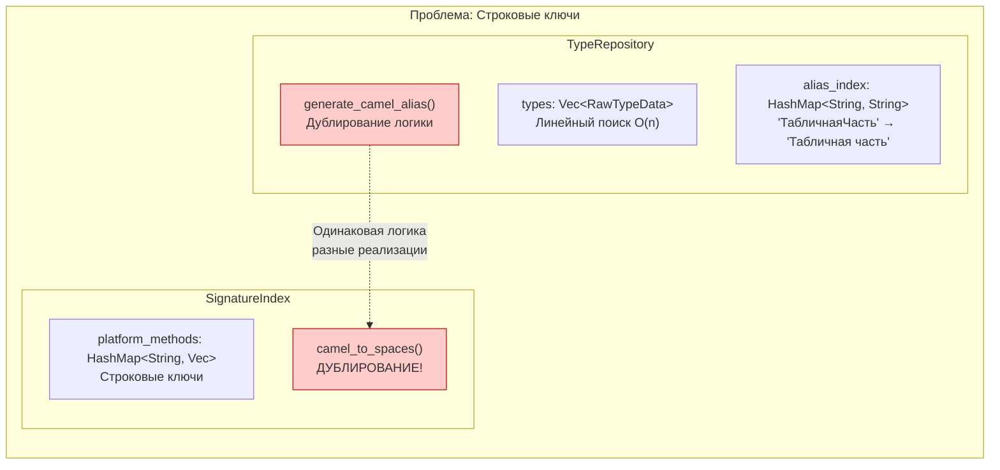
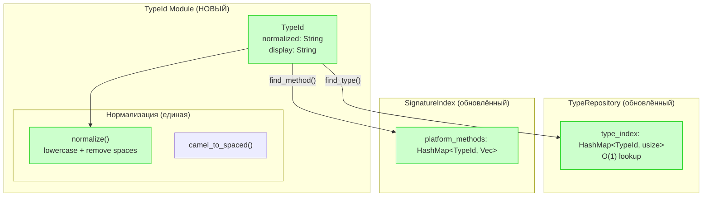
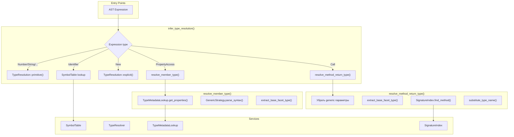
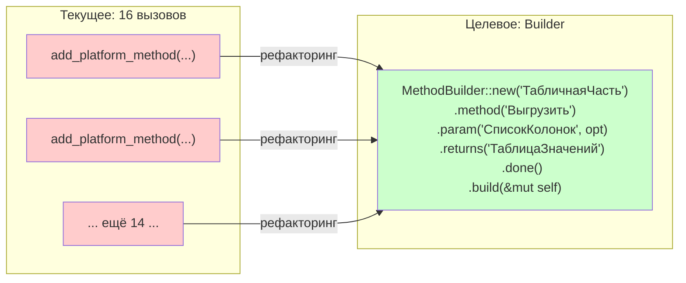
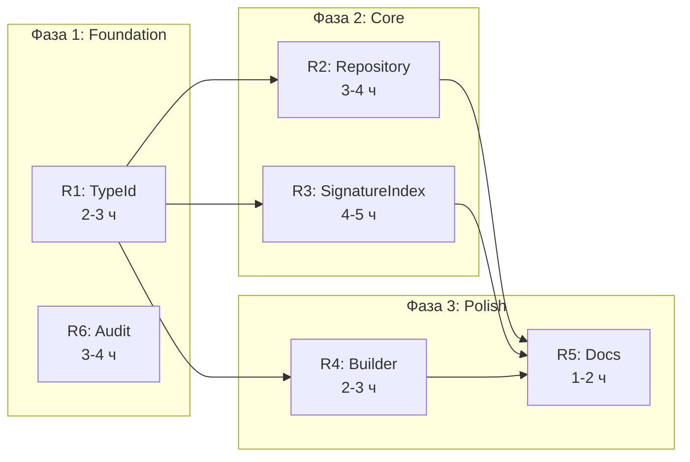

# Roadmap: Рефакторинг системы типов на TypeId

## Содержание

1. [Обзор проблем](#обзор-проблем)
2. [Диаграммы архитектуры](#диаграммы-архитектуры)
3. [Milestones](#milestones)
4. [Зависимости и порядок выполнения](#зависимости-и-порядок-выполнения)
5. [Риски и митигация](#риски-и-митигация)
6. [Оценка трудозатрат](#оценка-трудозатрат)

---

## Обзор проблем

### Текущая архитектура

```rust
// TypeRepository - строки как ключи + alias_index
pub struct InMemoryTypeRepository {
    types: RwLock<Vec<RawTypeData>>,           // Линейный поиск O(n)
    alias_index: RwLock<HashMap<String, String>>, // CamelCase -> оригинал
}

// SignatureIndex - тоже строки
pub struct SignatureIndex {
    platform_methods: HashMap<String, Vec<MethodSignature>>,
    // + собственный camel_to_spaces() - ДУБЛИРОВАНИЕ!
}
```

### Выявленные проблемы

| Приоритет | Проблема | Локация |
|-----------|----------|---------|
| **MAJOR** | Дублирование логики нормализации | `repository.rs` vs `index.rs` |
| **MAJOR** | 16 похожих вызовов add_platform_method | `index.rs:457-798` |
| **MINOR** | Строки как ключи HashMap (нет типобезопасности) | Везде |
| **MINOR** | Линейный поиск O(n) в find_type | `repository.rs` |
| **MINOR** | Неинформативные комментарии | Различные файлы |
| **MINOR** | Отсутствие tracing для отладки | Type resolution |

---

## Диаграммы архитектуры

### Текущая архитектура (проблемы)



### Целевая архитектура с TypeId



### Type Inference Flow



### MethodBuilder Pattern



---

## Milestones

### R1: TypeId Infrastructure (Foundation)

**Цель:** Создать типобезопасный идентификатор типа с унифицированной нормализацией

**Файлы:**
- `shared/src/domain/type_id/mod.rs` (новый)
- `shared/src/domain/type_id/type_id.rs` (новый)
- `shared/src/domain/type_id/normalization.rs` (новый)

**Ключевой код:**
```rust
#[derive(Debug, Clone, Eq, PartialEq, Hash)]
pub struct TypeId {
    normalized: String,  // lowercase, без пробелов
    display: String,     // оригинальное имя
}

impl TypeId {
    pub fn from_name(name: &str) -> Self;
    pub fn from_camel_case(name: &str) -> Self;
    pub fn base_type(&self) -> Option<TypeId>;
    pub fn without_generic_params(&self) -> TypeId;
}
```

**Оценка:** 2-3 часа | **Риск:** Низкий

---

### R2: TypeId Integration - TypeRepository

**Цель:** Заменить alias_index и линейный поиск на TypeId

**Файлы:**
- `shared/src/domain/repository.rs`

**Изменения:**
```rust
pub struct InMemoryTypeRepository {
    types: RwLock<Vec<RawTypeData>>,
    type_index: RwLock<HashMap<TypeId, usize>>,  // O(1) lookup
    // УДАЛЕНО: alias_index
}
```

**Оценка:** 3-4 часа | **Риск:** Средний

---

### R3: TypeId Integration - SignatureIndex

**Цель:** Унифицировать ключи, удалить camel_to_spaces дублирование

**Файлы:**
- `shared/src/domain/signature_index/index.rs`

**Изменения:**
```rust
pub struct SignatureIndex {
    platform_methods: HashMap<TypeId, Vec<MethodSignature>>,
    // УДАЛЕНО: fn camel_to_spaces()
}

pub fn add_platform_method(&mut self, type_name: impl Into<TypeId>, method: MethodSignature);
```

**Оценка:** 4-5 часов | **Риск:** Средний

---

### R4: MethodBuilder Helper

**Цель:** Устранить дублирование 16 вызовов через fluent API

**Файлы:**
- `shared/src/domain/signature_index/method_builder.rs` (новый)

**Использование:**
```rust
MethodBuilder::new("ТабличнаяЧасть")
    .method("Выгрузить")
        .param("СписокКолонок", "Строка").optional()
        .returns("ТаблицаЗначений")
        .done()
    .method("Добавить")
        .returns("СтрокаТабличнойЧасти")
        .done()
    // ... остальные методы
    .build(&mut signature_index);
```

**Оценка:** 2-3 часа | **Риск:** Низкий

---

### R5: Docstrings и Logging

**Цель:** Улучшить документацию и добавить tracing

**Файлы:**
- Все изменённые файлы из R1-R4

**Добавить:**
```rust
tracing::debug!(
    "TypeRepository.find_type('{}') normalized='{}' -> {:?}",
    name, type_id.normalized(), result
);
```

**Оценка:** 1-2 часа | **Риск:** Низкий

---

### R6: Type Inference Audit

**Цель:** Документировать flow и выявить проблемные места

**Deliverables:**
- Документ `docs/architecture/type-inference-flow.md`
- Интеграционные тесты для цепочек вызовов
- Список известных ограничений

**Оценка:** 3-4 часа | **Риск:** Низкий

---

## Зависимости и порядок выполнения



### Параллельная работа

| Можно параллельно | Последовательно |
|-------------------|-----------------|
| R1 + R6 | R2, R3, R4 требуют R1 |
| R2 + R3 + R4 (после R1) | R5 требует R2, R3, R4 |

---

## Риски и митигация

| Риск | Вероятность | Митигация |
|------|-------------|-----------|
| Breaking changes в API | Высокая | `impl Into<TypeId>` для обратной совместимости |
| Регрессии в type resolution | Средняя | R6 создаёт тесты ДО изменений |
| Performance regression | Низкая | TypeId O(1) lookup вместо O(n) |

---

## Оценка трудозатрат

| Milestone | Часы | Сложность |
|-----------|------|-----------|
| R1: TypeId Infrastructure | 2-3 | Низкая |
| R2: TypeId in TypeRepository | 3-4 | Средняя |
| R3: TypeId in SignatureIndex | 4-5 | Средняя |
| R4: MethodBuilder Helper | 2-3 | Низкая |
| R5: Docstrings & Logging | 1-2 | Низкая |
| R6: Type Inference Audit | 3-4 | Низкая |
| **ИТОГО** | **15-21** | |

---

## Checklist

### Готовность к началу
- [ ] `cargo build --workspace` успешен
- [ ] `cargo test --workspace` проходит
- [ ] Ветка `refactor/type-id` создана

### Завершение
- [ ] R1-R6 выполнены
- [ ] Все тесты проходят
- [ ] `cargo fmt && cargo clippy` без warnings
- [ ] PR создан и прошёл ревью
