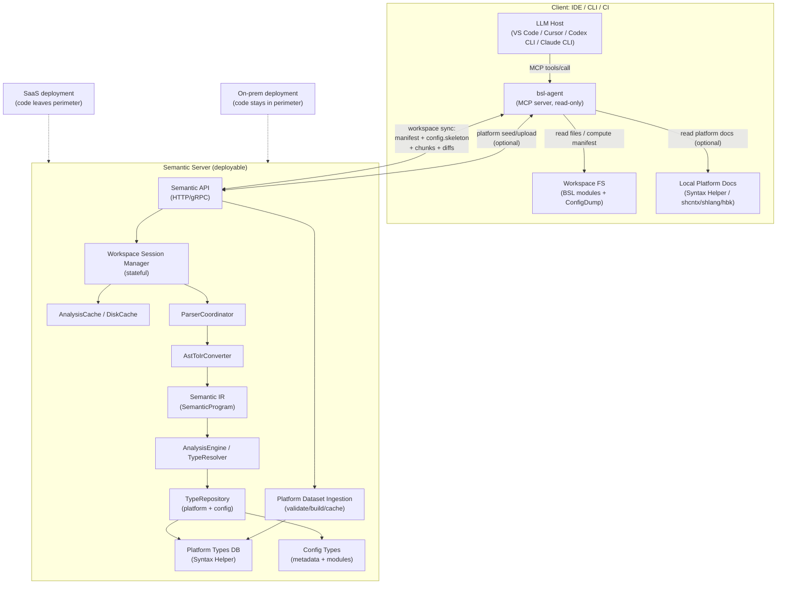

# Будущая архитектура (vNext): Server-first Semantic Platform (SaaS + On-prem)

**Статус:** 🟡 DRAFT  
**Цель:** запустить продукт как *семантическую платформу* для LLM-агентов (IDE/MCP + CI) без архитектурных ловушек, сохранив возможность двух поставок: SaaS и on-prem (код не покидает периметр).

Связанные документы:
- `docs/roadmap/ADR-001-server-vs-client-utf8.md`
- `docs/roadmap/server-first-offline-roadmap.md`
- `.claude/rules/architecture.md` (текущее состояние и слои)

---

## TL;DR: где проходит линия разреза

**Сервер = source of truth.** Клиенты не содержат inference-логики и не строят семантическое дерево.

### Что именно уходит на сервер (важно)
Клиент **не отправляет “данные после парсинга BSL”** (AST/IR/семантический граф).  
Сервер остаётся местом, где строится AST → IR → семантика и выполняется inference (ADR-001).

При этом есть два рабочих варианта по “Data Layer” (платформа/метаданные конфигурации):

1) **Raw inputs (проще для v1):** клиент отправляет исходные данные (`*.bsl`, “семантически важные” `*.xml`, optional Syntax Helper сырьё),
   сервер сам строит `RawTypeData`/индексы и кэширует по fingerprint.
2) **Data-layer bundle (быстрее/дешевле для больших конф):** клиент парсит артефакты на своей стороне (Data Layer) и отправляет
   **нормализованный результат** (например `Vec<RawTypeData>` + индексы экспортов/сигнатур) + fingerprint (Merkle).
   Сервер всё равно строит AST→IR→inference для BSL кода, но не тратит трафик/CPU на XML/HTML ingestion.

Практический плюс: в текущем коде такие “bundle”-границы уже естественные (они сериализуются в DiskCache),
например `CombinedConfigCachePayload { raw_types: Vec<RawTypeData>, indexed: IndexedConfigSignatures }`.

**Workspace (конфигурация/модули):**
- исходные данные файлов (тексты `*.bsl` и “семантически важные” `*.xml`) или инкрементальные изменения к ним;
- `config.skeleton` (обязателен для `hot_set/progressive`);
- `config.bundle` (опционально/по политике): нормализованный пакет `RawTypeData/индексы` для ускорения ingestion;
- манифест/хэши (Merkle) для дедупа и возобновления;
- метаданные сессии (версия платформы, язык, режим синхронизации).

**Платформенная документация (Syntax Helper):**
- по умолчанию сервер использует prebuilt датасеты;
- при `platform.ensure` клиент может загрузить *сырьё* (архив/каталог shcntx/shlang/hbk) или нормализованный пакет (manifest+blobs),
  но **построение** `Platform Types DB` и валидация выполняются на сервере.

### На стороне клиента (thin)
- Запуск и управление сессией воркспейса (open/close).
- Чтение файлов из workspace FS, вычисление хэшей/манифеста, фильтрация (include/exclude), подготовка чанков.
- Инкрементальные обновления (diff/patch на уровне файлов/диапазонов).
- Транспорт, auth, retry/cancel, ограничение частоты запросов.
- MCP-адаптер **только read-only** (никаких write/patch в проект).
- Подготовка и загрузка платформенной документации (seeding/пополнение), когда на сервере нет нужной версии платформы/языка.

### На стороне сервера (thick)
- Парсинг BSL и метаданных, AST → IR, построение SymbolTable/semantic graph.
- Type inference / gradual typing / facets / propagation.
- Кэширование, индексация, хранение состояния workspace-сессий.
- Платформенная база типов (Syntax Helper) и конфигурационные типы (metadata).
- Ingestion/валидация платформенных датасетов (пополнение с клиента, кэширование по fingerprint, изоляция по tenant/policy).

---

## Архитектурные драйверы (почему так)
- **Корректность/полнота** важнее “фич IDE”: LLM должен получать воспроизводимый семантический контекст.
- **Server-first** упрощает монетизацию (usage-based), контроль нагрузки агентов и защиту IP.
- **On-prem/offline** нужен для закрытых контуров; допускается lease/периодическая проверка лицензии.
- **Большие конфигурации** требуют stateful workspace на сервере и дедуп/кэширование (иначе latency и стоимость растут квадратично).

---

## Компоненты (vNext)

### Клиентская сторона
**`bsl-agent` (локальный бинарник)**
- Роль: MCP server (stdio) для IDE/CLI-агентов + “sync client” для сервера семантики.
- Экспортирует tools вида “прочитать семантику” (diagnostics, type-at-position, definition, references, context pack).
- Не пишет в workspace и не применяет патчи.
- Может выступать загрузчиком платформенной документации (если в окружении есть исходные артефакты Syntax Helper / shcntx/shlang).

**IDE/CLI/CI**
- VS Code / Cursor / Codex CLI / Claude CLI выступают MCP-клиентами и вызывают `bsl-agent`.
- CI вызывает `bsl-agent` в batch-режиме и получает отчёты (JSON/SARIF/…).

### Серверная сторона (Semantic Server)
**Semantic API**
- Workspace lifecycle: `workspace.open`, `workspace.applyChanges`, `workspace.close`, `workspace.status`.
  - `workspace.applyChanges` покрывает и обычные текстовые изменения, и догрузку артефактов по `missingInputs[]` (как full-file blobs).
- Semantic queries: `diagnostics`, `typeAtPosition`, `members`, `definition`, `references`, `context.pack`.
- Cancelability и таймауты на уровне запросов (агенты генерируют burst-нагрузку).
- Platform datasets: `platform.ensure`, `platform.status`, `platform.upload` (опционально/по политике), чтобы пополнять базу платформы.

**Workspace Session Manager**
- Держит состояние загруженного воркспейса (файлы, версии, индексы, кэши).
- Использует fingerprints (Merkle) для reuse и дедупа между сессиями.

**Parsing + Semantic**
- Парсер BSL/метаданных → AST → IR (SemanticProgram).
- AnalysisEngine/TypeResolver работает только с IR (не зависит от парсера).

**Type data**
- Platform types: Syntax Helper dataset (версия платформы, язык).
- Config data: метаданные конфигурации + извлечённые сигнатуры модулей.

---

## Диаграмма архитектуры (vNext)

---

## Потоки данных (v1, чтобы “запуститься”)

### Минимальная модель данных: артефакты и запрос недостающих входов
Сервер оперирует артефактами (inputs) и всегда может запросить недостающие.
Это нужно, чтобы `hot_set/progressive` были **честными** и не требовали “залить всю конфу”.

**ArtifactRef (в `missingInputs[]`):**
- `kind`: `bsl|xml|config.skeleton|config.bundle|platform.bundle`
- `path`: нормализованный путь (или логический идентификатор для bundle)
- `reason`: человекочитаемая причина (“нужны реквизиты табличной части”, “нужен модуль менеджера для экспортов”)
- `priority`: `blocking|background`

**Правило:** если для точного ответа нужен артефакт, которого нет на сервере, запрос помечается `completeness=partial` и возвращает `missingInputs[]`.

### Поток (IDE, `syncMode=progressive` по умолчанию)
1) `platform.ensure` (опционально): убедиться, что на сервере есть `Platform Types DB` для `platformVersion+language`.
2) `workspace.open`:
   - клиент отправляет `config.skeleton` (см. ниже) + “горячий набор” (`hot_set`) открытых `*.bsl`;
   - сервер отвечает “что нужно догрузить” (dedup по манифесту/хэшам).
3) `context.pack` / batch queries:
   - сервер строит/обновляет семантику для доступных артефактов;
   - при нехватке данных отвечает `partial + missingInputs[]`;
   - клиент догружает недостающее через `workspace.applyChanges` (full-file blobs) и повторяет запрос.

### Поток (CI, `syncMode=full`)
1) `platform.ensure` (или prebuilt).
2) `workspace.open(full)` + загрузка “семантически релевантного набора”.
3) `diagnostics`/`context.pack` батчами, без интерактивного цикла догрузок (или с фоновым `missingInputs` как улучшение качества).

## Сценарии использования (важно для 1С)

Типичный сценарий разработчика 1С: одновременно открыто несколько модулей:
- 3–4 общих модуля,
- 3–4 модуля объектов,
- 3–4 модуля форм.

Из этого следуют два требования:
- IDE должен давать “быструю семантику” для открытых модулей без многогигабайтного аплоада.
- Семантика должна быть **честной**: если данных не хватает, сервер обязан говорить об этом и уметь запрашивать недостающее.

### Режимы синхронизации (рекомендуемо для IDE vs CI)
Для 1С-конфигураций масштаба `examples/conf_big` “залить весь воркспейс целиком” может быть слишком дорогим для первого UX в IDE.
Поэтому в `workspace.open` стоит явно задавать режим синхронизации.

**Предложение:**
- `syncMode = hot_set` — отправляем только “горячий набор” (открытые/активные модули) + минимальный индекс метаданных.
- `syncMode = progressive` — как `hot_set`, но сервер может запрашивать недостающие файлы, а клиент догружает их; дополнительно фоновая догрузка индексов.
- `syncMode = full` — отправляем весь “семантически релевантный” набор (для CI и полного анализа).

**Важно (1С-специфика):**
- Выбор зависимостей по “call graph из открытых модулей” ненадёжен: вызовы часто не имеют явного указания на модуль-источник, встречаются динамические вызовы и платформенные entrypoints.
- Поэтому `hot_set/progressive` должны работать как **demand-driven**: сервер честно отвечает “не могу точно резолвить без X” и возвращает список недостающих входов, которые клиент может догрузить.

### 0) `platform.ensure` (пополнение платформенной документации с клиента)
Цель: не отправлять “платформенную базу” вместе с каждым воркспейсом, но иметь возможность поддерживать любые версии платформы.

**Идея:**
- Клиент указывает `platformVersion` + `language` (например, `ru`).
- Сервер проверяет, есть ли готовый датасет: `platform.status` → `available|missing|building`.
- Если `missing`, клиент (при наличии локальных артефактов) отправляет платформенную документацию на сервер:
  - как “сырьё” (архив/каталог Syntax Helper), либо
  - как нормализованный пакет (manifest + blobs), чтобы сервер дедуплицировал по fingerprint.

**Политика/безопасность (особенно для SaaS):**
- Загрузка платформенной базы должна быть разрешена политикой (admin/tenant scoped), иначе это канал инъекции данных.
- Сервер валидирует вход (структура/версии/контрольные суммы) и строит нормализованный `Platform Types DB` с версионированием.

### 1) `workspace.open` (SaaS и on-prem одинаково)
- Клиент строит манифест файлов (path/size/hash) + workspace fingerprint (Merkle).
- Сервер отвечает, какие файлы/чанки нужны (дедуп/кэш).
- Клиент догружает данные чанками с компрессией и возобновлением.

Рекомендуемая политика включения (для больших конфигураций):
- включать `*.bsl` (семантика кода);
- включать **минимум метаданных** (см. `config.skeleton`);
- `*.xml` догружать **по требованию** (progressive), а не целиком;
- исключать тяжёлые UI/ресурсы по умолчанию:
  - `**/Templates/**`, `**/*.png`, `**/*.jpg`, `**/*.gif`, `**/*.epf`, `**/*.erf`, `**/*.cf`, `**/*.cfe`;
  - `**/Forms/**` — включать *только* формы, для которых открыт модуль формы или запрошена семантика формы.

Минимальный “bootstrapping” для `syncMode = hot_set/progressive`:
- `config.skeleton`: минимальный индекс конфигурации (список метаданных/фасетов/контекстов выполнения + соответствие “объект → файлы модулей”);
- сами открытые `*.bsl` модули;
- версия платформы и язык документации (чтобы выбрать server-side базу типов).

`config.skeleton` (решение v1):
- **обязателен** для `hot_set/progressive`;
- строится на клиенте (дёшево, без inference) и может быть отправлен как отдельный артефакт;
- содержит:
  - `configSetId`/`prefix`/`compatibilityMode` (для выбора платформенной базы),
  - список объектов метаданных: `{kind, name, fullName, uuid?}`,
  - фасеты (Manager/Object/Reference/…) и execution context (Server/Client/Universal) для модулей,
  - отображение `{metadata object → module paths}` (ObjectModule/ManagerModule/FormModule/…),
  - отображение `{metadata object → semantic xml paths}` (какие `*.xml` нужны, чтобы построить типы атрибутов/табличных частей/реквизитов формы).

### 2) `workspace.applyChanges`
- Инкрементальные изменения файлов (текст/диапазоны), versioned.
- Сервер обновляет состояние и инвалидации кэшей точечно.

### 3) Semantic queries (read-only)
- IDE-агент: много коротких запросов (type/definition/references/context).
- CI-агент: батч-режим, но чаще **таргетированный** (по изменённым файлам/модулям/областям интереса), а не “полная диагностика всей конфигурации”.

Рекомендуемый контракт “честности” (critical для LLM):
- Каждый ответ содержит `completeness: full|partial`.
- При `partial` сервер возвращает `missingInputs[]` (какие файлы/сущности нужны для повышения точности) и не “галлюцинирует” типы.

---

## Latency: SaaS остаётся работоспособным (если не делать “chatty”)

Предпосылка для v1: основной потребитель — **LLM-агент**, и допустима задержка “несколько секунд” на tool-вызов.
Психологический порог для UX — около **5 секунд** на один запрос к семантической платформе (без учёта задержки самой LLM).

Отсюда ключевое правило для SaaS (RTT ~90мс и выше):
- нельзя проектировать протокол так, чтобы один “смысловой шаг” требовал 10–30 мелких round-trip запросов;
- API должен быть **крупнозернистым** и уметь отвечать “пакетом”, а не точечно.

Практическая цель по SLO (v1):
- серверная обработка в тёплой workspace-сессии: обычно <1с на типовой запрос агента;
- end-to-end (с сетью) в P99 укладываться в ~5с, иначе агентный UX “разваливается”.

Рекомендуемые интерфейсы для LLM (вместо LSP-style чатов):
- `context.pack` как основной endpoint: один запрос возвращает контекст (типы/диагностика/ключевые определения/участок графа ссылок) с флагом `completeness`.
- batch-запросы вместо одиночных: `members.batch`, `typeAtPosition.batch`, `definition.batch`.
- обязательные метаданные ответа: `completeness`, `missingInputs[]`, `timings{...}`, `traceId` (для профилирования и отладки).

Для интерактивного IDE-IntelliSense (completion “на каждый символ”) SaaS возможен только при агрессивном кэшировании/батчинге,
а для “максимально отзывчивого” UX предпочтительнее on-prem/offline (localhost) как отдельный режим поставки.

---

## Нефункциональные требования (минимум для устойчивого запуска)
- **Determinism:** одинаковый вход → одинаковый вывод.
- **Cancelability:** отмена запросов (особенно completion/поиск контекста).
- **Position encoding:** явная политика кодировок и конвертации позиций (UTF-16 vs UTF-8) на границе API.
- **Isolation:** изоляция воркспейсов/пользователей (SaaS multi-tenant).
- **Retention policy:** явное TTL/удаление данных на SaaS; on-prem хранит данные по политике заказчика.

---

## Решения по “открытым вопросам” (выбор для v1)

### 1) “Семантический минимальный набор” метаданных
**Ответ (v1):** минимальный набор — это `config.skeleton` + точечная догрузка `semantic xml` по требованию.
Мы не пытаемся “протащить всю UI-конфу”, но сохраняем корректность для типов:
- атрибуты/табличные части объектов метаданных,
- экспортные методы/сигнатуры модулей,
- реквизиты/контекст выполнения форм — только когда анализируем модуль формы.

### 2) Нужен ли “progressive upload”
**Ответ (v1):** да, это дефолт для IDE.
`hot_set` используется как быстрый старт, но полноценный UX достигается через `progressive` (demand-driven догрузка по `missingInputs[]`).
`full` — для CI и полного анализа.

### 3) Делать ли data-layer bundle обязательным
**Ответ (v1):** нет, это optional-ускоритель.
- **SaaS:** bundle включается фичефлагом/политикой (лимиты размера, tenant isolation, schema version).
- **On-prem/offline:** bundle можно включать по умолчанию, чтобы уменьшить трафик/CPU на ingestion XML/HTML.

### 4) Контракт `context.pack` для LLM-агентов
**Ответ (v1):** `context.pack` — основной “крупнозернистый” endpoint, который заменяет набор мелких LSP-запросов.

`context.pack` request (минимум):
- `workspaceId`
- `focus`: `{uri, position}`
- `intent`: `explain|fix|refactor|tests|diagnose` (влияет на состав пакета)
- `mode`: `fast|precise` (precise может возвращать `missingInputs` чаще)
- `budget`: `{maxBytes, maxItems}`
- `include`: `{diagnostics, types, members, definitions, references}`

`context.pack` response (минимум):
- `completeness: full|partial`
- `missingInputs[]: ArtifactRef[]`
- `payload`: один или два формата:
  - `text` (Markdown/PlainText для прямой подачи в LLM),
  - `structured` (JSON с типами/диагностикой/ссылками для повторного использования)
- `timings{...}` + `traceId`

### 5) Версионирование contracts/DTO
**Ответ (v1):**
- API версионируется через `/v1/...` (или эквивалент в gRPC service version).
- В `workspace.open` делается handshake: клиент присылает `clientVersion` и `supportedProtocolVersions[]`,
  сервер выбирает `protocolVersion` и возвращает `capabilities`.
- Любой сериализуемый payload (включая bundle) имеет `schemaVersion`, который включается в fingerprint/ключи кэша.

### 6) Пополнение `Platform Types DB` в SaaS
**Ответ (v1):** “curated prebuilt + controlled tenant upload”.
- Сервер поставляется с **curated** набором prebuilt версий платформы/языков.
- Если версии нет: `platform.status=missing`.
- `platform.upload` разрешён только admin/tenant scoped политикой (и/или enterprise-тарифом):
  - вход валидируется (структура/контрольные суммы/лимиты),
  - сборка делается асинхронно (`building`),
  - результат хранится tenant-scoped (без глобального шаринга по умолчанию).

## Оставшиеся вопросы (после v1)
- Как формализовать “semantic xml paths” для форм так, чтобы корректность типов была высокой, но объём догрузки оставался малым?
- Нужны ли отдельные предзагрузочные профили (например “только общие модули” vs “модули форм”) для ускорения UX?
