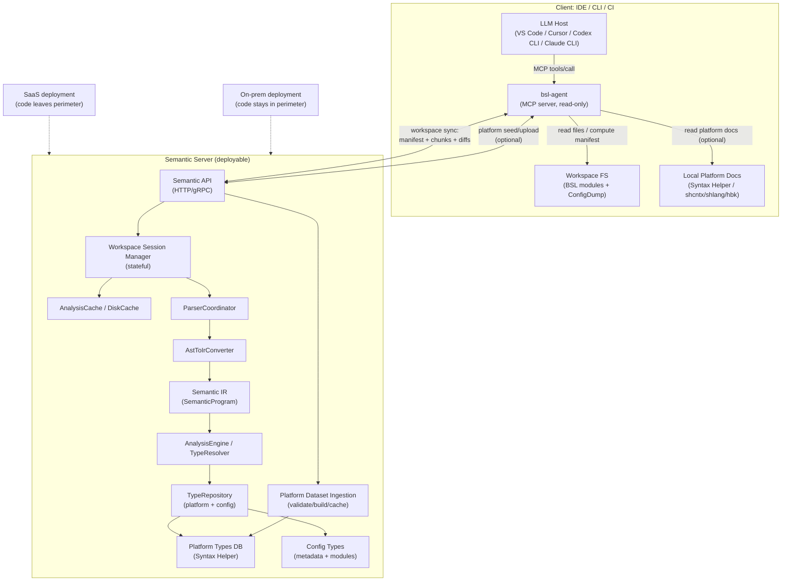

# Будущая архитектура (vNext): Server-first Semantic Platform (SaaS + On-prem)

**Статус:** 🟡 DRAFT  
**Цель:** запустить продукт как *семантическую платформу* для LLM-агентов (IDE/MCP + CI) без архитектурных ловушек, сохранив возможность двух поставок: SaaS и on-prem (код не покидает периметр).

Связанные документы:
- `docs/roadmap/ADR-001-server-vs-client-utf8.md`
- `docs/roadmap/server-first-offline-roadmap.md`
- `.claude/rules/architecture.md` (текущее состояние и слои)

---

## TL;DR: где проходит линия разреза

**Сервер = source of truth.** Клиенты не содержат inference-логики и не строят семантическое дерево.

### На стороне клиента (thin)
- Запуск и управление сессией воркспейса (open/close).
- Чтение файлов из workspace FS, вычисление хэшей/манифеста, фильтрация (include/exclude), подготовка чанков.
- Инкрементальные обновления (diff/patch на уровне файлов/диапазонов).
- Транспорт, auth, retry/cancel, ограничение частоты запросов.
- MCP-адаптер **только read-only** (никаких write/patch в проект).
- Подготовка и загрузка платформенной документации (seeding/пополнение), когда на сервере нет нужной версии платформы/языка.

### На стороне сервера (thick)
- Парсинг BSL и метаданных, AST → IR, построение SymbolTable/semantic graph.
- Type inference / gradual typing / facets / propagation.
- Кэширование, индексация, хранение состояния workspace-сессий.
- Платформенная база типов (Syntax Helper) и конфигурационные типы (metadata).
- Ingestion/валидация платформенных датасетов (пополнение с клиента, кэширование по fingerprint, изоляция по tenant/policy).

---

## Архитектурные драйверы (почему так)
- **Корректность/полнота** важнее “фич IDE”: LLM должен получать воспроизводимый семантический контекст.
- **Server-first** упрощает монетизацию (usage-based), контроль нагрузки агентов и защиту IP.
- **On-prem/offline** нужен для закрытых контуров; допускается lease/периодическая проверка лицензии.
- **Большие конфигурации** требуют stateful workspace на сервере и дедуп/кэширование (иначе latency и стоимость растут квадратично).

---

## Компоненты (vNext)

### Клиентская сторона
**`bsl-agent` (локальный бинарник)**
- Роль: MCP server (stdio) для IDE/CLI-агентов + “sync client” для сервера семантики.
- Экспортирует tools вида “прочитать семантику” (diagnostics, type-at-position, definition, references, context pack).
- Не пишет в workspace и не применяет патчи.
- Может выступать загрузчиком платформенной документации (если в окружении есть исходные артефакты Syntax Helper / shcntx/shlang).

**IDE/CLI/CI**
- VS Code / Cursor / Codex CLI / Claude CLI выступают MCP-клиентами и вызывают `bsl-agent`.
- CI вызывает `bsl-agent` в batch-режиме и получает отчёты (JSON/SARIF/…).

### Серверная сторона (Semantic Server)
**Semantic API**
- Workspace lifecycle: `workspace.open`, `workspace.applyChanges`, `workspace.close`, `workspace.status`.
- Semantic queries: `diagnostics`, `typeAtPosition`, `members`, `definition`, `references`, `context.pack`.
- Cancelability и таймауты на уровне запросов (агенты генерируют burst-нагрузку).
- Platform datasets: `platform.ensure`, `platform.status`, `platform.upload` (опционально/по политике), чтобы пополнять базу платформы.

**Workspace Session Manager**
- Держит состояние загруженного воркспейса (файлы, версии, индексы, кэши).
- Использует fingerprints (Merkle) для reuse и дедупа между сессиями.

**Parsing + Semantic**
- Парсер BSL/метаданных → AST → IR (SemanticProgram).
- AnalysisEngine/TypeResolver работает только с IR (не зависит от парсера).

**Type data**
- Platform types: Syntax Helper dataset (версия платформы, язык).
- Config data: метаданные конфигурации + извлечённые сигнатуры модулей.

---

## Диаграмма архитектуры (vNext)

---

## Потоки данных (v1, чтобы “запуститься”)

## Сценарии использования (важно для 1С)

Типичный сценарий разработчика 1С: одновременно открыто несколько модулей:
- 3–4 общих модуля,
- 3–4 модуля объектов,
- 3–4 модуля форм.

Из этого следуют два требования:
- IDE должен давать “быструю семантику” для открытых модулей без многогигабайтного аплоада.
- Семантика должна быть **честной**: если данных не хватает, сервер обязан говорить об этом и уметь запрашивать недостающее.

### Режимы синхронизации (рекомендуемо для IDE vs CI)
Для 1С-конфигураций масштаба `examples/conf_big` “залить весь воркспейс целиком” может быть слишком дорогим для первого UX в IDE.
Поэтому в `workspace.open` стоит явно задавать режим синхронизации.

**Предложение:**
- `syncMode = hot_set` — отправляем только “горячий набор” (открытые/активные модули) + минимальный индекс метаданных.
- `syncMode = progressive` — как `hot_set`, но сервер может запрашивать недостающие файлы, а клиент догружает их; дополнительно фоновая догрузка индексов.
- `syncMode = full` — отправляем весь “семантически релевантный” набор (для CI и полного анализа).

**Важно (1С-специфика):**
- Выбор зависимостей по “call graph из открытых модулей” ненадёжен: вызовы часто не имеют явного указания на модуль-источник, встречаются динамические вызовы и платформенные entrypoints.
- Поэтому `hot_set/progressive` должны работать как **demand-driven**: сервер честно отвечает “не могу точно резолвить без X” и возвращает список недостающих входов, которые клиент может догрузить.

### 0) `platform.ensure` (пополнение платформенной документации с клиента)
Цель: не отправлять “платформенную базу” вместе с каждым воркспейсом, но иметь возможность поддерживать любые версии платформы.

**Идея:**
- Клиент указывает `platformVersion` + `language` (например, `ru`).
- Сервер проверяет, есть ли готовый датасет: `platform.status` → `available|missing|building`.
- Если `missing`, клиент (при наличии локальных артефактов) отправляет платформенную документацию на сервер:
  - как “сырьё” (архив/каталог Syntax Helper), либо
  - как нормализованный пакет (manifest + blobs), чтобы сервер дедуплицировал по fingerprint.

**Политика/безопасность (особенно для SaaS):**
- Загрузка платформенной базы должна быть разрешена политикой (admin/tenant scoped), иначе это канал инъекции данных.
- Сервер валидирует вход (структура/версии/контрольные суммы) и строит нормализованный `Platform Types DB` с версионированием.

### 1) `workspace.open` (SaaS и on-prem одинаково)
- Клиент строит манифест файлов (path/size/hash) + workspace fingerprint (Merkle).
- Сервер отвечает, какие файлы/чанки нужны (дедуп/кэш).
- Клиент догружает данные чанками с компрессией и возобновлением.

Рекомендуемая политика включения (для больших конфигураций):
- включать `*.bsl` (семантика кода);
- включать “семантически важные” `*.xml`;
- исключать тяжёлые артефакты UI/ресурсов по умолчанию (например, `Templates/*`, бинарники), но оставлять возможность включить их опционально.

Минимальный “bootstrapping” для `syncMode = hot_set/progressive`:
- минимальный индекс конфигурации (список метаданных/фасетов/контекстов выполнения + соответствие “объект → файлы модулей”);
- сами открытые `*.bsl` модули;
- версия платформы и язык документации (чтобы выбрать server-side базу типов).

### 2) `workspace.applyChanges`
- Инкрементальные изменения файлов (текст/диапазоны), versioned.
- Сервер обновляет состояние и инвалидации кэшей точечно.

### 3) Semantic queries (read-only)
- IDE-агент: много коротких запросов (type/definition/references/context).
- CI-агент: батч-режим, но чаще **таргетированный** (по изменённым файлам/модулям/областям интереса), а не “полная диагностика всей конфигурации”.

Рекомендуемый контракт “честности” (critical для LLM):
- Каждый ответ содержит `completeness: full|partial`.
- При `partial` сервер возвращает `missingInputs[]` (какие файлы/сущности нужны для повышения точности) и не “галлюцинирует” типы.

---

## Нефункциональные требования (минимум для устойчивого запуска)
- **Determinism:** одинаковый вход → одинаковый вывод.
- **Cancelability:** отмена запросов (особенно completion/поиск контекста).
- **Position encoding:** явная политика кодировок и конвертации позиций (UTF-16 vs UTF-8) на границе API.
- **Isolation:** изоляция воркспейсов/пользователей (SaaS multi-tenant).
- **Retention policy:** явное TTL/удаление данных на SaaS; on-prem хранит данные по политике заказчика.

---

## Открытые вопросы
- Какой “семантический минимальный набор” метаданных нужен, чтобы не отправлять гигабайты UI-ресурсов, но не терять корректность типов?
- Нужен ли отдельный режим “progressive upload”: сначала открытые файлы + метаданные, затем фоновая догрузка?
- Как версионировать contracts/DTO так, чтобы клиенты (IDE/CI) не ломались при обновлениях сервера?
- Какой процесс пополнения `Platform Types DB` принять для SaaS: prebuilt-only, tenant-scoped upload, admin-curated список версий?
