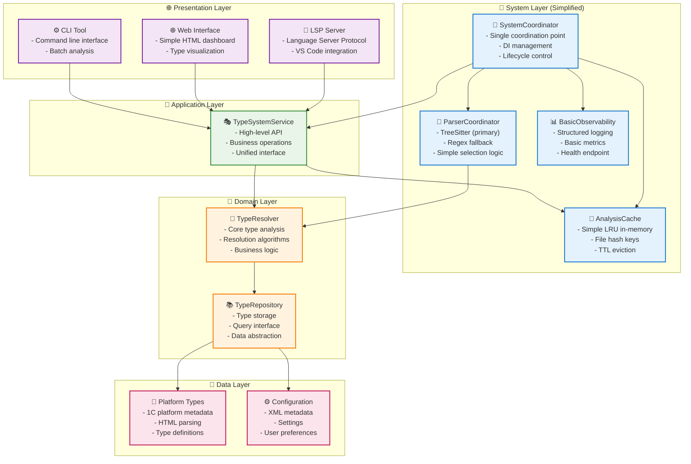

# Упрощенная архитектура BSL Gradual Type System

## 🎯 Right-Sized Architecture для BSL Type System

**Философия**: Start simple, scale up по необходимости

---

## 🤔 Проблема с текущей архитектурой

### **Что получилось сложного:**
- 25-30 компонентов
- 4 специализированных координатора  
- L1+L2 многоуровневое кеширование
- Parser strategy pattern с 3+ стратегиями
- Full observability stack (Circuit Breaker, Event Bus, etc.)
- 3000-5000+ LOC только на архитектуру

### **Для кого это оправдано:**
✅ **Enterprise teams (5+ разработчиков)**  
✅ **High-load systems (10K+ файлов)**  
✅ **Multiple integrations** (IDEs, CI/CD, APIs)  
✅ **6+ месяцев разработки**

### **Но для BSL Type System возможно overkill:**
❓ 1-2 разработчика  
❓ Средние проекты (<1K файлов)  
❓ Основная задача: LSP + VS Code  
❓ 3-6 месяцев на MVP

---

## 🎯 Simplified Architecture

### **Core Principle: "Essential Components Only"**

```rust
// 6-8 компонентов вместо 25-30
struct SimplifiedBSLTypeSystem {
    // 1. Coordination (1 компонент)
    coordinator: SystemCoordinator,
    
    // 2. Caching (1 компонент) 
    cache: AnalysisCache,
    
    // 3. Parsing (1 компонент)
    parser: ParserCoordinator,
    
    // 4. Observability (1 компонент)
    observability: BasicObservability,
    
    // 5. Core Domain (без изменений)
    type_resolver: TypeResolver,
    repository: TypeRepository,
    
    // 6. API Interface (1 компонент)
    api_service: TypeSystemService,
}
```

---

## 🏗️ Simplified Architecture Diagram



---

## 🔧 Component Details

### **🎯 SystemCoordinator** 
```rust
struct SystemCoordinator {
    cache: AnalysisCache,
    parser: ParserCoordinator,
    observability: BasicObservability,
    type_service: TypeSystemService,
}

impl SystemCoordinator {
    fn new() -> Self {
        let cache = AnalysisCache::new(1000); // Simple LRU
        let parser = ParserCoordinator::with_fallback();
        let observability = BasicObservability::default();
        let type_service = TypeSystemService::new(cache.clone());
        
        Self { cache, parser, observability, type_service }
    }
    
    fn start(&self) -> Result<(), StartupError> {
        self.observability.log_startup();
        self.cache.warm_cache()?;
        self.type_service.initialize()?;
        Ok(())
    }
}
```

### **💾 AnalysisCache (Simple)**
```rust
struct AnalysisCache {
    storage: LruCache<FileHash, AnalysisResult>,
    ttl_tracker: HashMap<FileHash, Instant>,
}

impl AnalysisCache {
    fn new(capacity: usize) -> Self {
        Self {
            storage: LruCache::new(capacity),
            ttl_tracker: HashMap::new(),
        }
    }
    
    fn get(&mut self, file_hash: &FileHash) -> Option<AnalysisResult> {
        // Simple TTL check
        if let Some(timestamp) = self.ttl_tracker.get(file_hash) {
            if timestamp.elapsed() > Duration::from_secs(300) {
                self.storage.remove(file_hash);
                self.ttl_tracker.remove(file_hash);
                return None;
            }
        }
        
        self.storage.get(file_hash).cloned()
    }
    
    fn insert(&mut self, file_hash: FileHash, result: AnalysisResult) {
        self.storage.insert(file_hash, result);
        self.ttl_tracker.insert(file_hash, Instant::now());
    }
}
```

### **🎨 ParserCoordinator (Simple)**
```rust
struct ParserCoordinator {
    tree_sitter: TreeSitterParser,
    regex_fallback: RegexParser,
}

impl ParserCoordinator {
    fn with_fallback() -> Self {
        Self {
            tree_sitter: TreeSitterParser::new(),
            regex_fallback: RegexParser::new(),
        }
    }
    
    fn parse(&self, content: &str) -> ParseResult {
        // Simple strategy: try TreeSitter, fallback to Regex
        match self.tree_sitter.parse(content) {
            Ok(result) => Ok(result),
            Err(tree_sitter_error) => {
                log::warn!("TreeSitter failed: {}, falling back to regex", tree_sitter_error);
                self.regex_fallback.parse(content)
            }
        }
    }
}
```

### **📊 BasicObservability** 
```rust
struct BasicObservability {
    logger: StructuredLogger,
    metrics: SimpleMetrics,
}

impl BasicObservability {
    fn default() -> Self {
        Self {
            logger: StructuredLogger::new(),
            metrics: SimpleMetrics::new(),
        }
    }
    
    fn log_analysis(&self, file_path: &Path, duration: Duration) {
        self.logger.info("analysis_completed", json!({
            "file": file_path.display(),
            "duration_ms": duration.as_millis(),
            "timestamp": Utc::now()
        }));
        
        self.metrics.increment("analyses_total");
        self.metrics.observe("analysis_duration_ms", duration.as_millis() as f64);
    }
    
    fn health_check(&self) -> HealthStatus {
        HealthStatus {
            status: "healthy".to_string(),
            uptime: self.metrics.uptime(),
            cache_size: self.metrics.cache_size(),
        }
    }
}
```

---

## 📊 Comparison: Complex vs Simple

| Aspect | Complex Architecture | Simple Architecture | Savings |
|--------|---------------------|-------------------|---------|
| **Components** | 25-30 | 6-8 | **70-80%** |
| **Coordinators** | 4 specialized | 1 unified | **75%** |
| **Caching** | L1+L2 multi-level | Simple LRU | **60%** |
| **Parsing** | Strategy pattern + 3 parsers | 2 parsers, simple fallback | **50%** |
| **Observability** | Full stack (8+ components) | Basic logging + metrics | **80%** |
| **LOC Estimate** | 3000-5000 | 800-1200 | **70-80%** |
| **Development Time** | 6+ months | 2-3 months | **60%** |
| **Learning Curve** | High | Low | **Major** |

---

## 🚀 Migration Path: Complex → Simple

### **Phase 1: Simplify Coordinators**
```rust
// Before: 4 specialized coordinators
InitCoordinator + RuntimeCoordinator + ConfigCoordinator + ObservabilityCoordinator

// After: 1 unified coordinator  
SystemCoordinator
```

### **Phase 2: Simplify Caching**
```rust
// Before: Multi-level caching
AdvancedAnalysisCache { L1HotCache + L2PersistentCache + CacheStrategy }

// After: Simple caching
AnalysisCache { LruCache + TTL }
```

### **Phase 3: Simplify Parsing**
```rust
// Before: Strategy pattern
UnifiedParserCoordinator { TreeSitterStrategy + SyntaxHelperStrategy + RegexFallback }

// After: Simple fallback
ParserCoordinator { TreeSitter + Regex }
```

### **Phase 4: Simplify Observability**
```rust
// Before: Enterprise stack
LoggingManager + MetricsCollector + HealthChecker + CircuitBreaker + EventBus

// After: Basic observability
BasicObservability { Logger + SimpleMetrics + HealthEndpoint }
```

---

## 🎯 When to Use Each Architecture

### **✅ Use Simple Architecture When:**
- Team size: 1-3 developers
- Project scope: BSL type analysis for VS Code
- File count: < 1000 files typically
- Timeline: 3-6 months to MVP
- Performance: "good enough" is fine
- Maintenance: want low complexity

### **✅ Use Complex Architecture When:**
- Team size: 4+ developers  
- Project scope: Multiple IDE integrations, CI/CD, APIs
- File count: > 5000 files regularly
- Timeline: 12+ months development
- Performance: need sub-second response times
- Maintenance: have dedicated DevOps/SRE

---

## 🏆 Recommendation

**For BSL Gradual Type System, I recommend starting with the Simple Architecture:**

1. **Faster time-to-market** (2-3 months vs 6+)
2. **Lower maintenance burden** (6 components vs 25+)
3. **Easier onboarding** for new contributors
4. **Good enough performance** for typical BSL projects
5. **Can scale up later** if needed

**Progressive enhancement strategy:**
- Start simple ✅
- Measure actual performance bottlenecks 📊
- Add complexity only where proven necessary 🎯

**Remember**: "Perfect is the enemy of good" 😊

---

## 💡 Next Steps

1. **Validate with users**: Do we need enterprise-grade features?
2. **Performance testing**: Is simple cache fast enough?
3. **Prototype both approaches**: Build simplified version first
4. **Measure and compare**: Real metrics over theoretical benefits

**The goal**: Right-sized architecture for the actual problem domain! 🎯

---

## 🔄 MIGRATION POTENTIAL: Simple → Enterprise

### 🤔 **Критический вопрос: "А можно ли будет перейти к Enterprise?"**

**Краткий ответ: ДА, но с некоторыми оговорками! ✅**

---

### 📋 **Architecture Foundation Analysis**

#### **✅ Что ХОРОШО заложено в Simple для миграции:**

**🏗️ Clean Architecture Layers** - **ПОЛНАЯ СОВМЕСТИМОСТЬ**
```rust
// Simple сохраняет все слои Clean Architecture:
🎯 System Layer → Enterprise может добавить специализированные координаторы  
🌐 Presentation → Легко добавить новые API (GraphQL, gRPC)
🔧 Application → Command/Query separation добавляется естественно
🧠 Domain → TypeResolver остается без изменений
💾 Data → Repositories уже абстрагированы
```

**🎯 SystemCoordinator как Composition Root** - **ИДЕАЛЬНЫЙ ЗАДЕЛ**
```rust
// Текущий SystemCoordinator:
struct SystemCoordinator {
    cache: AnalysisCache,           // → AdvancedAnalysisCache  
    parser: ParserCoordinator,      // → UnifiedParserCoordinator
    observability: BasicObservability, // → Full observability stack
    type_service: TypeSystemService,   // остается
}

// Легко расширяется до:
struct SystemCoordinator {
    init: InitCoordinator,          // NEW: lifecycle management
    runtime: RuntimeCoordinator,    // NEW: analysis orchestration  
    config: ConfigCoordinator,      // NEW: configuration
    observability: ObservabilityCoordinator, // UPGRADED
    api_gateway: BSLApiGateway,     // NEW: unified API
}
```

**🔌 Trait-Based Design** - **ОТЛИЧНАЯ ОСНОВА**
```rust
// Simple уже использует traits:
trait TypeRepository { /* ... */ }
trait Parser { /* ... */ }

// Enterprise просто добавляет новые implementations:
impl TypeRepository for PostgresRepository { /* ... */ }
impl TypeRepository for EventStoreRepository { /* ... */ }
impl Parser for TreeSitterStrategy { /* ... */ }
impl Parser for SyntaxHelperStrategy { /* ... */ }
```

#### **⚠️ Что ПОТРЕБУЕТ РЕФАКТОРИНГА:**

**💾 Caching Architecture** - **СРЕДНЯЯ СЛОЖНОСТЬ**
```rust
// Simple: Монолитный cache
struct AnalysisCache {
    storage: LruCache<FileHash, AnalysisResult>,
    ttl_tracker: HashMap<FileHash, Instant>,
}

// Enterprise: Нужно разделить на L1+L2
struct AdvancedAnalysisCache {
    l1_hot: InMemoryCache,       // HOT data
    l2_persistent: DiskCache,    // WARM data  
    strategy: CacheStrategy,     // Intelligence
}

// МИГРАЦИЯ: Wrapper pattern
impl AnalysisCache {
    fn migrate_to_advanced(self) -> AdvancedAnalysisCache {
        AdvancedAnalysisCache::with_existing_data(self.storage)
    }
}
```

**🎨 Parser Selection** - **ПРОСТАЯ МИГРАЦИЯ**
```rust
// Simple: Hardcoded fallback
fn parse(&self, content: &str) -> ParseResult {
    match self.tree_sitter.parse(content) {
        Ok(result) => Ok(result),
        Err(_) => self.regex_fallback.parse(content),
    }
}

// Enterprise: Strategy pattern
fn parse(&self, content: &str) -> ParseResult {
    let best_strategy = self.select_best_strategy(content);
    best_strategy.parse(content)
}

// МИГРАЦИЯ: Обернуть текущую логику в DefaultStrategy
```

**📊 Observability** - **ЛЕГКОЕ РАСШИРЕНИЕ**
```rust
// Simple: Basic metrics
struct BasicObservability {
    logger: StructuredLogger,
    metrics: SimpleMetrics,
}

// Enterprise: Добавить компоненты
struct ObservabilityCoordinator {
    logging: LoggingManager,      // UPGRADED
    metrics: MetricsCollector,    // UPGRADED
    health: HealthChecker,        // NEW
    circuit_breaker: CircuitBreaker, // NEW
    event_bus: EventBus,          // NEW
}

// МИГРАЦИЯ: BasicObservability становится частью LoggingManager
```

---

### 🗺️ **Detailed Migration Roadmap**

#### **Phase 1: Foundation (1-2 weeks)**
```rust
// Подготовить интерфейсы для расширения
trait CacheStrategy {
    fn should_cache(&self, key: &FileHash) -> bool;
    fn eviction_policy(&self) -> EvictionPolicy;
}

trait ParserStrategy {
    fn confidence(&self, content: &BSLContent) -> f64;
    fn parse(&self, content: &BSLContent) -> ParseResult;
}

// Simple архитектура начинает использовать эти traits
```

#### **Phase 2: Cache Enhancement (2-3 weeks)**
```rust
// Шаг 1: Добавить L2 cache рядом с существующим
struct AnalysisCache {
    l1_memory: LruCache<FileHash, AnalysisResult>, // existing
    l2_disk: Option<DiskCache<FileHash, AnalysisResult>>, // NEW
    ttl_tracker: HashMap<FileHash, Instant>,
}

// Шаг 2: Постепенно переключить на L2
// Шаг 3: Добавить cache strategies
```

#### **Phase 3: Parser Strategies (2-3 weeks)**
```rust
// Шаг 1: Обернуть текущие парсеры в strategies
struct CurrentTreeSitterStrategy(TreeSitterParser);
struct CurrentRegexStrategy(RegexParser);

// Шаг 2: Добавить ParserCoordinator с strategy selection
// Шаг 3: Добавить новые strategies (SyntaxHelper, etc.)
```

#### **Phase 4: Coordinators Split (3-4 weeks)**
```rust
// Постепенно выделить ответственности из SystemCoordinator
SystemCoordinator 
├→ InitCoordinator::extract_initialization_logic()
├→ RuntimeCoordinator::extract_analysis_orchestration()  
├→ ConfigCoordinator::extract_configuration_management()
└→ ObservabilityCoordinator::extract_monitoring_logic()
```

#### **Phase 5: Enterprise Features (4-6 weeks)**
```rust
// Добавить продвинутые возможности
├→ BSLApiGateway (unified API)
├→ Circuit Breakers & Resilience  
├→ Event Bus & Domain Events
├→ Advanced Security
└→ Plugin Architecture
```

---

### 📊 **Migration Risk Assessment**

| Component | Migration Complexity | Risk Level | Estimated Effort |
|-----------|---------------------|------------|------------------|
| **Clean Architecture** | ✅ No change | 🟢 Low | 0 days |
| **SystemCoordinator** | ✅ Extensions only | 🟢 Low | 2-3 days |
| **TypeResolver/Repository** | ✅ Interface compatible | 🟢 Low | 1-2 days |
| **Simple Cache → L1+L2** | ⚠️ Structural change | 🟡 Medium | 5-7 days |
| **Parser fallback → Strategy** | ⚠️ Logic refactor | 🟡 Medium | 3-5 days |
| **Basic → Full Observability** | ✅ Additive changes | 🟢 Low | 4-6 days |
| **Add Enterprise Features** | ✅ New components | 🟢 Low | 10-15 days |

**🎯 ИТОГО: 25-40 дней (~6-8 недель) для полной миграции**

---

### 🔧 **Migration Strategy: Strangler Fig Pattern**

**Идея**: Постепенно заменять компоненты, сохраняя работоспособность

```rust
// Phase 1: Dual implementations
struct HybridAnalysisCache {
    simple_cache: AnalysisCache,      // existing
    advanced_cache: Option<AdvancedAnalysisCache>, // new
    migration_percentage: f64,         // 0.0 → 1.0
}

impl HybridAnalysisCache {
    fn get(&self, key: &FileHash) -> Option<AnalysisResult> {
        if self.should_use_advanced() {
            self.advanced_cache.as_ref()?.get(key)
        } else {
            self.simple_cache.get(key)
        }
    }
    
    fn should_use_advanced(&self) -> bool {
        random::<f64>() < self.migration_percentage
    }
}
```

**Преимущества подхода:**
- ✅ **Zero downtime** миграция
- ✅ **A/B testing** новых компонентов
- ✅ **Easy rollback** при проблемах
- ✅ **Gradual learning** новой архитектуры

---

### 🎯 **Architecture Evolution Example**

```rust
// Month 1: Simple Architecture
SystemCoordinator {
    cache: AnalysisCache,
    parser: ParserCoordinator,
    observability: BasicObservability,
}

// Month 6: Hybrid Architecture  
SystemCoordinator {
    cache: HybridCache { simple + advanced },
    parser: StrategyCoordinator { fallback + strategies },
    observability: EnhancedObservability,
}

// Month 12: Full Enterprise
SystemCoordinator {
    init: InitCoordinator,
    runtime: RuntimeCoordinator, 
    config: ConfigCoordinator,
    observability: ObservabilityCoordinator,
    api_gateway: BSLApiGateway,
}
```

---

### 🏆 **Migration Verdict**

#### **✅ ХОРОШИЕ НОВОСТИ:**
- **Clean Architecture foundation** идеально подходит
- **SystemCoordinator pattern** легко расширяется
- **Trait-based design** обеспечивает гибкость
- **6-8 недель** для полной миграции (реалистично!)

#### **⚠️ CHALLENGES:**
- Cache архитектура требует рефакторинга
- Parser logic нужно перепроектировать под strategies
- Некоторые компоненты потребуют переписывания

#### **🎯 РЕКОМЕНДАЦИЯ:**
**ДА, миграция возможна и относительно безболезненна!**

**Start Simple → Measure Performance → Migrate Selectively**

**Архитектурный задел в Simple версии - ОТЛИЧНЫЙ!** 🚀
