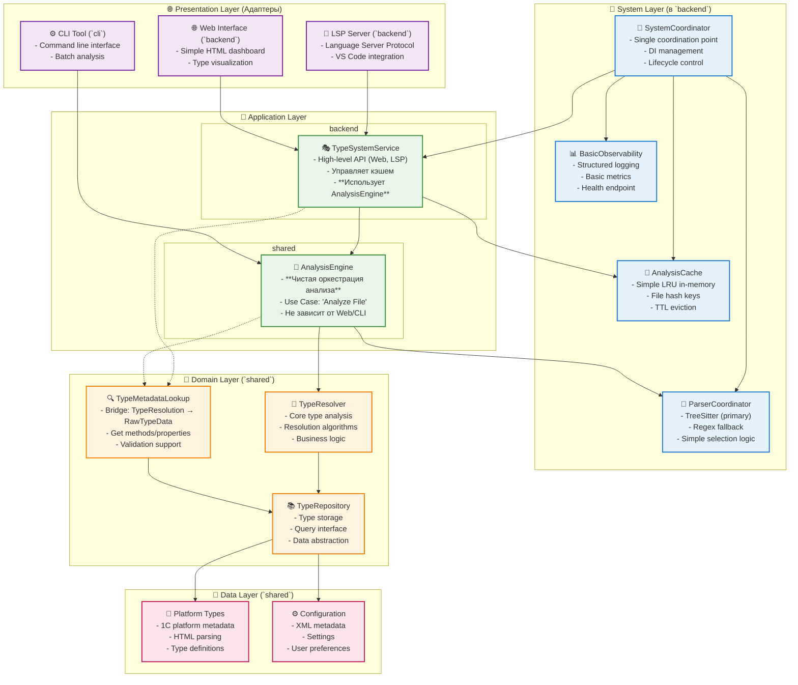

# Упрощенная архитектура BSL Gradual Type System

## 🎯 Right-Sized Architecture для BSL Type System

**Философия**: Start simple, scale up по необходимости

---

## 🤔 Проблема с текущей архитектурой (без изменений)

### **Что получилось сложного:**
- 25-30 компонентов
- 4 специализированных координатора  
- L1+L2 многоуровневое кеширование
- Parser strategy pattern с 3+ стратегиями
- Full observability stack (Circuit Breaker, Event Bus, etc.)
- 3000-5000+ LOC только на архитектуру

### **Для кого это оправдано:**
✅ **Enterprise teams (5+ разработчиков)**  
✅ **High-load systems (10K+ файлов)**  
✅ **Multiple integrations** (IDEs, CI/CD, APIs)  
✅ **6+ месяцев разработки**

### **Но для BSL Type System возможно overkill:**
❓ 1-2 разработчика  
❓ Средние проекты (<1K файлов)  
❓ Основная задача: LSP + VS Code  
❓ 3-6 месяцев на MVP

---

## 🎯 Simplified Architecture

### **Core Principle: "Essential Components Only"**

```rust
// 6-8 компонентов вместо 25-30
struct SimplifiedBSLTypeSystem {
    // 1. System Layer (в backend)
    system_coordinator: SystemCoordinator,
    cache: AnalysisCache,
    parser_coordinator: ParserCoordinator,
    observability: BasicObservability,
    
    // 2. Application Layer (в shared и backend)
    analysis_engine: AnalysisEngine,       // НОВОЕ: Чистый оркестратор анализа
    type_service: TypeSystemService,       // Обёртка для API (Web/LSP)
    
    // 3. Core Domain (без изменений)
    type_resolver: TypeResolver,
    repository: TypeRepository,
}
```

---

## 🏗️ Simplified Architecture Diagram (Актуализирована)



---

## 🔧 Component Details (Актуализированы и Упрощены)

### **🎯 SystemCoordinator** (в `backend`)
-   **Структура:** Содержит экземпляры всех ключевых системных сервисов (`AnalysisCache`, `ParserCoordinator`, `BasicObservability`, `TypeSystemService`).
-   **Назначение:** Является "точкой сборки" (Composition Root) и управляет жизненным циклом серверного приложения.

### **🚀 AnalysisEngine** (в `shared`)
-   **Структура:** Содержит `TypeResolver` и `ParserCoordinator`. Не зависит от `backend`.
-   **Назначение:** Реализует чистый сценарий "проанализировать файл". Является переиспользуемым ядром для всех адаптеров (`cli`, `backend`).

### **🎭 TypeSystemService** (в `backend`)
-   **Структура:** Содержит `AnalysisEngine` и специфичные для `backend` компоненты (`AnalysisCache`, `TypeMetadataLookup`).
-   **Назначение:** Предоставляет высокоуровневый API для `LSP Server` и `Web Interface`. Использует `AnalysisEngine` для выполнения анализа, добавляя поверх него логику кэширования и обработки сетевых запросов. Использует `TypeMetadataLookup` для обогащения данных методами/свойствами из RawTypeData.

### **🔍 TypeMetadataLookup** (в `shared`)
-   **Структура:** Содержит ссылку на `TypeRepository`.
-   **Назначение:** Мост между `TypeResolution` (результат анализа) и `RawTypeData` (полная документация). Предоставляет методы для получения методов, свойств, описаний из RawTypeData на основе TypeResolution. Используется для валидации и обогащения API ответов.
-   **Ключевые методы:**
    - `get_methods(resolution)` - получить методы типа
    - `get_properties(resolution)` - получить свойства типа
    - `get_raw_type(resolution)` - получить полную RawTypeData
    - `has_member(resolution, name)` - проверить существование метода/свойства

### **💾 AnalysisCache (Simple)**
-   **Структура:** Основан на LRU-кэше (`LruCache`) с отслеживанием времени жизни (TTL).
-   **Назначение:** Кэширует в памяти результаты анализа файлов для ускорения повторных запросов.

### **🎨 ParserCoordinator (Simple)**
-   **Структура:** Содержит основной парсер (`TreeSitter`) и запасной (`Regex`).
-   **Назначение:** Управляет процессом парсинга исходного кода, используя простую стратегию "попробовать основной, при ошибке — запасной".

### **📊 BasicObservability**
-   **Структура:** Включает в себя структурированный логгер и сборщик простых метрик.
-   **Назначение:** Обеспечивает базовый мониторинг работы приложения (логирование, метрики производительности, эндпоинт состояния).

---

## 🏗️ Crate Organization Strategy (Актуализирована) 

### 🤔 Слои VS Крейты: Важное различие

**Слои** — это **логическое разделение** (архитектурные границы)  
**Крейты** — это **физическое разделение** (единицы компиляции)

### 🎯 Рекомендуемый подход: НЕ выносить каждый слой в отдельный крейт

**Почему НЕ нужно создавать крейт для каждого слоя:**
- ❌ **Over-engineering** для нашего размера проекта
- ❌ **Сложность сборки** (6+ крейтов вместо 4)
- ❌ **Circular dependencies** между слоями
- ❌ **Усложнение DI** и координации

### ✅ ЛУЧШЕ: Объединить слои по **ролям**

```
shared/          # Domain + Application (Core Analysis Logic)
├── domain/      # TypeResolver, TypeRepository
├── types/       # ResolutionResult, Certainty
├── api/         # DTO для API (контракты)
└── engine/      # НОВОЕ: AnalysisEngine (чистый оркестратор анализа)

backend/         # System + Application (Web/LSP Specific) + Presentation (server)  
├── system/      # SystemCoordinator, AnalysisCache
├── application/ # TypeSystemService (использует shared::engine::AnalysisEngine)
├── parsing/     # ParserCoordinator (или его инициализация/использование)
├── presentation/# LSP Server, Web routes
└── data/        # Platform types, Config

frontend/        # Presentation (web UI)
├── components/  # Leptos компоненты
├── pages/       # Страницы
└── api/         # HTTP клиент

cli/             # Presentation (command line)
├── commands/    # Команды CLI
├── args.rs      # НОВОЕ: Аргументы CLI и форматтеры
└── main.rs      # Entry point (использует shared::engine::AnalysisEngine)
```


### 🎯 Роли крейтов

**shared/** — "чистые" типы и domain логика + **общий оркестратор анализа**
- ✅ Без I/O, сети, файловой системы (прямого доступа)
- ✅ Компилируется и под WASM, и под native
- ✅ Переиспользуется всеми крейтами

**backend/** — все "серверные" слои в одном крейте (System + Application + Server-side Presentation)
- ✅ Внутри организовано по модулям/папкам
- ✅ Единая сборка, простая координация

**frontend/**, **cli/** — специализированные презентационные слои

### 💡 Принцип организации

**Слои помогают организовать код внутри крейтов, крейты помогают изолировать роли и зависимости.**

Оставляем **логические слои внутри крейтов**, не выносим их в отдельные крейты. Это дает:
- 🎯 **Простоту** — 4 крейта вместо 6-8
- ⚡ **Быстроту сборки** — меньше межкрейтовых зависимостей  
- 🧩 **Гибкость** — слои остаются, но в рамках логических границ
- 📦 **Переиспользование** — shared крейт содержит общую логику

---

## 🧠 Core Type System Design (BSL Specific) (без изменений) 

### **🎯 TypeResolution - Центральная абстракция**

**Не просто "тип", а "разрешение типа" с уровнем уверенности:**

```rust
struct TypeResolution {
    // 🎯 Ключевое отличие: уровень уверенности
    certainty: Certainty,           // Known | Inferred(0.0-1.0) | Unknown
    
    result: ResolutionResult,       // Concrete | Union | Dynamic | Conditional
    source: ResolutionSource,       // Static | Inferred | Runtime
    metadata: ResolutionMetadata,   // Debugging info
    
    // 🎭 Фасетная система (BSL-специфичное)
    active_facet: Option<FacetKind>, 
    available_facets: Vec<FacetKind>,
}

enum Certainty {
    Known,              // 100% уверенности (статический анализ)
    Inferred(f32),      // 0.0-1.0 (градуальная типизация)
    Unknown,            // Runtime определение
}
```

**🎯 Преимущества подхода:**
- ✅ **Честность о неопределенности** - система не притворяется, что знает больше
- ✅ **Градуальная миграция** - от dynamic к static постепенно
- ✅ **Качественная диагностика** - показывает уверенность пользователю
- ✅ **Flow-sensitive анализ** - сужение типов в условиях

### **🎭 Фасетная система (1C-специфичная)**

**Один тип = множество представлений:**

```rust
// Пример: Справочник "Контрагенты"
enum FacetKind {
    Manager,    // Справочники.Контрагенты - создание, поиск
    Object,     // СправочникОбъект.Контрагенты - изменяемый объект  
    Reference,  // СправочникСсылка.Контрагенты - ссылка на элемент
    Metadata,   // Метаданные.Справочники.Контрагенты - описание структуры
}

// Автоматическое переключение контекста:
контрагент.Наименование           // Reference facet
контрагент.Записать()             // Object facet (если изменяемый)
Справочники.Контрагенты.Создать() // Manager facet
```

**🎯 Решает проблемы:**
- ✅ **Полиморфизм 1C объектов** - правильное автодополнение
- ✅ **Контекстные методы** - `.Записать()` только для Object
- ✅ **IntelliSense качество** - показывает релевантные методы

### **🔀 Union Types с весами**

**Обработка неопределенности через взвешенные типы:**

```rust
// Вместо "String или Number" → "String 60%, Number 40%"
struct WeightedType {
    type_: ConcreteType,
    weight: f32,              // Вероятность 0.0-1.0
}

// Пример из анализа кода:
переменная = ?(условие, "текст", 123);
// → Union<String 50%, Number 50%>

// Сужение в условиях:
Если ТипЗнч(переменная) = Тип("Строка") Тогда
    // → переменная теперь String 100%
    переменная.ВРег()  // ✅ Доступны строковые методы
КонецЕсли;
```

**🎯 Автоматические упрощения:**
- ✅ **Числовые типы** → объединяются в Number
- ✅ **Фильтрация** типов с весом < 5%
- ✅ **Ограничение** максимум 5 типов в union
- ✅ **Нормализация** и пересчет весов

### **⚡ Simplified vs Enterprise Type System**

| Aspect | Simplified Implementation | Enterprise Potential |
|--------|--------------------------|---------------------|
| **Union Types** | Basic WeightedType, 5 max | Sophisticated inference |
| **Flow Analysis** | Simple condition tracking | Full flow-sensitive analysis |
| **Facet System** | Manual assignment | Automatic context detection |
| **Certainty** | 3 levels (Known/Inferred/Unknown) | Fine-grained confidence scoring |
| **Performance** | O(n) simple checks | O(log n) with smart caching |

**📊 Implementation Complexity:**
- **Simple**: 800-1200 LOC для core типизации
- **Enterprise**: 3000-5000 LOC с продвинутым анализом

--- 

## 📊 Comparison: Complex vs Simple (без изменений) 

| Aspect | Complex Architecture | Simple Architecture | Savings |
|--------|---------------------|-------------------|---------|
| **Components** | 25-30 | 6-8 | **70-80%** |
| **Coordinators** | 4 specialized | 1 unified | **75%** |
| **Caching** | L1+L2 multi-level | Simple LRU | **60%** |
| **Parsing** | Strategy pattern + 3 parsers | 2 parsers, simple fallback | **50%** |
| **Observability** | Full stack (8+ components) | Basic logging + metrics | **80%** |
| **LOC Estimate** | 3000-5000 | 800-1200 | **70-80%** |
| **Development Time** | 6+ months | 2-3 months | **60%** |
| **Learning Curve** | High | Low | **Major** |

--- 

## 🚀 Migration Path: Complex → Simple (без изменений) 

*(Этот раздел оставлен для исторического контекста и демонстрации возможности масштабирования)*

--- 

## 🎯 When to Use Each Architecture (без изменений) 

### **✅ Use Simple Architecture When:**
- Team size: 1-3 developers
- Project scope: BSL type analysis for VS Code
- File count: < 1000 files typically
- Timeline: 3-6 months to MVP
- Performance: "good enough" is fine
- Maintenance: want low complexity

### **✅ Use Complex Architecture When:**
- Team size: 4+ developers  
- Project scope: Multiple IDE integrations, CI/CD, APIs
- File count: > 5000 files regularly
- Timeline: 12+ months development
- Performance: need sub-second response times
- Maintenance: have dedicated DevOps/SRE

--- 

## 🏆 Recommendation (без изменений) 

**For BSL Gradual Type System, I recommend starting with the Simple Architecture:**

1. **Faster time-to-market** (2-3 months vs 6+)
2. **Lower maintenance burden** (6 components vs 25+)
3. **Easier onboarding** for new contributors
4. **Good enough performance** for typical BSL projects
5. **Can scale up later** if needed

**Progressive enhancement strategy:**
- Start simple ✅
- Measure actual performance bottlenecks 📊
- Add complexity only where proven necessary 🎯

**Remember**: "Perfect is the enemy of good" 😊
```
---