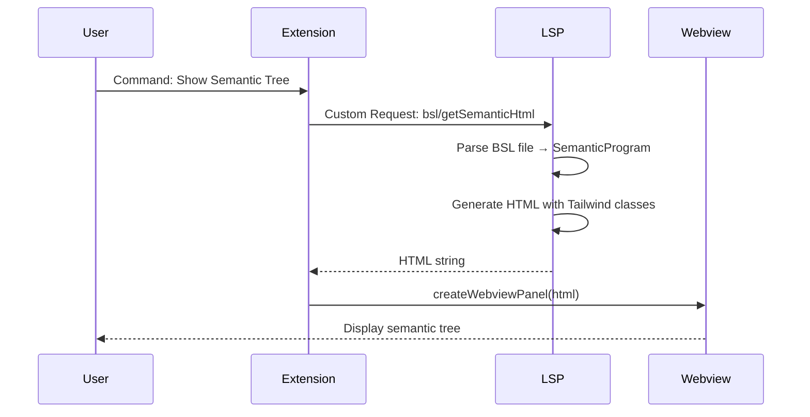
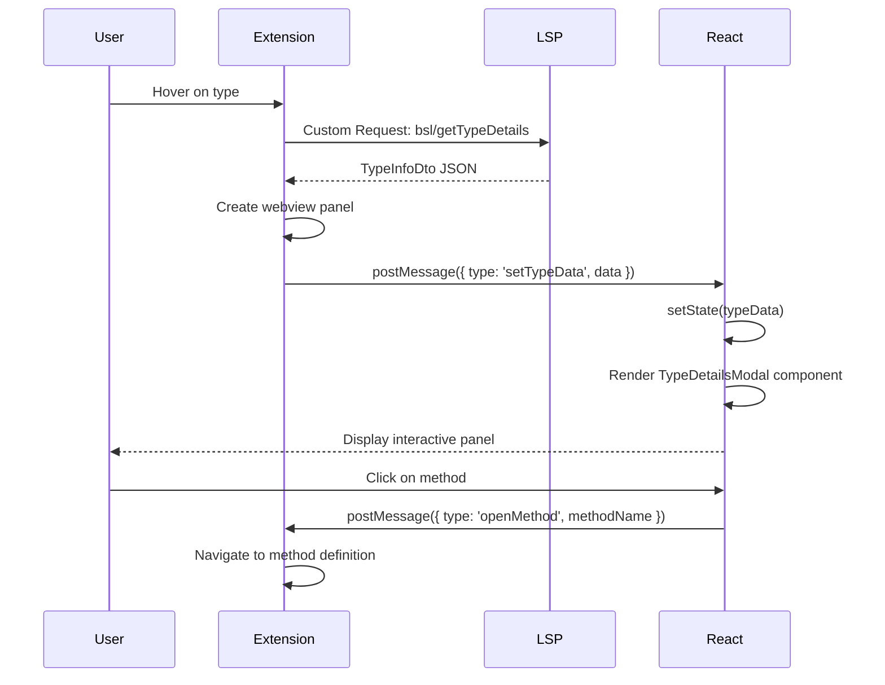
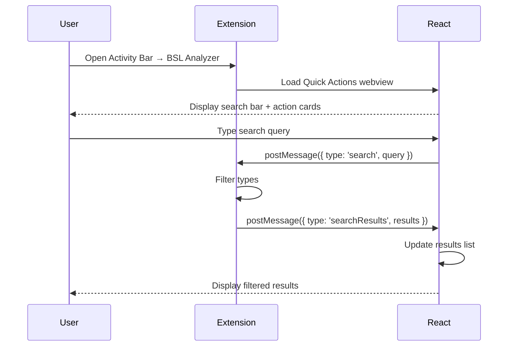

# Webview Architecture для BSL Gradual Types VSCode Extension

**Статус:** Утверждён (Milestone E1)
**Дата:** 2025-01-23
**Подход:** Hybrid (Pure HTML + React)

---

## 📋 Содержание

1. [Обзор архитектуры](#обзор-архитектуры)
2. [Типы Webview компонентов](#типы-webview-компонентов)
3. [Технологический стек](#технологический-стек)
4. [Диаграмма взаимодействия](#диаграмма-взаимодействия)
5. [Обоснование выбора](#обоснование-выбора)

---

## Обзор архитектуры

BSL Gradual Types Extension использует **hybrid подход** для webview компонентов:

- **Pure HTML/CSS + Tailwind** — для server-side rendered контента (Semantic Visualization)
- **React + Tailwind** — для интерактивных webview панелей (Type Details Modal, Quick Actions)

---

## Типы Webview компонентов

### 1. Semantic Visualization (Pure HTML + Tailwind)

**Цель:** Отображение семантического дерева BSL модулей

**Технологии:**
- **Backend:** LSP Server генерирует HTML с inline Tailwind классами
- **Endpoint:** `/api/semantic/:file_path?format=html&theme=dark|light`
- **Формат:** Self-contained HTML (включает Tailwind CDN)

**Архитектура:**
```
LSP Server (Rust)
    ↓
semantic_routes.rs → generate_semantic_html()
    ↓
HTML с Tailwind классами
    ↓
VSCode Webview Panel → отображение
```

**Преимущества Pure HTML подхода:**
- ✅ **Server-side rendering** — не требует React runtime в webview
- ✅ **Минимальный bundle** — только HTML + CSS (< 50 KB)
- ✅ **Быстрая загрузка** — нет инициализации JavaScript
- ✅ **SEO-friendly** — полностью рендерится на сервере
- ✅ **Theme switching** — поддержка через query parameter `?theme=dark|light`

**Недостатки:**
- ❌ **Нет интерактивности** — статический контент
- ❌ **Перегенерация** — при изменении файла требуется новый рендеринг

**Use cases:**
- Просмотр семантического дерева
- Экспорт в HTML для документации
- Печать/сохранение

---

### 2. Type Details Modal (React + Tailwind)

**Цель:** Интерактивная панель с детальной информацией о типе

**Технологии:**
- **Framework:** React 18.2
- **Styling:** Tailwind CSS 3.4
- **Build:** Vite 5.0
- **TypeScript:** 5.3

**Архитектура:**
```
Extension (TypeScript)
    ↓
Command: bsl.showTypeInfo
    ↓
LSP Custom Request → bsl/getTypeDetails
    ↓
typeDetailsWebview.ts → createWebviewPanel()
    ↓
React компонент (TypeDetailsModal.tsx)
    ↓
Отображение в Webview Panel
```

**Преимущества React подхода:**
- ✅ **Интерактивность** — клик на методы/свойства, табы, фильтры
- ✅ **State management** — React hooks для управления состоянием
- ✅ **Component reusability** — переиспользуемые UI компоненты
- ✅ **VSCode theme integration** — автоматическая адаптация к теме через CSS custom properties

**Компоненты:**
- `TypeDetailsModal.tsx` — основной контейнер
- `MethodList.tsx` — список методов с search
- `PropertyGrid.tsx` — grid свойств
- `FacetTabs.tsx` — переключение между фасетами (Manager/Object/Reference)

**Use cases:**
- Hover на типе → показать детали
- Клик на тип в Type Repository Tree
- Quick Actions → "Explore Type"

---

### 3. Quick Actions Webview (React + Tailwind)

**Цель:** Панель быстрых действий для пользователя

**Технологии:**
- **Framework:** React 18.2
- **Styling:** Tailwind CSS 3.4
- **Build:** Vite 5.0

**Архитектура:**
```
Extension (TypeScript)
    ↓
View: bslAnalyzer.actions (webview)
    ↓
actionsWebview.ts → getWebviewContent()
    ↓
React компонент (QuickActions.tsx)
    ↓
Отображение в Activity Bar Webview
```

**Компоненты:**
- `QuickActions.tsx` — основной контейнер с search bar
- `ActionCard.tsx` — карточка действия (Analyze, Search, Settings)
- `SearchBar.tsx` — поиск типов

**Use cases:**
- Быстрый доступ к командам
- Поиск типов платформы/конфигурации
- Shortcuts для настроек

---

## Технологический стек

### Build System

```
vscode-extension/
├── webview/                    # Separate build context
│   ├── src/
│   │   ├── quickActions.tsx   # Entry point 1
│   │   ├── typeDetails.tsx    # Entry point 2
│   │   ├── components/        # Shared React components
│   │   └── tailwind.css       # Tailwind entry
│   ├── package.json           # Webview dependencies
│   ├── tsconfig.json          # TypeScript config
│   ├── vite.config.ts         # Vite config (multi-entry)
│   ├── tailwind.config.js     # Tailwind config
│   └── postcss.config.js      # PostCSS config
└── media/
    └── webview/               # Build output
        ├── quickActions.js    # Compiled React bundle
        ├── typeDetails.js
        └── *.css
```

### Build Process

```bash
# Development (watch mode)
npm run watch:webview

# Production build
npm run build:webview

# Full extension build
npm run compile  # TypeScript + webview
```

### Dependencies

**Webview package.json:**
```json
{
  "devDependencies": {
    "tailwindcss": "^3.4.0",
    "postcss": "^8.4.0",
    "autoprefixer": "^10.4.0",
    "vite": "^5.0.0",
    "react": "^18.2.0",
    "react-dom": "^18.2.0",
    "@types/react": "^18.2.0",
    "@types/react-dom": "^18.2.0",
    "@vitejs/plugin-react": "^4.2.0",
    "typescript": "^5.3.0"
  }
}
```

**Extension package.json (updated scripts):**
```json
{
  "scripts": {
    "compile": "tsc -p ./ && npm run build:webview",
    "build:webview": "cd webview && npm run build",
    "watch": "tsc -watch -p ./ & npm run watch:webview",
    "watch:webview": "cd webview && npm run dev"
  }
}
```

---

## Диаграмма взаимодействия

### Semantic Visualization (Pure HTML)



### Type Details Modal (React)



### Quick Actions (React)



---

## Обоснование выбора

### Pure HTML vs React — когда использовать?

| Критерий | Pure HTML | React |
|----------|-----------|-------|
| **Интерактивность** | Статический контент | Высокая интерактивность |
| **Bundle size** | < 50 KB | 100-150 KB |
| **Load time** | Мгновенно | ~100-200ms (React init) |
| **State management** | Нет | React hooks |
| **Server-side rendering** | Да | Нет (CSR) |
| **Theme switching** | Server regeneration | Runtime CSS variables |
| **SEO/Export** | Отлично | N/A |

**Semantic Visualization → Pure HTML:**
- ✅ Контент статический (просто отображаем дерево)
- ✅ Генерируется на сервере (LSP уже парсит файл)
- ✅ Легко экспортировать в HTML/PDF
- ✅ Меньше overhead для пользователя

**Type Details Modal → React:**
- ✅ Интерактивность (табы, фильтры, search)
- ✅ Complex state (выбранный фасет, search query)
- ✅ Реагирует на user actions (клик → goto definition)
- ✅ Обновляется в realtime (при изменении типа)

**Quick Actions → React:**
- ✅ Search bar с autocomplete
- ✅ Command palette (клик → execute command)
- ✅ Dynamic content (список команд меняется)

---

## VSCode Theme Integration

### CSS Custom Properties

VSCode предоставляет CSS custom properties для theme colors:

```css
/* Автоматически доступны в webview */
--vscode-editor-background
--vscode-editor-foreground
--vscode-input-background
--vscode-input-foreground
--vscode-button-background
--vscode-button-foreground
--vscode-button-hoverBackground
--vscode-list-hoverBackground
--vscode-list-activeSelectionBackground
```

### Tailwind Config для VSCode Theme

```javascript
// vscode-extension/webview/tailwind.config.js
module.exports = {
  content: ['./src/**/*.{ts,tsx}'],
  theme: {
    extend: {
      colors: {
        'vscode-bg': 'var(--vscode-editor-background)',
        'vscode-fg': 'var(--vscode-editor-foreground)',
        'vscode-input-bg': 'var(--vscode-input-background)',
        'vscode-input-fg': 'var(--vscode-input-foreground)',
        'vscode-button-bg': 'var(--vscode-button-background)',
        'vscode-button-fg': 'var(--vscode-button-foreground)',
        'vscode-button-hover': 'var(--vscode-button-hoverBackground)',
        'vscode-list-hover': 'var(--vscode-list-hoverBackground)',
        'vscode-list-active': 'var(--vscode-list-activeSelectionBackground)',
      },
    },
  },
  plugins: [],
  darkMode: 'class', // VSCode управляет через CSS classes
}
```

### Использование в React компонентах

```tsx
// Пример: TypeDetailsModal.tsx
<div className="bg-vscode-bg text-vscode-fg p-6 rounded-lg">
  <button className="bg-vscode-button-bg hover:bg-vscode-button-hover text-vscode-button-fg px-4 py-2 rounded">
    Закрыть
  </button>
</div>
```

**Автоматическая адаптация к теме:**
- ✅ Dark+ (default dark) → тёмные цвета
- ✅ Light+ (default light) → светлые цвета
- ✅ Любая custom тема → адаптируется автоматически

---

## Bundle Size Target

| Компонент | Target Size | Примечания |
|-----------|-------------|------------|
| **quickActions.js** | < 100 KB | React + Tailwind (gzip) |
| **quickActions.css** | < 30 KB | Purged Tailwind CSS |
| **typeDetails.js** | < 120 KB | React + дополнительные компоненты |
| **typeDetails.css** | < 40 KB | Purged Tailwind CSS |
| **Total Webview** | < 300 KB | Приемлемо для VSCode Extension |
| **Extension VSIX** | < 2 MB | С webview + LSP binary |

---

## Next Steps (Milestone E2-E3)

**E2: Tailwind Setup для Webview**
- Task 2.1: Semantic Visualization (Pure HTML)
- Task 2.2: Type Details Modal (React)
- Task 2.3: Quick Actions Webview (React)

**E3: Production Build и Testing**
- Task 3.1: Bundle Optimization
- Task 3.2: Cross-theme Testing
- Task 3.3: Extension Size Audit

---

**Утверждено:** Milestone E1 (Task 1.1)
**Следующий шаг:** Task 1.2 — Настройка Vite + React + Tailwind
